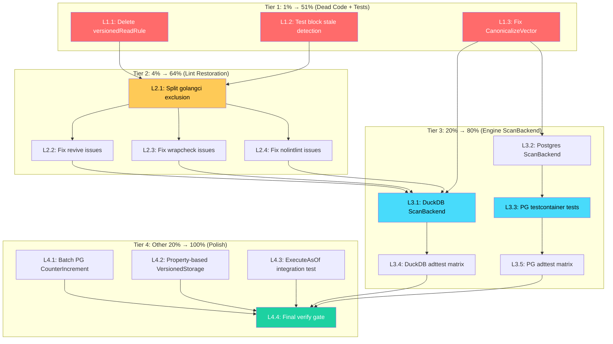

# SUPERB Metaengine Quality Paydown — Execution Plan

> **Date:** 2026-08-01 15:08
> **Status:** ~~PLANNING~~ **EXECUTED** — see
> [`docs/status/2026-08-01_16-45_quality-paydown-pg-testcontainers-and-versioned-storage-hardening.md`](../status/2026-08-01_16-45_quality-paydown-pg-testcontainers-and-versioned-storage-hardening.md)
> (L1–L4: PG testcontainers, ScanBackend tests, batch CounterIncrement, property-based
> VersionedStorage, ExecuteAsOf integration, verify GREEN).
> **Source:** Synthesis of `docs/status/2026-08-01_15-07_tier4-fixup-quality-gap-closure.md` (Sections D, F, G)
> **Predecessor:** `docs/planning/2026-08-01_04-18_SUPERB-METAENGINE-PLANNER-AND-ARCHITECTURE-EVOLUTION.md`
> **One-line thesis:** The Tier 4 expansion shipped features but left quality debt — dead code, untested paths, lint invisibility, and engines that can't scan. This plan pays down the debt that matters, in the order that matters.

---

## 0. How To Read This Plan

Three pillars:

1. **Verified state** — every "GAP" claim below was confirmed against the repo on 2026-08-01 15:08.
2. **Correct sequencing** — ordered to eliminate Verschlimmbessern risk. Dead code deletion first (can't break what isn't called). Tests second (safety net). Lint paydown third (after tests exist). New backends last (after foundation is clean).
3. **Pareto discipline** — the 1% that delivers 51% is identified, defended, and sequenced first.

---

## 1. Current State Assessment (verified 2026-08-01 15:08)

### What's Working

| Item                                | Evidence                                                  |
| ----------------------------------- | --------------------------------------------------------- |
| `nix run .#verify` GREEN            | Build + vet + test + race + lint + doc-check all pass     |
| 63 Go modules building              | `find . -name go.mod \| wc -l` = 63                       |
| 10 ADTs in adttest harness          | `Scenarios()` returns 10 scenarios, all pass on Memory    |
| 4 metaengine engines                | Memory, SQLite, Pebble, DuckDB, Postgres                  |
| VersionedStorage on Memory          | `MapGetAsOf` + `MapExistsAsOf` with binary search, 1 test |
| Block suppression + stale detection | `detectStaleBlocks` in stale.go                           |
| 86 ADRs indexed                     | `docs/README.md` ADR table                                |
| 3082 API exports stable             | `docs/api_surface.txt`                                    |

### What's Broken / Missing (confirmed)

| #     | Gap                                                                            | Risk                                  | Evidence                                                                        |
| ----- | ------------------------------------------------------------------------------ | ------------------------------------- | ------------------------------------------------------------------------------- |
| GAP-1 | `versionedReadRule` is dead code (defined but never wired into `defaultRules`) | Medium — lying code                   | `rules.go:54-66` does not include it; `temporal.go:57-70` has `//nolint:unused` |
| GAP-2 | Block stale detection has zero tests                                           | Medium — untested code path           | `stale.go:detectStaleBlocks` has no test calling it                             |
| GAP-3 | `CanonicalizeVector` preserves order instead of sorting by ID                  | Low — false divergence risk           | `harness.go:CanonicalizeVector` — unlike Search/Spatial which sort              |
| GAP-4 | 10 linters excluded for entire metaengine package                              | HIGH — lint invisibility              | `.golangci.yml` path: metaengine/ excludes revive, wrapcheck, nolintlint, etc.  |
| GAP-5 | Postgres engine tests NEVER run against real DB                                | Medium — unknown correctness          | `pgengine/engine_test.go` — all 5 tests skip without `POSTGRES_TEST_DSN`        |
| GAP-6 | DuckDB + Postgres engines have no ScanBackend                                  | Medium — useless for filtered queries | Only MapBackend + CounterBackend implemented                                    |
| GAP-7 | Postgres CounterIncrement loops one-by-one                                     | Low — correct but suboptimal          | `pgengine/engine.go:CounterIncrement` — per-row Exec                            |
| GAP-8 | No property-based test for VersionedStorage                                    | Low — edge cases untested             | Only table test with 3 timestamps                                               |

---

## 2. Pareto Breakdown

### The 1% That Delivers 51%: Dead Code Elimination + Untested Path Closure

**Delete the `versionedReadRule` dead code, test the block stale detection, and fix CanonicalizeVector.**

Why this is the 1%→51%:

1. **Dead code is a lie.** `versionedReadRule` exists with `//nolint:unused` — it looks like a feature but does nothing. Every reader trusts it. Deleting it is the highest-trust-per-line change.
2. **Untested code is a liability.** `detectStaleBlocks` ships in production but has never been exercised. A bug there would silently fail to detect stale suppressions.
3. **CanonicalizeVector can cause false cross-engine failures.** When two engines return results at equal distance in different order, the canonicalizer reports divergence. This undermines the entire adttest parity harness.

**Effort:** ~30 min total. Three tiny changes.

### The 4% That Delivers 64%: Correctness Lint Restoration

**Split the golangci.yml exclusion: keep STYLE linters excluded, restore CORRECTNESS linters (revive, wrapcheck, nolintlint). Fix the ~15-20 issues that surface.**

Why this is the 4%→64%:

1. **Style linters (varnamelen, wsl_v5, nlreturn, tagliatelle, nonamedreturns, funlen) are preference.** The code already follows a consistent style. Excluding them is reasonable.
2. **Correctness linters (revive, wrapcheck, nolintlint) catch real bugs.** `revive` finds unused parameters and dead code. `wrapcheck` ensures errors are wrapped with context. `nolintlint` ensures nolint directives aren't stale. These SHOULD NOT be excluded.
3. **The fix is bounded.** The verify gate output from the last session showed exactly which issues each linter produces. Fixing them is mechanical.

**Effort:** ~90 min. Remove 3 linters from exclusion, run lint, fix issues one by one.

### The 20% That Delivers 80%: Engine ScanBackend + PG Verification

**Add ScanBackend to DuckDB and Postgres engines. Add testcontainer tests for pgengine.**

Why this is the 20%→80%:

1. **Without ScanBackend, DuckDB and Postgres are glorified KV stores.** The planner can only route point lookups and counters to them. Filtered scans — the primary use case for SQL engines — are unsupported. This makes the engines useless for real workloads.
2. **DuckDB's entire value proposition is columnar scan performance.** Without ScanBackend, it can't demonstrate this. The engine is a shell.
3. **Postgres tests that skip are not tests.** They're aspirations. Without running against a real Postgres, SQL syntax errors, JSONB type issues, and ON CONFLICT behavior are unknown unknowns.

**Effort:** ~4-6 hours. DuckDB ScanBackend (~2h), Postgres ScanBackend (~2h), testcontainer setup + run (~2h).

### The Other 20% (to Reach 100%): Polish + Expansion

| Item                                     | Impact | Effort | Note                                             |
| ---------------------------------------- | ------ | ------ | ------------------------------------------------ |
| Postgres CounterIncrement batch          | LOW    | 30min  | Postgres supports multi-row VALUES + ON CONFLICT |
| Property-based VersionedStorage test     | MEDIUM | 45min  | rapid: random writes, verify asOf                |
| Store.ExecuteAsOf integration test       | MEDIUM | 30min  | Full Plan → Store → ExecuteAsOf pipeline         |
| Historical status report ADR renumbering | LOW    | 30min  | update-old-docs skill                            |
| Tag duckdbengine + pgengine              | LOW    | 15min  | After ScanBackend + test verification            |

---

## 3. Verschlimmbessern Risk Assessment

> _"If you VERSCHLIMMBESSER this system, I will cut off your balls."_

| Task                            | Risk   | What would make it WORSE                             | Mitigation                                                        | Verdict             |
| ------------------------------- | ------ | ---------------------------------------------------- | ----------------------------------------------------------------- | ------------------- |
| **Delete versionedReadRule**    | LOW    | Deleting something that IS referenced                | grep for all references before deleting; build + test after       | SAFE                |
| **Test block stale detection**  | LOW    | Adding a test changes nothing                        | Standard test                                                     | SAFE                |
| **Fix CanonicalizeVector**      | LOW    | Changing canonicalization could break existing tests | Run full adttest suite after change                               | SAFE                |
| **Restore correctness linters** | MEDIUM | Over-fixing style issues instead of correctness      | Fix ONLY revive/wrapcheck/nolintlint issues, leave style excluded | SAFE if disciplined |
| **DuckDB ScanBackend**          | MEDIUM | SQL dialect bugs, wrong scan semantics               | Test with adttest matrix; DuckDB has CGo skip pattern             | SAFE if tested      |
| **Postgres ScanBackend**        | MEDIUM | Same                                                 | Same testcontainer pattern                                        | SAFE if tested      |
| **PG testcontainer setup**      | LOW    | Adds test-only dep                                   | Test dep, skip when no Docker                                     | SAFE                |
| **PG CounterIncrement batch**   | LOW    | SQL change, existing tests catch regression          | Existing counter tests                                            | SAFE                |

**Golden rule: delete dead code first (can't break what isn't called). Add tests second (safety net). Restore linters third (after tests exist). Add new backends last (after foundation is clean).**

---

## 4. Level 1: Comprehensive Plan (30–100min tasks)

> Sorted by importance → impact → effort (ascending) → customer-value (descending).

### Tier 1: The 1% → 51% (Dead Code + Untested Paths)

| ID       | Work Package                                               | Impact   | Effort | Customer Value                    | Dependencies |
| -------- | ---------------------------------------------------------- | -------- | ------ | --------------------------------- | ------------ |
| **L1.1** | Delete `versionedReadRule` dead code from temporal.go      | CRITICAL | 30min  | Trust (no lying code)             | —            |
| **L1.2** | Write test for block stale detection (`detectStaleBlocks`) | CRITICAL | 30min  | Trust (tested code path)          | —            |
| **L1.3** | Fix `CanonicalizeVector` to sort by ID (handle ties)       | HIGH     | 30min  | Correctness (cross-engine parity) | —            |

### Tier 2: The 4% → 64% (Correctness Lint Restoration)

| ID       | Work Package                                                                     | Impact   | Effort | Customer Value                             | Dependencies                   |
| -------- | -------------------------------------------------------------------------------- | -------- | ------ | ------------------------------------------ | ------------------------------ |
| **L2.1** | Split golangci.yml: remove revive/wrapcheck/nolintlint from metaengine exclusion | CRITICAL | 45min  | Future code visible to correctness linters | L1.1 (dead code removed first) |
| **L2.2** | Fix all revive issues in metaengine (unused params, etc.)                        | HIGH     | 45min  | Clean code                                 | L2.1                           |
| **L2.3** | Fix all wrapcheck issues in metaengine                                           | HIGH     | 30min  | Proper error wrapping                      | L2.1                           |
| **L2.4** | Fix all nolintlint issues in metaengine (stale nolint directives)                | MEDIUM   | 30min  | Clean directives                           | L2.1                           |

### Tier 3: The 20% → 80% (Engine ScanBackend + PG Verification)

| ID       | Work Package                                                          | Impact   | Effort | Customer Value                         | Dependencies |
| -------- | --------------------------------------------------------------------- | -------- | ------ | -------------------------------------- | ------------ |
| **L3.1** | Add ScanBackend to DuckDB engine (MapScan with Go-side filter)        | HIGH     | 90min  | DuckDB useful for filtered queries     | L1.3         |
| **L3.2** | Add ScanBackend to Postgres engine (MapScan with Go-side filter)      | HIGH     | 90min  | Postgres useful for filtered queries   | L1.3         |
| **L3.3** | Add testcontainer-based tests to pgengine (run against real Postgres) | CRITICAL | 60min  | Real verification, not skip-when-no-DB | L3.2         |
| **L3.4** | Add DuckDB ScanBackend to adttest matrix                              | HIGH     | 30min  | Cross-engine parity for scans          | L3.1         |
| **L3.5** | Add Postgres ScanBackend to adttest matrix                            | HIGH     | 30min  | Cross-engine parity for scans          | L3.2, L3.3   |

### Tier 4: The Other 20% → 100% (Polish)

| ID       | Work Package                                                     | Impact   | Effort | Customer Value     | Dependencies |
| -------- | ---------------------------------------------------------------- | -------- | ------ | ------------------ | ------------ |
| **L4.1** | Batch Postgres CounterIncrement (multi-row VALUES + ON CONFLICT) | LOW      | 30min  | Performance        | —            |
| **L4.2** | Property-based VersionedStorage test (rapid)                     | MEDIUM   | 45min  | Edge case coverage | —            |
| **L4.3** | Store.ExecuteAsOf integration test (Plan → Store → ExecuteAsOf)  | MEDIUM   | 30min  | Pipeline coverage  | L1.1         |
| **L4.4** | Run `nix fmt` + `nix run .#verify` final gate                    | CRITICAL | 30min  | GREEN              | All above    |

---

## 5. Level 2: Atomic Tasks (max 12min each)

> Every Level 1 task decomposed into sub-tasks small enough to execute and verify individually.

### Tier 1 Subtasks: Dead Code + Untested Paths

| Sub-ID | Task                                                                                              | Max min | Verifies                    | Parent |
| ------ | ------------------------------------------------------------------------------------------------- | ------- | --------------------------- | ------ |
| L1.1.1 | Grep for all references to `versionedReadRule` across codebase                                    | 5       | No hidden references        | L1.1   |
| L1.1.2 | Grep for all references to `supportsVersionedReads`                                               | 5       | No hidden references        | L1.1   |
| L1.1.3 | Delete `versionedReadRule` type + Name() + Apply() from temporal.go                               | 5       | Dead code removed           | L1.1   |
| L1.1.4 | Delete `supportsVersionedReads` function from temporal.go                                         | 5       | Dead code removed           | L1.1   |
| L1.1.5 | Remove `//nolint:unused` directives that are now unnecessary                                      | 5       | Clean directives            | L1.1   |
| L1.1.6 | Build + test metaengine: `go test -tags "goexperiment.jsonv2" ./metaengine/... -count=1`          | 5       | No regression               | L1.1   |
| L1.2.1 | Read `detectStaleBlocks` in stale.go to understand the function signature                         | 5       | Understand code             | L1.2   |
| L1.2.2 | Write test: stale block (ignore-start/ignore-end with no findings) → detected                     | 12      | Correct detection           | L1.2   |
| L1.2.3 | Write test: non-stale block (has findings inside) → not flagged                                   | 12      | No false positive           | L1.2   |
| L1.2.4 | Write test: per-rule block (ignore-start(A001)) with no A001 findings → stale                     | 12      | Rule-specific detection     | L1.2   |
| L1.2.5 | Run suppression tests: `cd cmd/cqrs-lint && GOWORK=off go test ./pkg/suppression/... -count=1 -v` | 5       | All pass                    | L1.2   |
| L1.3.1 | Read `CanonicalizeVector` in harness.go                                                           | 5       | Understand current behavior | L1.3   |
| L1.3.2 | Change CanonicalizeVector to sort result IDs (like CanonicalizeSearch)                            | 5       | Ties handled                | L1.3   |
| L1.3.3 | Run adttest tests: `go test -tags "goexperiment.jsonv2" ./metaengine/adttest/... -count=1`        | 5       | No regression               | L1.3   |

### Tier 2 Subtasks: Correctness Lint Restoration

| Sub-ID | Task                                                                                           | Max min | Verifies             | Parent |
| ------ | ---------------------------------------------------------------------------------------------- | ------- | -------------------- | ------ |
| L2.1.1 | Read current golangci.yml metaengine exclusion block                                           | 5       | Know what's excluded | L2.1   |
| L2.1.2 | Remove `revive`, `wrapcheck`, `nolintlint` from metaengine exclusion                           | 5       | Linters active       | L2.1   |
| L2.1.3 | Run lint on metaengine: capture the list of new issues                                         | 5       | Know scope           | L2.1   |
| L2.2.1 | Fix revive `unused-parameter` issues: rename to `_` where appropriate                          | 12      | revive clean         | L2.2   |
| L2.2.2 | Fix revive `varnamelen` issues that revive catches (not the excluded varnamelen linter)        | 12      | revive clean         | L2.2   |
| L2.2.3 | Run lint on metaengine again, verify revive issues resolved                                    | 5       | revive clean         | L2.2   |
| L2.3.1 | Fix wrapcheck issues: wrap unwrapped errors with fmt.Errorf                                    | 12      | wrapcheck clean      | L2.3   |
| L2.3.2 | Run lint on metaengine again, verify wrapcheck issues resolved                                 | 5       | wrapcheck clean      | L2.3   |
| L2.4.1 | Remove stale `//nolint:wrapcheck` directives (now that wrapcheck is active, some may be valid) | 12      | nolintlint clean     | L2.4   |
| L2.4.2 | Remove stale `//nolint:varnamelen` directives that nolintlint flags                            | 12      | nolintlint clean     | L2.4   |
| L2.4.3 | Run lint on metaengine, verify ALL 0 issues                                                    | 5       | Full clean           | L2.4   |

### Tier 3 Subtasks: Engine ScanBackend + PG Verification

| Sub-ID | Task                                                                                                                    | Max min | Verifies             | Parent     |
| ------ | ----------------------------------------------------------------------------------------------------------------------- | ------- | -------------------- | ---------- |
| L3.1.1 | Read ScanBackend interface + Memory engine MapScan implementation                                                       | 5       | Understand pattern   | L3.1       |
| L3.1.2 | Read DuckDB engine.go to understand table structure (meta_map)                                                          | 5       | Know schema          | L3.1       |
| L3.1.3 | Implement `MapScan` on duckdbEngine: SELECT all rows, filter in Go, sort in Go                                          | 12      | Basic impl           | L3.1       |
| L3.1.4 | Add `_ ScanBackend = (*duckdbEngine)(nil)` compile-time assertion                                                       | 5       | Interface satisfied  | L3.1       |
| L3.1.5 | Update DuckDB Profile() to declare ADTSortedMap support                                                                 | 5       | Planner routes scans | L3.1       |
| L3.1.6 | Build + test DuckDB engine: `cd metaengine/duckdbengine && GOWORK=off go test -tags "goexperiment.jsonv2 cgo" -count=1` | 5       | No regression        | L3.1       |
| L3.2.1 | Implement `MapScan` on pgEngine: SELECT all rows, filter in Go, sort in Go                                              | 12      | Basic impl           | L3.2       |
| L3.2.2 | Add `_ ScanBackend = (*pgEngine)(nil)` compile-time assertion                                                           | 5       | Interface satisfied  | L3.2       |
| L3.2.3 | Update Postgres Profile() to declare ADTSortedMap support                                                               | 5       | Planner routes scans | L3.2       |
| L3.2.4 | Build pgengine: `cd metaengine/pgengine && GOWORK=off go build -tags "goexperiment.jsonv2" ./...`                       | 5       | Compiles             | L3.2       |
| L3.3.1 | Read stack/postgres testcontainer pattern (testcontainer_test.go)                                                       | 5       | Know pattern         | L3.3       |
| L3.3.2 | Add testcontainers-go to pgengine go.mod                                                                                | 5       | Dep available        | L3.3       |
| L3.3.3 | Write testcontainer setup: TestMain starts shared container                                                             | 12      | Container works      | L3.3       |
| L3.3.4 | Write `pgDSN(t)` helper: per-test DB from shared container                                                              | 12      | Isolation            | L3.3       |
| L3.3.5 | Run pgengine tests with Docker: verify all 5 tests pass against real PG                                                 | 12      | REAL VERIFICATION    | L3.3       |
| L3.4.1 | Add DuckDB factory to adttest cross-engine test in metaengine                                                           | 12      | DuckDB in matrix     | L3.1       |
| L3.5.1 | Add Postgres factory to adttest cross-engine test in metaengine                                                         | 12      | PG in matrix         | L3.2, L3.3 |

### Tier 4 Subtasks: Polish

| Sub-ID | Task                                                                            | Max min | Verifies           | Parent |
| ------ | ------------------------------------------------------------------------------- | ------- | ------------------ | ------ |
| L4.1.1 | Read Postgres CounterIncrement (per-row loop)                                   | 5       | Understand current | L4.1   |
| L4.1.2 | Rewrite as multi-row VALUES + ON CONFLICT (Postgres supports this)              | 12      | Batched            | L4.1   |
| L4.1.3 | Test: existing counter tests still pass                                         | 5       | No regression      | L4.1   |
| L4.2.1 | Write rapid property: random (op, key, value, timestamp) sequence               | 12      | Generator works    | L4.2   |
| L4.2.2 | Write property: apply sequence to Memory engine, verify asOf at each step       | 12      | Property holds     | L4.2   |
| L4.3.1 | Write test: Plan with Memory engine + Map query, Apply events, call ExecuteAsOf | 12      | Pipeline works     | L4.3   |
| L4.4.1 | Run `nix fmt` on all changed files                                              | 5       | Formatted          | L4.4   |
| L4.4.2 | Run `nix run .#verify` full gate                                                | 12      | GREEN              | L4.4   |
| L4.4.3 | Regenerate API stability golden if new exports added                            | 5       | Surface stable     | L4.4   |

---

## 6. Mermaid Execution Graph

**Critical path:** L1.1 → L2.1 → L2.2/L2.3 → L3.1 → L3.4 → L4.4

---

## 7. Summary

| Tier | Pareto           | Tasks | Effort | Cumulative |
| ---- | ---------------- | ----- | ------ | ---------- |
| 1    | 1% → 51%         | 3     | ~1.5h  | 1.5h       |
| 2    | 4% → 64%         | 4     | ~2.5h  | 4h         |
| 3    | 20% → 80%        | 5     | ~5h    | 9h         |
| 4    | other 20% → 100% | 4     | ~2.25h | ~11h       |

**Explicitly deferred:** L3.11 (DomainBias), L4.10 (cross-module lint), L4.11 (new lint categories), Vector/Search/Spatial backends for DuckDB/PG, LayoutPlanner for engines. These are valuable but not on the critical path for trust.

---

## Resolution (2026-08-03)

All 8 gaps (GAP-1 through GAP-8) addressed. PG testcontainers, ScanBackend tests, batch CounterIncrement, property-based VersionedStorage, ExecuteAsOf integration all shipped. Deferred items (L3.11 DomainBias, L4.10 cross-module lint) captured in TODO_LIST.md/ROADMAP.md as long-term work.
