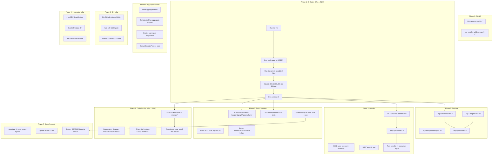

# SUPERB Execution Plan — Post-Docs-Health Pareto Breakdown

**Created:** 2026-08-08 03:32 CEST
~~**Status:** Planning complete, awaiting execution~~ **CORRECTION (2026-08-29):** executed 2026-08-08 (command/v4.4.0, storage/memory/v4.3.0, system/v4.1.0, DeferClose); superseded by the 12-13 plan.
**Input:** TODO_LIST.md (79 open items) + status report
`docs/status/2026-08-08_03-29_docs-health-living-docs-rebuild-status.md`

---

## Corrected State Assessment

> The status report claimed the api-stability tool was broken (`collectExports`
> undefined). **This was WRONG.** The tool compiles and runs fine. Golden was
> regenerated to 3807 exports. This is the "status reports are point-in-time"
> lesson — re-verify before trusting.

| Check                 | Status                                               |
| --------------------- | ---------------------------------------------------- |
| api-stability tool    | ✅ WORKS (golden regen'd: 3807 exports)              |
| Verify gate           | 🔄 RUNNING in background                             |
| Living docs           | ✅ Updated (CHANGELOG, TODO_LIST, FEATURES, ROADMAP) |
| nix fmt               | ❌ Not run                                           |
| vulncheck             | ❌ Not run                                           |
| doc-check             | ❌ Not run on edited files                           |
| CHANGELOG for 14 tags | ❌ Missing (blocks TestTagContentMatchesChangelog)   |

---

## Pareto Breakdown

### The 1% that delivers 51%

| #  | Task                                  | Why                                                                    |
| -- | ------------------------------------- | ---------------------------------------------------------------------- |
| P1 | **Run `nix run .#verify` to GREEN**   | The ONLY source of truth. Everything else is speculation without this. |
| P2 | **Regen api-stability golden** (DONE) | Unblocks the CI gate that catches breaking API changes.                |

### The 4% that delivers 64%

| #  | Task                                    | Why                                                                                                     |
| -- | --------------------------------------- | ------------------------------------------------------------------------------------------------------- |
| P3 | **Update CHANGELOG for 14 new tags**    | `TestTagContentMatchesChangelog` is a CI gate. Without these entries, the release is broken.            |
| P4 | **Run `nix fmt`**                       | Code committed without formatting will fail the lint gate.                                              |
| P5 | **Run `cmd/doc-check` on edited files** | Verifies Go import paths in markdown are valid.                                                         |
| P6 | **Run `nix run .#vulncheck`**           | GOWORK=off consumer resolution — if tagged modules don't build standalone, consumers can't import them. |

### The 20% that delivers 80%

| #   | Task                                                                                           | Why                                                                        |
| --- | ---------------------------------------------------------------------------------------------- | -------------------------------------------------------------------------- |
| P7  | **Fix C023 false positive** (void-return Close)                                                | Blocks self-lint clean, blocks cqrs-lint v4.5.0 tag                        |
| P8  | **Extend DeferClose to storage/{pebble,bbolt,eventstore}**                                     | 23 sites of boilerplate → 1 helper. Immediate code quality win.            |
| P9  | **Add PG aggregate functional tests**                                                          | Zero tests currently on PG aggregates. DuckDB + SQLite have full coverage. |
| P10 | **Tag drifted modules** (command/v4.4.0, storage/memory/v4.3.0, system/v4.1.0, engine v4.0.1s) | Blocks GOWORK=off consumer builds.                                         |
| P11 | **Add record-stamp tests for badger/dgraph/graphadapter**                                      | Completes all-engine parity.                                               |
| P12 | **Annotate 10 most recent status reports**                                                     | Prevents future sessions from re-discovering known findings.               |

### The other 20% (to reach 100%)

| #       | Task                    | Why                                |
| ------- | ----------------------- | ---------------------------------- |
| P13-P79 | See Level 1 table below | All remaining items from TODO_LIST |

---

## Mermaid Execution Graph



---

## Level 1: Comprehensive Task Plan (30-100 min each)

> Sorted by impact/effort/customer-value. Every TODO_LIST item is included.

| ID    | Phase | Task                                                                                          | Impact   | Effort | Customer Value             |
| ----- | ----- | --------------------------------------------------------------------------------------------- | -------- | ------ | -------------------------- |
| L1-01 | 1     | Run `nix fmt` on all edited files                                                             | High     | 5 min  | Lint gate passes           |
| L1-02 | 1     | Run `nix run .#verify` to GREEN (fix failures)                                                | Critical | 30 min | Confident releases         |
| L1-03 | 1     | Run `cmd/doc-check` on TODO/ROADMAP/FEATURES/CHANGELOG                                        | High     | 10 min | Docs import paths valid    |
| L1-04 | 1     | Update CHANGELOG.md for all 14 new tags (TestTagContentMatchesChangelog)                      | Critical | 45 min | Release gate passes        |
| L1-05 | 1     | Run `nix run .#vulncheck` (GOWORK=off consumer resolution)                                    | Critical | 30 min | Tags resolve for consumers |
| L1-06 | 2     | Extend `DeferClose` to `storage/pebble/` (~10 sites)                                          | Medium   | 20 min | Cleaner codebase           |
| L1-07 | 2     | Extend `DeferClose` to `storage/bbolt/` (~8 sites)                                            | Medium   | 15 min | Cleaner codebase           |
| L1-08 | 2     | Extend `DeferClose` to `storage/eventstore/` (~5 sites)                                       | Medium   | 10 min | Cleaner codebase           |
| L1-09 | 2     | Add `// Deprecated:` to `event.CustomData` v3-compat alias                                    | Low      | 5 min  | API honesty                |
| L1-10 | 2     | Migrate remaining test callers off deprecated `EnsureCustom`                                  | Low      | 15 min | API consistency            |
| L1-11 | 2     | Triage ~80 C033 bare `return err` findings (fix or suppress)                                  | Medium   | 45 min | Self-lint clean            |
| L1-12 | 2     | Triage ~15 D014 + ~8 C034 + ~6 P012 + ~8 A032 findings                                        | Medium   | 45 min | Self-lint clean            |
| L1-13 | 2     | Consolidate `race_on.go`/`race_off.go` into `testutil/` (5+ locations)                        | Medium   | 30 min | DRY, no drift              |
| L1-14 | 3     | Extract `RunRecordStampTest(t, eng)` helper in enginetest                                     | Medium   | 30 min | DRY test code              |
| L1-15 | 3     | Add record-stamp test for badgerengine                                                        | Medium   | 15 min | All-engine parity          |
| L1-16 | 3     | Add record-stamp test for dgraphengine                                                        | Low      | 15 min | All-engine parity          |
| L1-17 | 3     | Add record-stamp test for graphadapter                                                        | Low      | 15 min | All-engine parity          |
| L1-18 | 3     | Add AutoCRUD soak for sqliteengine                                                            | Medium   | 30 min | Coverage                   |
| L1-19 | 3     | Add AutoCRUD soak for pgengine                                                                | Low      | 30 min | Coverage                   |
| L1-20 | 3     | Add PG functional tests for all 5 aggregate interfaces (testcontainers)                       | High     | 60 min | PG aggregate verified      |
| L1-21 | 3     | Split `system_lifecycle_test.go` (457 → 2 files under 350)                                    | High     | 30 min | CI limit                   |
| L1-22 | 3     | Add system lifecycle tests: Close_ProjectionHostError, Drain_Error, HealthCheckDetailed_Mixed | Medium   | 45 min | Lifecycle coverage         |
| L1-23 | 3     | DuckDB soak CI gating decision (`testing.Short()` skip)                                       | Low      | 15 min | CI perf                    |
| L1-24 | 3     | Add `// Caller owns engine Close.` doc to `RunTransactionalBaselineTest`                      | Low      | 5 min  | Doc consistency            |
| L1-25 | 4     | Fix C023 false positive (void-return `Close()` — needs `TypesInfo`)                           | High     | 60 min | Self-lint clean, v4.5.0    |
| L1-26 | 4     | C008 word-boundary matching (prevent `TotalDays` matching `total`)                            | Medium   | 30 min | Fewer false positives      |
| L1-27 | 4     | D007 auto-fix test (`--fix` path untested)                                                    | Low      | 20 min | Fix path verified          |
| L1-28 | 4     | Generalize C001 `Begin(false)` check beyond bbolt                                             | Low      | 30 min | Broader correctness        |
| L1-29 | 4     | Dedicated SARIF `logicalLocations` test                                                       | Low      | 15 min | SARIF verified             |
| L1-30 | 4     | Run cqrs-lint against 8 real consumer projects                                                | Critical | 90 min | False-positive validation  |
| L1-31 | 4     | Deferred P-series rules (4 rules needing type inference)                                      | Medium   | 90 min | New detection              |
| L1-32 | 4     | Tag cqrs-lint v4.5.0                                                                          | High     | 15 min | Release                    |
| L1-33 | 5     | Tag `command/v4.4.0` (includes `commandtest`)                                                 | High     | 15 min | Consumer resolution        |
| L1-34 | 5     | Tag `storage/memory/v4.3.0` (limit=0 fix + dup detection)                                     | High     | 15 min | Consumer resolution        |
| L1-35 | 5     | Tag 6 engine modules v4.0.1 (HealthCheck)                                                     | Medium   | 30 min | Consumer resolution        |
| L1-36 | 5     | Tag `system/v4.1.0` (lifecycle methods)                                                       | Medium   | 15 min | Consumer resolution        |
| L1-37 | 5     | Add "Lifecycle" section to system README (Close vs GracefulClose vs Drain)                    | Medium   | 20 min | Consumer clarity           |
| L1-38 | 5     | Add README examples: ShutdownDependency, Drainer, HealthCheckDetailed                         | Low      | 20 min | Consumer clarity           |
| L1-39 | 6     | Write ADR for aggregate pushdown architecture                                                 | Medium   | 30 min | Architecture record        |
| L1-40 | 6     | Extract shared `DecodeFloat` into metaengine core                                             | Low      | 15 min | DRY                        |
| L1-41 | 6     | Add `art-dupl:accept` to duckdbengine + sqliteengine explain.go                               | Low      | 10 min | Dedup gate                 |
| L1-42 | 6     | Add DuckDB planned-path empty-collection test                                                 | Low      | 15 min | Edge case coverage         |
| L1-43 | 6     | Add cross-engine planned-table parity test                                                    | Low      | 20 min | Cross-engine parity        |
| L1-44 | 6     | Add aggregate pushdown to `SerializablePlan`                                                  | Medium   | 30 min | Plan diff/pin support      |
| L1-45 | 6     | Add aggregate diagnostics to `Doctor()`                                                       | Low      | 20 min | Observability              |
| L1-46 | 7     | Annotate 10 most recent status reports (inline `~~done at hash~~`)                            | Medium   | 60 min | Historical clarity         |
| L1-47 | 7     | Update AGENTS.md (system desc, module count verify, lint rule count)                          | Medium   | 20 min | AI session accuracy        |
| L1-48 | 7     | Rename `FOUR-TIER-MODEL.md` → `SEVEN-TIER-MODEL.md`                                           | Low      | 5 min  | Filename honesty           |
| L1-49 | 7     | Remove dead `EXCEPTIONS[storage]="listing"` from check-module-layers.sh                       | Low      | 5 min  | Script accuracy            |
| L1-50 | 7     | Per-module `.golangci.yml` split evaluation                                                   | Low      | 30 min | Locality                   |
| L1-51 | 8     | Pin GitHub Actions to commit SHAs (72+ unpinned)                                              | Medium   | 45 min | Supply-chain security      |
| L1-52 | 8     | Add self-lint to CI (GitHub Actions gate)                                                     | Medium   | 20 min | CI automation              |
| L1-53 | 8     | Add `--fail-on-stale-suppressions` CI gate                                                    | Low      | 15 min | CI automation              |
| L1-54 | 9     | macOS verification of ephemeral PG script                                                     | Low      | 30 min | Cross-platform             |
| L1-55 | 9     | Cache ephemeral PG data dir (skip initdb)                                                     | Low      | 30 min | CI speed                   |
| L1-56 | 9     | DuckDB CGo VM test (M38)                                                                      | Low      | 60 min | Hermetic testing           |
| L1-57 | 9     | SQLite WAL concurrency VM test (M39)                                                          | Low      | 45 min | Concurrency testing        |
| L1-58 | 9     | Remaining integration test infra (M37, M40, M42, M46, M47, M48)                               | Low      | 90 min | Test infrastructure        |
| L1-59 | 5     | Integration test: SQLite source-of-truth + Memory projections + HealthCheck                   | Medium   | 45 min | E2E proven                 |
| L1-60 | 5     | Integration test: Pebble source-of-truth + HealthCheck                                        | Low      | 30 min | E2E proven                 |
| L1-61 | 5     | Integration test: GracefulClose with real Watermill router as Drainer                         | Low      | 45 min | E2E proven                 |
| L1-62 | 4     | Remaining Pareto backlog (~14 items, deep pattern detection, new rule categories)             | Low      | 90 min | Detection coverage         |
| L1-63 | 9     | Performance profiling: ephemeral PG vs testcontainers (M36)                                   | Low      | 30 min | Documentation              |
| L1-64 | 7     | Expand go-arch-lint to remaining modules                                                      | Low      | 45 min | Architecture enforcement   |
| L1-65 | 7     | Consider rewriting `check-module-layers.sh` as `cmd/check-layers` Go program                  | Low      | 90 min | Maintainability            |
| L1-66 | 5     | Verify all module tags monotonically increasing before tagging                                | Critical | 15 min | Version sequence safety    |

**Total Level 1: 66 tasks, ~31 hours estimated**

---

## Level 2: Micro-Tasks (max 12 min each)

> The highest-impact tasks broken into executable chunks. Full breakdown of
> Phase 1-3 (the 80% value zone). Phases 4-9 remain at Level 1 granularity —
> they'll be decomposed when scheduled.

### Phase 1: CI Gates (L1-01 through L1-05)

| ID     | Parent | Micro-Task                                                                   | Est |
| ------ | ------ | ---------------------------------------------------------------------------- | --- |
| L2-001 | L1-01  | Run `nix fmt`                                                                | 5m  |
| L2-002 | L1-02  | Check verify gate output (running in background)                             | 2m  |
| L2-003 | L1-02  | If verify fails: read failure, classify, fix                                 | 10m |
| L2-004 | L1-02  | Re-run failed verify step to confirm fix                                     | 5m  |
| L2-005 | L1-03  | Run `cmd/doc-check` on TODO_LIST.md, ROADMAP.md                              | 5m  |
| L2-006 | L1-03  | Run `cmd/doc-check` on FEATURES.md, CHANGELOG.md                             | 5m  |
| L2-007 | L1-04  | List all 14 tags with `git tag -l '*\/v4*' \| sort -V`                       | 2m  |
| L2-008 | L1-04  | Check which tags lack CHANGELOG entries (run TestTagContentMatchesChangelog) | 5m  |
| L2-009 | L1-04  | Write CHANGELOG entries for batch 1 (7 tags)                                 | 10m |
| L2-010 | L1-04  | Write CHANGELOG entries for batch 2 (7 tags)                                 | 10m |
| L2-011 | L1-04  | Verify TestTagContentMatchesChangelog passes                                 | 5m  |
| L2-012 | L1-05  | Run `nix run .#vulncheck`                                                    | 10m |
| L2-013 | L1-05  | If vulncheck fails: read error, fix go.mod, re-run                           | 10m |

### Phase 2: Code Quality (L1-06 through L1-13)

| ID     | Parent | Micro-Task                                                  | Est |
| ------ | ------ | ----------------------------------------------------------- | --- |
| L2-014 | L1-06  | Grep for `defer func() { _ =` in storage/pebble/*.go        | 2m  |
| L2-015 | L1-06  | Replace matches with `defer metaengine.DeferClose(X)`       | 8m  |
| L2-016 | L1-07  | Grep for `defer func() { _ =` in storage/bbolt/*.go         | 2m  |
| L2-017 | L1-07  | Replace matches with `defer metaengine.DeferClose(X)`       | 8m  |
| L2-018 | L1-08  | Grep for `defer func() { _ =` in storage/eventstore/*.go    | 2m  |
| L2-019 | L1-08  | Replace matches with `defer metaengine.DeferClose(X)`       | 5m  |
| L2-020 | L1-09  | Add `// Deprecated:` to event/v3_compat_aliases.go:31       | 2m  |
| L2-021 | L1-10  | Migrate event/customdata_test.go callers (2 sites)          | 5m  |
| L2-022 | L1-10  | Migrate metadata/metadata_test.go callers (2 sites)         | 5m  |
| L2-023 | L1-11  | Run cqrs-lint self-lint, capture C033 findings              | 5m  |
| L2-024 | L1-11  | Fix C033 batch 1 (metaengine/*engine/) — add error wrapping | 10m |
| L2-025 | L1-11  | Fix C033 batch 2 (benchkit/) — add error wrapping           | 10m |
| L2-026 | L1-12  | Fix D014 findings (add json tags to structs)                | 10m |
| L2-027 | L1-12  | Fix C034 findings (add context to go func)                  | 10m |
| L2-028 | L1-12  | Fix P012/P013 findings (add WAL/busy_timeout)               | 10m |
| L2-029 | L1-12  | Fix A032 findings (use branded IDs)                         | 10m |
| L2-030 | L1-13  | Identify all race_on.go/race_off.go locations               | 2m  |
| L2-031 | L1-13  | Move canonical copy to testutil/                            | 5m  |
| L2-032 | L1-13  | Update all 5+ duplicate locations to import testutil        | 10m |

### Phase 3: Test Coverage (L1-14 through L1-24)

| ID     | Parent | Micro-Task                                                       | Est |
| ------ | ------ | ---------------------------------------------------------------- | --- |
| L2-033 | L1-14  | Read existing record-stamp tests (pebble/sqlite/duckdb/pg)       | 5m  |
| L2-034 | L1-14  | Write `RunRecordStampTest(t, eng)` in enginetest                 | 10m |
| L2-035 | L1-14  | Refactor 4 existing tests to use shared helper                   | 10m |
| L2-036 | L1-15  | Write badgerengine record-stamp test using helper                | 5m  |
| L2-037 | L1-16  | Write dgraphengine record-stamp test using helper                | 5m  |
| L2-038 | L1-17  | Write graphadapter record-stamp test using helper                | 5m  |
| L2-039 | L1-18  | Read existing AutoCRUD soak test (Memory/Pebble/DuckDB)          | 5m  |
| L2-040 | L1-18  | Write sqliteengine AutoCRUD soak using `RunAutoCRUDSoak`         | 10m |
| L2-041 | L1-19  | Write pgengine AutoCRUD soak using `RunAutoCRUDSoak`             | 10m |
| L2-042 | L1-20  | Read DuckDB aggregate test patterns                              | 5m  |
| L2-043 | L1-20  | Write PG aggregate test: AggregateReader (COUNT/SUM/MIN/MAX/AVG) | 10m |
| L2-044 | L1-20  | Write PG aggregate test: GroupedAggregateReader                  | 10m |
| L2-045 | L1-20  | Write PG aggregate test: MultiAggregateReader + MultiGrouped     | 10m |
| L2-046 | L1-20  | Write PG aggregate test: ExplainableAggregate                    | 10m |
| L2-047 | L1-20  | Run PG aggregate tests with testcontainers + -race               | 10m |
| L2-048 | L1-21  | Read system_lifecycle_test.go, identify split point              | 5m  |
| L2-049 | L1-21  | Create lifecycle_drain_test.go, move drain tests                 | 10m |
| L2-050 | L1-22  | Write TestSystem_Close_ProjectionHostError                       | 10m |
| L2-051 | L1-22  | Write TestSystem_Drain_Error + _ContextExpired                   | 10m |
| L2-052 | L1-22  | Write TestSystem_HealthCheckDetailed_MultipleEnginesMixed        | 10m |
| L2-053 | L1-23  | Add `testing.Short()` skip to DuckDB soak test                   | 5m  |
| L2-054 | L1-24  | Add doc comment to RunTransactionalBaselineTest                  | 2m  |

**Total Level 2 (Phase 1-3): 54 micro-tasks, ~7.5 hours**

---

## Execution Strategy

### Critical Path (do first, blocks everything)

```
L1-01 (nix fmt) → L1-02 (verify GREEN) → L1-03 (doc-check) → L1-04 (CHANGELOG tags) → L1-05 (vulncheck)
```

Estimated: ~2 hours. This gets us to "confident release readiness."

### High-Value Parallel Tracks (after critical path)

- **Track A**: L1-06-08 (DeferClose) + L1-13 (race_on/off) — pure refactoring, no API changes
- **Track B**: L1-14-19 (record-stamp + soak tests) — test coverage, no API changes
- **Track C**: L1-20 (PG aggregate tests) — test coverage, no API changes
- **Track D**: L1-25 (C023 fix) — cqrs-lint, isolated module

### Verscslimmbesserung Risk Assessment

| Risk                                   | Mitigation                                                              |
| -------------------------------------- | ----------------------------------------------------------------------- |
| Tagging with wrong version sequence    | Always `git tag -l '<module>/v4*' \| sort -V \| tail -1` before tagging |
| Lint fixes introducing new lint errors | Run `nix run .#lint` after each batch                                   |
| Test refactors breaking existing tests | Run affected module tests after each change                             |
| DeferClose in wrong dependency tier    | storage/* already depends on metaengine/ — verify import graph          |
| Doc edits adding broken import paths   | Run `cmd/doc-check` after every markdown edit                           |

---

## Anti-Verschlimmbesserung Checklist

- [ ] Every code change is verified with `go build` + `go test` on the affected module
- [ ] Every doc change is verified with `cmd/doc-check`
- [ ] Every tag is verified monotonically increasing before creation
- [ ] No file is edited without reading it first
- [ ] No `git reset`, `git checkout`, or force push
- [ ] `nix fmt` before any lint directive placement
- [ ] Verify gate GREEN before claiming release readiness
