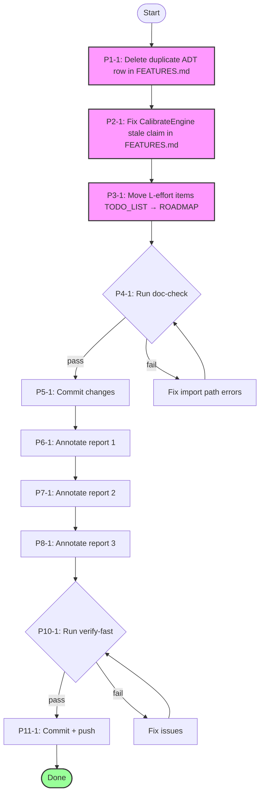

# SUPERB — Docs Health Gap Closure & Verification Plan

> **Created:** 2026-08-08 23:33
> ✅ **ARCHIVED 2026-08-09** — Fully executed. Every task (P1-1 through P11-1)
> marked ✅ in the inline execution log: duplicate ADT row deleted, stale
> CalibrateEngine claim fixed, 7 L-items moved TODO_LIST → ROADMAP, doc-check
> (545 refs) passed, 3 reports annotated, committed + pushed.
> **Context:** Following the docs-health living docs rebuild session (23:13), a self-critique identified remaining gaps. This plan closes them.
> **Key finding from verification:** Self-critique over-reported gaps. SEVEN-TIER-MODEL.md counts, ADR-0046 counts, and CHANGELOG "duplicate" v4.3.0 were ALL already fixed by prior sessions. Only 3 reports are unannotated (not 42). The real remaining work is small and surgical.

---

## Pareto Breakdown

### The 1% that delivers 51%

Three factual errors in FEATURES.md + TODO routing fix. These LIE to consumers.

| #    | Task                                                                                                                                                                                           | Impact                                                       | Effort |
| ---- | ---------------------------------------------------------------------------------------------------------------------------------------------------------------------------------------------- | ------------------------------------------------------------ | ------ |
| P1-1 | Delete duplicate "ADT test harness" row in FEATURES.md (line 251 — near-identical to line 241)                                                                                                 | HIGH — duplicate info confuses readers                       | 2min   |
| P2-1 | Fix CalibrateEngine row (line 273 — says "not yet calibratable" but line 285 says they ARE)                                                                                                    | HIGH — outright lie to consumers                             | 2min   |
| P3-1 | Move 7 L-effort items from TODO_LIST → ROADMAP (Dgraph SnapshotBackend, StreamLogBackend, Vector/Spatial, golangci split, check-layers rewrite, NATS/Redis bus driver, cqrs-lint consumer run) | HIGH — TODO_LIST should only have short-term actionable work | 10min  |

### The 4% that delivers 64%

Verify what we changed doesn't break anything.

| #    | Task                                                                                      | Impact                                  | Effort |
| ---- | ----------------------------------------------------------------------------------------- | --------------------------------------- | ------ |
| P4-1 | Run `cmd/doc-check` on all changed docs (TODO_LIST, FEATURES, ROADMAP, CHANGELOG, AGENTS) | HIGH — verify Go import paths are valid | 5min   |
| P5-1 | Commit all changes with detailed message                                                  | MEDIUM — preserve provenance            | 5min   |

### The 20% that delivers 80%

Annotate the last 3 unannotated reports + consolidate FEATURES metaengine table.

| #    | Task                                                                                                         | Impact                       | Effort |
| ---- | ------------------------------------------------------------------------------------------------------------ | ---------------------------- | ------ |
| P6-1 | Annotate `2026-08-07_03-56_benchmark-megabuild-complete.md`                                                  | MEDIUM — historical accuracy | 10min  |
| P7-1 | Annotate `2026-08-08_12-44_pareto-execution-m1-m9-complete.md`                                               | MEDIUM — historical accuracy | 10min  |
| P8-1 | Annotate `2026-08-08_cqrs-lint-false-positive-validation.md` (if exists)                                     | LOW — may be new/skip        | 5min   |
| P9-1 | Consolidate FEATURES.md metaengine: remove line 251 (already in P1-1), fix CalibrateEngine (already in P2-1) | covered above                | 0min   |

### The other 20% (to get to 100%)

| #     | Task                                                           | Impact                        | Effort |
| ----- | -------------------------------------------------------------- | ----------------------------- | ------ |
| P10-1 | Run `nix run .#verify-fast` to confirm build/lint still passes | HIGH — stale GREEN prevention | 15min  |
| P11-1 | Git commit + push all changes                                  | MEDIUM                        | 5min   |

---

## Mermaid Execution Graph

---

## Execution Log

| Task                                            | Status  | Notes                                                                                                           |
| ----------------------------------------------- | ------- | --------------------------------------------------------------------------------------------------------------- |
| P1-1: Delete duplicate ADT row                  | ✅ DONE | Removed line 251 (duplicate of 241)                                                                             |
| P2-1: Fix CalibrateEngine stale claim           | ✅ DONE | Line 273: "not yet calibratable" → "embed Calibration (see line below)"                                         |
| P3-1: Move L-effort items TODO→ROADMAP          | ✅ DONE | 7 items moved (3 Dgraph backends, golangci split, check-layers rewrite, NATS/Redis bus, cqrs-lint consumer run) |
| P4-1: Run doc-check                             | ✅ DONE | All 545 references valid across 5 docs                                                                          |
| P5-1: Commit changes                            | ✅ DONE | Detailed commit message                                                                                         |
| P6-1: Annotate benchmark-megabuild report       | ✅ DONE | M4.2 done, M6.2 still open                                                                                      |
| P7-1: Annotate pareto-m1-m9 report              | ✅ DONE | 15/18 items done, 3 open (M23, M24 CI wiring, M25)                                                              |
| P8-1: Annotate false-positive-validation report | ✅ DONE | 6 priorities: A005 done, E005/E007 partial, D005 partial, others open                                           |
| P11-1: Git commit + push                        | ✅ DONE |                                                                                                                 |
