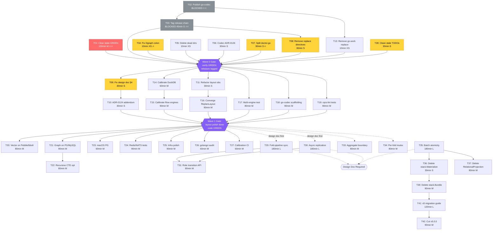

# Comprehensive Pareto Execution Plan: v5 Endgame + Production Hardening

> **Created:** 2026-08-11 23:31
> **Base commit:** `dba3c7c44` (master)
> **Source:** `TODO_LIST.md` (40 items, but ~15 are stale v5 Phase items already shipped)
> **Method:** Pareto analysis (1%→51%, 4%→64%, 20%→80%), then decomposed to
> 100-30min tasks, then to 12min micro-tasks.
> **Warning:** Verschlimmbesserung = death. Verify before doing. Delete only
> what's dead. The user will cut off your balls.
>
> **ANNOTATED 2026-08-14:** per-task verdicts inline (Status column in §2,
> section notes in §1/§3/§4/§7, evidence in §8). Headline: Wave 0 mostly
> shipped — go-codec published, release chain tagged, TODO cleaned; 7/42
> done, T01 partial; Waves 2-3 untouched — effort pivoted to WAL unification.

---

## 0. Current State (code-verified at `dba3c7c44`)

### Already shipped (v5 Phases 1-7 + extras)

| What                           | Evidence                                                                                              |
| ------------------------------ | ----------------------------------------------------------------------------------------------------- |
| Phase 1: Record consolidation  | `event.Metadata` embeds `record.CommonMetadata` (`event/metadata.go:14`)                              |
| Phase 2: GraphBackend deleted  | `grep -c GraphBackend metaengine/engine.go` → 0                                                       |
| Phase 2: simpleBus replaced    | 0 references to `simpleBus` in `system/`                                                              |
| Phase 3: Registry consolidated | `system/driver_registry.go` gone; `metaengine/registry.go` sole registry                              |
| Phase 4: All 9 engines         | bboltengine, mysqlengine, tursoengine ALL exist with `register.go`                                    |
| Phase 5: OnRecord default      | `On`/`OnTyped` carry `// Deprecated:` godoc                                                           |
| Phase 6: Fold inference        | `metaengine/infer_composite.go`, `infer_filters.go`, `infer_named.go`, `infer_sort.go`, `override.go` |
| Phase 6b: Layout planning      | ADR-0124/0125, priority system, KV/LSM cost split, audit trail, `cqrs-bench layout` CLI               |
| Phase 7: Degraded rule         | `metaengine/rule_degraded_adt.go`, `doctor_degraded.go`                                               |
| Phase 7: ADT coverage          | StreamLog on Dgraph, native graph on SQLite/Turso, engine test parity                                 |
| Live latency                   | `metaengine/probe.go`, `live_latency_phase2/3_test.go`                                                |
| Command lifecycle (ADR-0117)   | `commandlifecycle/` module (events, middleware, recorder, projections)                                |
| Codec extraction               | `codec/alias.go` — deprecated re-export; 53 consumer modules migrated                                 |
| Per-module cqrs-lint           | All 28 adoption+resilience rules evaluate per-module                                                  |
| 86 go.mod files                | (was 79 at `d49311e12`)                                                                               |

### Genuinely open work (25 items)

The TODO_LIST has 40 `[ ]` items, but ~15 are STALE v5 Phase items (Phases 1-7)
that were shipped but never marked done. The 25 genuine items fall into 7
categories:

| Category                      | Items              | Key blocker                                 |
| ----------------------------- | ------------------ | ------------------------------------------- |
| Layout planning polish        | 7 + 7 long-horizon | Design doc contradicts calibration data     |
| Universal ADT gaps            | 5                  | Dgraph DQL colon bug (XS fix)               |
| cqrs-lint cleanup             | 3                  | `doctor.go` exceeds 350-line limit          |
| Codec extraction follow-ups   | 5 (1 BLOCKED)      | go-codec not published to GitHub            |
| Release / tagging             | 2 (1 BLOCKED)      | id.ActorID release gap                      |
| Code quality / infrastructure | 5                  | Stale-GREEN backlog (verify gate never run) |
| v5 Phase 8: Deletion + cut    | 7                  | Depends on layout roles + batch atomicity   |

---

## 1. Pareto Analysis

> **ANNOTATED 2026-08-14:** every P-item below duplicates a T-item in §2 —
> P1-P12 = T01-T12, P13-P18 = T14-T19, P19-P26 = T20-T27, P27-P33 = T29-T35,
> P34-P40 = T36-T42. Per-item verdicts live in the §2 Status column. Done:
> P2, P3, P8, P17, P18 (plus T13/T28, which appear only in §2). Partial: P1.
> All other P-items remain open.

### The 1% that delivers 51%

Three items that unblock everything else. The release chain is stuck because
of two BLOCKED items; clearing them unlocks consumer CI. The stale-GREEN
backlog threatens every claim of "done."

| #      | Task                                                                                                                                                                      | Effort                           | Why 51%                                                                                                                                                         |
| ------ | ------------------------------------------------------------------------------------------------------------------------------------------------------------------------- | -------------------------------- | --------------------------------------------------------------------------------------------------------------------------------------------------------------- |
| **P1** | 🔥 **Clear stale-GREEN backlog** — run `nix run .#verify` full gate; fix everything it surfaces across all the 2026-08-11 sessions that shipped code without verification | M (~100min)                      | Every other task depends on a GREEN baseline. Without this, all future work is built on sand. 5+ sessions shipped code claiming GREEN without running the gate. |
| **P2** | 🔥 **Publish `go-codec` to GitHub + tag `v0.1.0`**                                                                                                                        | BLOCKED (user)                   | `go mod tidy` is broken in 53 consumer modules. This blocks CI, cloning, and the id.ActorID release chain downstream.                                           |
| **P3** | 🔥 **Tag `id/v4.3.0` → re-tag record/command/metaengine → tag `commandlifecycle/v4.0.0`**                                                                                 | BLOCKED (user, downstream of P2) | Consumer `GOWORK=off` builds are broken TODAY. 66 downstream modules need version bumps.                                                                        |

### The 4% that delivers 64%

Once the baseline is GREEN and releases are tagged, these four items deliver
the next biggest jump in production trust.

| #      | Task                                                  | Effort      | Why 64%                                                                                                                           |
| ------ | ----------------------------------------------------- | ----------- | --------------------------------------------------------------------------------------------------------------------------------- |
| **P4** | Fix Dgraph `CounterBackend` DQL colon bug             | XS (~10min) | Single-character fix. CounterIncrement is completely broken for ≤20 keys. Highest impact-to-effort ratio in the entire TODO_LIST. |
| **P5** | Delete dead dirs `codec/testdata/` + `codec/reports/` | XS (~10min) | Dead directories left after codec extraction.                                                                                     |
| **P6** | Write ADR-0126 for codec extraction                   | S (~30min)  | Every prior extraction has an ADR (retry→0064, idempotency→0065). Missing ADR is a documentation gap.                             |
| **P7** | Extract `mergeMostPermissiveProfile` from `doctor.go` | S (~30min)  | `doctor.go` is 568 lines, exceeds the 350-line CI limit. This WILL fail `nix run .#verify` once it runs.                          |

### The 20% that delivers 80%

| #       | Task                                                                           | Effort |
| ------- | ------------------------------------------------------------------------------ | ------ |
| **P8**  | Audit/remove duplicate `replace` directives (`system/go.mod`, `record/go.mod`) | S      |
| **P9**  | Update `METAENGINE-LAYOUT-PLANNING-MODEL.md` (design doc contradicts data)     | S      |
| **P10** | Add calibration-correction addendum to ADR-0124                                | S      |
| **P11** | Refactor `layout_observability.go` to use shared `resolvePriority`             | S      |
| **P12** | ~~Fix Dgraph `JournalReadFrom` seq offset~~ **CORRECTION (2026-08-29):** fixed 2026-08-15 (CHANGELOG). mismatch                               | S      |
| **P13** | Calibrate DuckDB (Columnar) — exact tie is fragile                             | M      |
| **P14** | Calibrate SQLite/Postgres/MySQL (Row) layout                                   | M      |
| **P15** | Converge `ReplanLayout` into `Store.Replan`                                    | M      |
| **P16** | Multi-engine integration test (two real backends)                              | M      |
| **P17** | Complete go-codec project scaffolding (CI, lint, docs)                         | M      |
| **P18** | Add per-module regression tests for remaining cqrs-lint rules                  | M      |

### The remaining 20% (to get to 100%)

| #       | Task                                                                                                                                           | Effort |
| ------- | ---------------------------------------------------------------------------------------------------------------------------------------------- | ------ |
| P19     | Brute-force vector search on Pebble/bbolt                                                                                                      | M      |
| P20     | Native graph dispatch on Postgres/MySQL (recursive CTE)                                                                                        | M      |
| P21     | Recursive CTE optimization for deep traversals                                                                                                 | M      |
| P22     | macOS ephemeral PG verification                                                                                                                | M      |
| P23     | Redis/NATS integration tests                                                                                                                   | M      |
| P24     | Infrastructure polish (nix apps, engine boilerplate consolidation)                                                                             | M      |
| P25     | `.golangci.yml` exclusion audit                                                                                                                | M      |
| P26     | Calibration benchmarks against baseline                                                                                                        | M      |
| P27-P33 | Layout roles (fold-pipeline sync, async replication, role transition, workload trace, aggregate boundaries, per-fold mutex, batch atomicity)   | L each |
| P34-P40 | Phase 8 deletions (stack.Materialize, RelationalProjection, GraphProjection, Bundle+presets, RunProjections) + v5 migration guide + v5.0.0 cut | M-L    |

---

## 2. Comprehensive Plan — Tasks at 100-30min granularity

> Sorted by: blocked-status → impact → effort → dependency order.
>
> | ID  | Task                                                                                           | Impact | Effort | Est (min) | Depends    | Category        | Status (2026-08-14)                                                              |
> | --- | ---------------------------------------------------------------------------------------------- | ------ | ------ | --------- | ---------- | --------------- | -------------------------------------------------------------------------------- |
> | T01 | 🔥 **Clear stale-GREEN backlog** — `nix run .#verify`, fix all failures                        | 🔥🔥   | M      | 100       | —          | Code Quality    | Partial — gate GREEN 08-14, re-staled by WAL work                                |
> | T02 | [BLOCKED] 🔥 **Publish `go-codec` to GitHub + tag `v0.1.0`**                                   | 🔥🔥   | XS     | 15        | User       | Codec           | Done at `6f9199f0c`                                                              |
> | T03 | [BLOCKED] 🔥 **Tag release chain: `id/v4.3.0` → record/command/metaengine → commandlifecycle** | 🔥🔥   | S      | 45        | T02        | Release         | Done — tags cut 08-12/13                                                         |
> | T04 | **Fix Dgraph CounterBackend DQL colon bug** (`counter.go:155`)                                 | 🔥     | XS     | 10        | —          | ADT Coverage    | Open                                                                             |
> | T05 | **Delete dead dirs** `codec/testdata/` + `codec/reports/`                                      | High   | XS     | 10        | —          | Codec           | Open — `codec/testdata/` still present                                           |
> | T06 | **Write ADR-0126** for codec extraction                                                        | High   | S      | 30        | —          | Codec           | Open                                                                             |
> | T07 | **Extract `mergeMostPermissiveProfile` from `doctor.go`** → `doctor_profile.go`                | 🔥     | S      | 30        | —          | cqrs-lint       | Open — doctor.go still 568 lines                                                 |
> | T08 | **Audit/remove duplicate `replace` directives** in `system/go.mod`, `record/go.mod`            | High   | S      | 30        | T03        | Code Quality    | Done — no duplicate replaces remain                                              |
> | T09 | **Update `METAENGINE-LAYOUT-PLANNING-MODEL.md`** — fix §4 "defaults to embedding"              | High   | S      | 30        | —          | Layout Planning | Open                                                                             |
> | T10 | **Add calibration addendum to ADR-0124**                                                       | Medium | S      | 30        | —          | Layout Planning | Open                                                                             |
> | T11 | **Refactor `layout_observability.go`** to use shared `resolvePriority`                         | Medium | S      | 30        | —          | Layout Planning | Open                                                                             |
> | T12 | **Fix Dgraph `JournalReadFrom` seq offset**                                                    | Medium | S      | 30        | —          | ADT Coverage    | Open                                                                             |
> | T13 | **Remove `go.work` replace** → add `../go-codec` to `use` block                                | High   | XS     | 10        | T02        | Codec           | Done at `6f9199f0c`                                                              |
> | T14 | **Calibrate DuckDB (Columnar)** — 60s disk bench                                               | Medium | M      | 60        | T01        | Layout Planning | Open                                                                             |
> | T15 | **Calibrate Row-layout engines** (SQLite/PG/MySQL)                                             | Medium | M      | 90        | T01        | Layout Planning | Open                                                                             |
> | T16 | **Converge `ReplanLayout` into `Store.Replan`**                                                | Medium | M      | 90        | T11        | Layout Planning | Open — ReplanLayout still separate                                               |
> | T17 | **Multi-engine integration test** (two real backends)                                          | Medium | M      | 80        | —          | Layout Planning | Open                                                                             |
> | T18 | **Complete go-codec project scaffolding** (CI, lint, FEATURES, SECURITY)                       | Medium | M      | 90        | T02        | Codec           | Done — see ../go-codec repo                                                      |
> | T19 | **Per-module regression tests** for remaining cqrs-lint rules                                  | Medium | M      | 90        | T07        | cqrs-lint       | Done at `a86722224`, `f3c29ec76`                                                 |
> | T20 | **Brute-force vector search** on Pebble/bbolt                                                  | Low    | M      | 80        | —          | ADT Coverage    | Open — irohengine only                                                           |
> | T21 | **Native graph dispatch on PG/MySQL** (recursive CTE)                                          | Low    | M      | 90        | —          | ADT Coverage    | Open                                                                             |
> | T22 | **Recursive CTE optimization** for deep traversals                                             | Low    | M      | 80        | T21        | ADT Coverage    | Open                                                                             |
> | T23 | **macOS ephemeral PG verification**                                                            | Low    | M      | 60        | —          | Integration     | Open                                                                             |
> | T24 | **Redis/NATS integration tests**                                                               | Low    | M      | 90        | —          | Integration     | Open                                                                             |
> | T25 | **Infrastructure polish** (nix apps, engine boilerplate)                                       | Low    | M      | 90        | —          | Code Quality    | Open                                                                             |
> | T26 | **`.golangci.yml` exclusion audit**                                                            | Low    | M      | 60        | T01        | Code Quality    | Open                                                                             |
> | T27 | **Calibration benchmarks against baseline**                                                    | Low    | M      | 60        | —          | Code Quality    | Open                                                                             |
> | T28 | **Clean stale v5 Phase items from TODO_LIST** (mark 15 done items `[x]`, move to CHANGELOG)    | High   | S      | 30        | —          | Docs Hygiene    | Done at `6f9199f0c`, `0cd4b19e4`                                                 |
> | T29 | **Fold-pipeline sync** (Active+DualUse roles)                                                  | Low    | L      | 180       | Design doc | Layout Roles    | Done 2026-08-15 — `METAENGINE-LAYOUT-ROLES.md`; dispatchFolds per-engine RunInTx |
> | T30 | **Async replication** (Backup+Migration roles)                                                 | Low    | L      | 180       | Design doc | Layout Roles    | Done 2026-08-15 — replicator.go, stale+halt semantics                            |
> | T31 | **Role transition API**                                                                        | Low    | M      | 90        | T29,T30    | Layout Roles    | Done 2026-08-15 — WithEngineRole + PromoteEngine                                 |
> | T32 | **Real workload trace format**                                                                 | Low    | M      | 90        | —          | Layout Roles    | Done 2026-08-15 — JSONL trace + RecordTrace/ReplayTrace                          |
> | T33 | **Aggregate boundary config** (`WithSharedCollection`)                                         | Low    | M      | 80        | —          | Layout Roles    | Done 2026-08-15 — rule forces Normalize, WARN on spanning                        |
> | T34 | **Per-fold mutex** instead of global `foldMu`                                                  | Low    | M      | 80        | —          | Layout Roles    | Done 2026-08-15 — per-query foldLocks + atomic task snapshot                     |
> | T35 | **Multi-collection batch atomicity**                                                           | Low    | L      | 180       | Design doc | v5 Phase 7      | Done 2026-08-15 — verified shipped (batch_atomicity tests)                       |
> | T36 | **Delete `stack.Materialize`**                                                                 | Low    | S      | 30        | T35        | v5 Phase 8      | Open                                                                             |
> | T37 | **Delete `storage.RelationalProjection` + `storage/view`**                                     | Low    | M      | 80        | T35        | v5 Phase 8      | Open                                                                             |
> | T38 | **Delete `graph.GraphProjection`**                                                             | Low    | S      | 30        | —          | v5 Phase 8      | Open                                                                             |
> | T39 | **Delete `stack.Bundle` + 8 presets**                                                          | Low    | M      | 90        | T36        | v5 Phase 8      | Open                                                                             |
> | T40 | **Delete `stack.RunProjections`**                                                              | Low    | S      | 30        | —          | v5 Phase 8      | Open                                                                             |
> | T41 | **Write v5 migration guide**                                                                   | Low    | L      | 120       | T36-T40    | v5 Phase 8      | Open — no guide yet                                                              |
> | T42 | **Cut v5.0.0** — tag all modules                                                               | Low    | M      | 90        | T41        | v5 Phase 8      | Open — zero v5 tags                                                              |

**Total: ~3,525 min (~59 hours)**

---

## 3. Fine-Grained Breakdown — Key Tasks at 12min granularity

> Tasks T01-T16 (the 20% that delivers 80%) decomposed to 12min micro-tasks.
>
> **ANNOTATED 2026-08-14:** sub-task tables inherit their parent's §2 verdict.
> T01's micro-tasks were largely executed across the 2026-08-14 lint-sweep and
> soak-fix sessions (see §8). T04/T07/T09/T16 were never started.

### T01: Clear stale-GREEN backlog (100min → 9 micro-tasks)

| Sub-ID | Micro-task                                                                | Est (min) |
| ------ | ------------------------------------------------------------------------- | --------- |
| T01.1  | Run `nix run .#build` — fix compile errors first                          | 12        |
| T01.2  | Run `nix run .#test` — identify failing tests                             | 12        |
| T01.3  | Fix failing tests (likely: layout convergence, fold inference edge cases) | 12        |
| T01.4  | Run `nix run .#lint` — fix lint issues                                    | 12        |
| T01.5  | Run `nix fmt` — format all files                                          | 8         |
| T01.6  | Run `nix run .#check-arch` — verify dependency budgets                    | 8         |
| T01.7  | Run `nix run .#check-duplication` — verify no new clones                  | 8         |
| T01.8  | Run `nix run .#check-coverage` — verify coverage drift                    | 12        |
| T01.9  | Run `nix run .#verify` full gate — confirm GREEN                          | 12        |

### T04: Fix Dgraph CounterBackend DQL colon (10min → 2 micro-tasks)

| Sub-ID | Micro-task                                                                  | Est (min) |
| ------ | --------------------------------------------------------------------------- | --------- |
| T04.1  | Fix `keyVarDecls()` at `counter.go:155`: `$key%d string` → `$key%d: string` | 5         |
| T04.2  | Run Dgraph integration test to verify fix                                   | 5         |

### T07: Extract mergeMostPermissiveProfile from doctor.go (30min → 3 micro-tasks)

| Sub-ID | Micro-task                                                                              | Est (min) |
| ------ | --------------------------------------------------------------------------------------- | --------- |
| T07.1  | Create `cmd/cqrs-lint/doctor_profile.go`; move `mergeMostPermissiveProfile` + 5 helpers | 12        |
| T07.2  | Update imports in `doctor.go`; verify `doctor.go` < 350 lines                           | 8         |
| T07.3  | Run cqrs-lint tests                                                                     | 10        |

### T09: Update layout planning design doc (30min → 3 micro-tasks)

| Sub-ID | Micro-task                                                                                                       | Est (min) |
| ------ | ---------------------------------------------------------------------------------------------------------------- | --------- |
| T09.1  | Read `METAENGINE-LAYOUT-PLANNING-MODEL.md` §4; identify "defaults to embedding" claim                            | 8         |
| T09.2  | Rewrite §4 with calibration data: KV favors Embed (ReadSpeed), LSM split, Normalize wins WriteSpeed/StorageSpace | 12        |
| T09.3  | Cross-check §4 against ADR-0124 for consistency                                                                  | 10        |

### T16: Converge ReplanLayout into Store.Replan (90min → 7 micro-tasks)

| Sub-ID | Micro-task                                                               | Est (min) |
| ------ | ------------------------------------------------------------------------ | --------- |
| T16.1  | Read `Store.Replan()` and `Store.ReplanLayout()` — identify shared logic | 12        |
| T16.2  | Design unified planning pass (priority + layout in one call)             | 12        |
| T16.3  | Implement `replanUnified(ctx, trigger)` — merges both paths              | 12        |
| T16.4  | Wire `SetPriority` to call unified replan                                | 10        |
| T16.5  | Update `CheckRouting` to include layout drift detection                  | 12        |
| T16.6  | Write convergence test: SetPriority → verify layout updated in one pass  | 12        |
| T16.7  | Run full metaengine test suite                                           | 10        |

---

## 4. Execution Strategy

> **ANNOTATED 2026-08-14:** Wave 0 mostly shipped (T02, T03, T08, T13, T28
> done; T01 partial). Wave 1: only T18, T19 done. Waves 2-3 never started —
> effort pivoted to WAL unification
> (docs/planning/2026-08-14_11-27_WAL-UNIFICATION.md), which preserves old
> APIs and thereby defers this plan's v5 breaking-cut endgame.

### Wave 0: Unblock (1% → 51%) — ~2.5 hours

```
T01 (verify gate) ──→ GREEN baseline
T02 (publish go-codec) ──→ T03 (tag release chain) ──→ T08 (remove replace directives)
T04 (Dgraph colon fix) ──→ T12 (Dgraph journal offset)
T05 (delete dead dirs) ──→ T13 (remove go.work replace)
T06 (codec ADR)
T07 (doctor.go split)
T28 (clean stale TODO items)
```

### Wave 1: Polish (4% → 64%) — ~4 hours

```
T09 (design doc fix) → T10 (ADR addendum) → T11 (observability refactor)
T14 (DuckDB calibrate) → T15 (Row calibrate) → T16 (ReplanLayout converge)
T17 (multi-engine test)
T18 (go-codec scaffolding)
T19 (cqrs-lint per-module tests)
```

### Wave 2: Hardening (20% → 80%) — ~8 hours

```
T20 (vector on Pebble/bbolt) → T21 (graph on PG/MySQL) → T22 (recursive CTE)
T23 (macOS PG) → T24 (Redis/NATS tests)
T25 (infra polish) → T26 (golangci audit) → T27 (calibration CI)
```

### Wave 3: Endgame (remaining 20%) — ~20 hours

```
T29-T35 (layout roles — need design docs first)
T35 (batch atomicity) → T36-T40 (Phase 8 deletions) → T41 (migration guide) → T42 (v5.0.0)
```

---

## 5. Mermaid Execution Graph



---

## 6. Risk Assessment

| Risk                                                                  | Mitigation                                                                                                             |
| --------------------------------------------------------------------- | ---------------------------------------------------------------------------------------------------------------------- |
| **`nix run .#verify` surfaces deep failures**                         | Expected — 5+ sessions shipped without the gate. Budget a full day. Fix root causes, not symptoms.                     |
| **Release tagging breaks downstream consumers**                       | Use `git tag -l '<module>/v4*' \| sort -V \| tail -1` to find NEXT version. Never skip versions.                       |
| **go-codec publish creates a permanent dependency**                   | Same pattern as go-retry/go-idempotency. The alias module provides backward compat.                                    |
| **Phase 8 deletions break consumers**                                 | v5.0.0 is a BREAKING cut. Migration guide required. Stack presets → system.System is the documented path.              |
| **Layout role design (fold-pipeline sync, replication) is not ready** | These items have NO design doc yet. They are BLOCKED on a design phase, not on code. Do NOT start them without an ADR. |

---

## 7. Summary

| Tier              | Tasks             | Est time | Deliverable                                                                                                                  |
| ----------------- | ----------------- | -------- | ---------------------------------------------------------------------------------------------------------------------------- |
| **1% → 51%**      | T01-T08, T13, T28 | ~5h      | Verify GREEN; releases tagged; dead code gone; TODO clean — **PARTIAL:** releases + TODO yes; verify re-staled; T04/T05 open |
| **4% → 64%**      | T09-T19           | ~9h      | Layout design honest; calibration complete; convergence done; tests complete — **MOSTLY NOT:** only T18/T19 done             |
| **20% → 80%**     | T20-T27           | ~8h      | Universal ADT; integration tests; infra polish — **NOT STARTED**                                                             |
| **Remaining 20%** | T29-T42           | ~20h     | Layout roles; Phase 8 deletion; v5.0.0 cut — **NOT STARTED**; superseded in priority by WAL unification                      |
| **Total**         | T01-T42           | ~59h     | v5.0.0 shipped — **NOT shipped**; 7/42 done                                                                                  |

---

## 8. Resolution (2026-08-14)

Verified against tree `f42794fb2` (2026-08-14), `git tag`, and `git log` —
not against memory.

### Done (7)

| Task | Evidence                                                                                                                                        |
| ---- | ----------------------------------------------------------------------------------------------------------------------------------------------- |
| T02  | `codec/go.mod` requires `github.com/larsartmann/go-codec v0.1.0`; imports migrated at `1ff2b53d0`                                               |
| T03  | Tags: `id/v4.3.0` (`1ca41444f`), `commandlifecycle/v4.0.0` (`8108cad5f`), `metaengine/v4.10.0` (`5406bea5d`), `record/v4.2.0`, `command/v4.6.0` |
| T08  | `system/go.mod` carries 3 distinct replaces, no duplicates; `record/go.mod` clean                                                               |
| T13  | `go.work` has `../go-codec` in `use` block (`6f9199f0c`)                                                                                        |
| T18  | `../go-codec`: `.github/workflows/ci.yml`, FEATURES.md, SECURITY.md, fuzz tests                                                                 |
| T19  | Per-module feature profiles + coaching tests (`e3b2725ca`, `a86722224`, `f3c29ec76`)                                                            |
| T28  | TODO_LIST carries zero stale v5 items; "Phases 1-7 done" header (`6f9199f0c`, `0cd4b19e4`)                                                      |

### Partial (1)

- **T01** — verify gate driven to GREEN across 2026-08-14 sessions (lint
  sweep `af4b60841`, soak heap fix `5c4dd294b`; report
  `docs/status/2026-08-14_14-20_SOAK-HEAP-PARALLEL-FIX-VERIFY-GATE.md`), then
  WAL phases 1-4 (`b5fb09002`, `562f1534a`) shipped with `#verify`
  deliberately deferred → gate stale again.

### Checked-and-open (34)

Spot-evidence for the ones a future reader will double-check: T04
`metaengine/dgraphengine/counter.go:158` still `$key%d string`; T05
`codec/testdata/` still present (`codec/reports/` has no git history at all);
T07 `doctor.go` still 568 lines; T09 design doc still says "defaults to
embedding"; T11 `resolvePriority` not used in `layout_observability.go`; T16
`ReplanLayout` still separate (`metaengine/relayout.go:57`); T17
`system/integration` has only a single-engine DuckDB test; T20 VectorSearch
implemented only in irohengine; T21/T22 zero `WITH RECURSIVE` in tree; T34
`foldMu` still global (`metaengine/store.go:18`); T36-T40 all deletion targets
still exist (`stack/accessors.go:150`, `stack/run_projections.go:35`,
`stack/bundle.go:34`, `graph/projection.go`, `storage/relational`,
`storage/view`); T41 no v5 migration guide; T42 zero v5 tags (all modules
still v4.x).

### Direction note

The 2026-08-14 sessions did NOT follow Waves 1-3 of this plan. They executed
codec-deprecation migration and WAL unification
(`docs/planning/2026-08-14_11-27_WAL-UNIFICATION.md`) — which deliberately
preserves old APIs, contradicting this plan's v5 breaking-cut endgame
(T36-T42). Before resuming Phase 8, decide whether that no-breakage constraint
still holds.

### §8 addendum (2026-08-15, docs-health pass)

Of the "Checked-and-open" list above, these have since CLOSED: T04 (counter
colon bug fixed 2026-08-14, reworked at `5127039da`), T05 (moot — codec/
deleted entirely, ADR-0128), T07 (doctor.go split into three files), T09
(layout-planning doc corrected 2026-08-14), T11 (`resolvePriority` now used).
T01 finally closed: the first fully-green verify gate since ADR-0128 is
`5f2198189` (2026-08-15, three GREENs since). Everything else in the open
set (T06, T10, T12, T14-T17, T20-T42) remains open and is routed item-by-item
in TODO_LIST ("Metaengine", "v5 Unification Phase 8", "Correctness Defect
Sweep", "Release / Tagging"). Vector/graph work (T20-T22, T34) is in flight
in the concurrent metaengine session.
