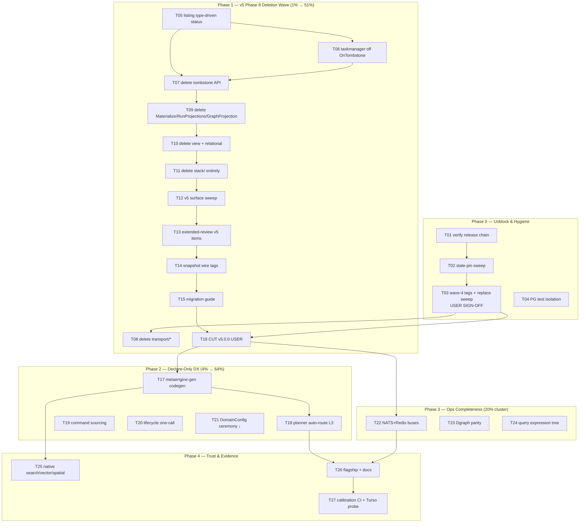

~~# GOAL-GAP-CLOSURE PARETO PLAN~~ **CORRECTION (2026-08-29):** Superseded by docs/planning/2026-08-27_17-35_ALL-TODOS-PARETO-PLAN.md (2026-08-27). — Closing the Distance to the metaengine/system End Goal

> **Date:** 2026-08-27 16:18 CEST · **Session:** "Research my end goal with metaengine/ and system/ → where are we furthest → make a plan"
> **Companion artifacts:** `2026-08-27_16-18_goal-gap-closure.d2` + `.svg` (execution graph) · `2026-08-27_16-18_GOAL-GAP-CLOSURE-PARETO-PLAN.html` (styled report)
> **Inputs:** AGENTS.md north star · ADR-0112/0116/0123/0124/0125/0126/0127 · ROADMAP.md · TODO_LIST.md (976 lines, full inventory 2026-08-27) · system/ + metaengine/ READMEs · `docs/planning/meta-engine-project-definition.md` · `docs/planning/keep-apps-off-db-layer.md` · `docs/adr/2026-08-17_system-v4-review-proposals.md`
> **Concurrent session warning:** a deep-full-code-review session is MID-FLIGHT (its status doc is `docs/status/2026-08-27_16-09_deep-full-code-review-midflight.md`; tree may carry its dirty files). Do NOT touch `cmd/cqrs-lint/main.go` or `idempotency/sqlstore/*` while it is active; coordinate before the v5 deletion wave.

---

## 0. The Goal (one paragraph, verified against source)

The developer declares ONLY Commands + Events + Queries and their relationships; the operator decides infrastructure at DEPLOYMENT time via `DeploymentConfig`; `system.System` (the single composition root) + `metaengine` (the cost-based, ES-native planner) derive everything else — projections, layouts, engine routing, indexes. Every engine serves every query (universal ADTs, degraded where needed); the planner **warns, never blocks**. App code never imports a storage backend. One composition root, one read-model API, zero storage-layer thinking.

## 1. Verified Current Distance (2026-08-27 — corrected against TODO_LIST, not stale reports)

| #  | Gap                                                                                                                                                                             | Status (verified)                                                                                                                                                                                                     | Distance                                          |
| -- | ------------------------------------------------------------------------------------------------------------------------------------------------------------------------------- | --------------------------------------------------------------------------------------------------------------------------------------------------------------------------------------------------------------------- | ------------------------------------------------- |
| D1 | **Split brain still shipped** — `stack.Bundle` + 8 presets, `Materialize`, `RelationalProjection`, `SQLViewStore`, `GraphProjection`, `RunProjections`, `transport/*` all alive | Deprecation markers shipped 2026-08-17; **v5 Phase 8 deletions NOT executed**                                                                                                                                         | FAR — but purely executional (12 known S/M tasks) |
| D2 | **Release hygiene** — wave-4 tags pending, replace directives (~19), stale pins, CI billing broken                                                                              | system/v4.5.0 wave (7 tags) landed 2026-08-18; cqrs-lint v4.7.0 tagged 2026-08-21; wave-4 (event/metadata/schema/metaengine/irohengine/projectionhost/storage) still outstanding + [BLOCKED-user] items               | MEDIUM — mixture of user-blocked and mechanical   |
| D3 | **Developer DX last mile** — "declare-only" is still "write folds + closures + Execute boilerplate"                                                                             | Layer 1 (`AutoCRUD`, `Infer`/`Override`) shipped; **Layer 2 codegen (`metaengine-gen`) and Layer 3 auto-route NOT built; command sourcing (ADR-0112 #4) NOT built; `system.WithCommandLifecycle` one-call NOT wired** | FARTHEST conceptually — this IS the promise       |
| D4 | **Ops/engine completeness**                                                                                                                                                     | NATS/Redis bus registration, Dgraph Snapshot/StreamLog, structured query tree (`query.Or/And/Gt`), native search/vector/spatial backends, iroh graph-edge replication, Turso CTE-probe test — all open                | MEDIUM — engines are the healthiest layer         |
| D5 | **Trust & evidence**                                                                                                                                                            | v5 migration guide (L) unwritten; no flagship example running on `system/`; skill refs still teach v1 tiers in places; PG integration isolation defect; calibration regression check un-gated                         | MEDIUM                                            |

**Corrections vs the 2026-08-27 morning analysis** (status reports are point-in-time): the system/ honesty cluster (Count-by-name, named buses, role wiring, reserved-config honesty, durability wiring) was **fixed 2026-08-18** with system/v4.5.0 shipped; bbolt E3 + turso E9 + system E10 were fixed by the concurrent deep-review session today. The remaining distance is concentrated in **D1 (execution), D3 (the real gap), D2 (shipping), D4/D5 (polish)**.

## 2. Pareto Breakdown

| Tier                 | Effort share                                | Goal-distance closed | What it is                                                                                                                                                                                                                                                                                                                             |
| -------------------- | ------------------------------------------- | -------------------- | -------------------------------------------------------------------------------------------------------------------------------------------------------------------------------------------------------------------------------------------------------------------------------------------------------------------------------------- |
| **1% → 51%**         | ~3 focused days (14 tasks, mostly deletion) | **51%**              | **Execute v5 Phase 8**: delete the v1 world (stack/, view, relational, GraphProjection, RunProjections, transport/*, tombstone metadata API, compat shells), write the migration guide, cut v5.0.0. All markers + prereqs are known; this converts "two stacks" into "the goal shape". Nothing else moves the goal this much per hour. |
| **4% → 64%**         | ~2 weeks (5 tracks)                         | **+13%**             | **Declare-only DX**: `metaengine-gen` Layer 2 codegen, planner Layer 3 auto-route (declared query → inferred projection, zero hand folds), command sourcing, `system.WithCommandLifecycle` one-call, `DomainConfig` ceremony reduction. This is the FARTHEST gap (D3) — and the second Pareto jump.                                    |
| **20% → 80%**        | ~3–4 weeks (6 tracks)                       | **+16%**             | **Ops completeness + trust**: NATS/Redis buses, Dgraph parity, structured query tree, native search/vector/spatial, flagship taskmanager-on-system example, calibration CI gate, docs/skill refresh.                                                                                                                                   |
| **Other 80% → 100%** | the long tail                               | **+20%**             | Release polish (GitHub Releases, retract-pattern doc, indirect-dep consolidation), lint-config audit, iroh edge convergence, PG isolation, environment-blocked items (macOS hardware, GH billing [user], mysql-nspawn [root], go-codec F46 [user], iroh P99 ratify [user]).                                                            |

## 3. Comprehensive Plan — Medium Granularity (27 tasks, 30–100 min each)

Sorted by importance/impact/effort/customer-value. Tier column = Pareto tier from §2. Effort in minutes.

| ID  | Task                                                                                                                                                                                                                  | Phase | Tier          | Effort | Impact                                 | Customer value                    |
| --- | --------------------------------------------------------------------------------------------------------------------------------------------------------------------------------------------------------------------- | ----- | ------------- | ------ | -------------------------------------- | --------------------------------- |
| T01 | Verify release-chain state: wave-4 tags outstanding?, `092b5e8a8` content on master?, TODO Release-section staleness, pebble/bbolt standalone builds                                                                  | 0     | tail-critical | 60     | unblocks T03                           | published consumers stop breaking |
| T02 | Repo-wide stale-pin sweep (~50 go.mod) + GOWORK=off standalone re-verify of leaf modules                                                                                                                              | 0     | tail-critical | 100    | kills pin-rot class                    | standalone builds green           |
| T03 | **[USER SIGN-OFF]** Cut wave-4 tags (event, metadata, schema, metaengine, irohengine, projectionhost, storage v4.7.2) + transport final v4.x, then replace-drop sweep                                                 | 0     | 1%            | 100    | ecosystem unblocked                    | every consumer can bump           |
| T04 | PG integration isolation: per-test database even under explicit DSN (`#integration-pg` shares one DB today)                                                                                                           | 0     | tail          | 30     | test honesty                           | no cross-package ghost events     |
| T05 | `listing`: type-driven status — replace `event.DetectTombstone` call (`listing/in_memory.go:155`) with event-type-driven status                                                                                       | 1     | 1%            | 100    | tombstone API becomes deletable        | ADR-0114 completion prereq        |
| T06 | Migrate `example/taskmanager` off `OnTombstone`/`OnRebirth` (branch on `evt.Type()`), regen golden                                                                                                                    | 1     | 1%            | 60     | prereq for T07/T09                     | flagship leads the migration      |
| T07 | Delete tombstone metadata API: `event.DetectTombstone`/`MarkTombstone`/`MarkRebirth`/`TombstoneStatus`/`Metadata.Tombstone`                                                                                           | 1     | 1%            | 60     | deletion is purely event-type-driven   | ADR-0114 done                     |
| T08 | Delete `transport/http` + `transport/grpc` (after final v4.x tags): drop from go.work/flake/api-stability, delete dirs, F030 stays as coaching                                                                        | 1     | 1%            | 60     | ADR-0127 done                          | watermill + go-sse only path      |
| T09 | Delete `stack.Materialize` (+tombstone bridge test), `stack.RunProjections`, `graph.GraphProjection`                                                                                                                  | 1     | 1%            | 60     | one projection runner (projectionhost) | one read API                      |
| T10 | Delete `storage/view` (SQLViewStore) + `storage/relational` (RelationalProjection); absorb concepts as engine internals                                                                                               | 1     | 1%            | 100    | v1 read tiers gone                     | auto-projection only path         |
| T11 | Delete `stack/` module entirely: Bundle + all 8 presets + stack/bench references; workspace/flake/api-stability cleanup                                                                                               | 1     | 1%            | 100    | **one composition root**               | system.New is THE entry point     |
| T12 | v5 surface sweep: ADR-0126 compat shells, `BuildWhereClause`, `record.StreamKey` rename, breaking `record.NewStreamRef` validation, remove `BusConfig.Mode`/`Subscribe`/`CacheConfig.Engine`                          | 1     | 1%            | 100    | honest API surface                     | no lying config                   |
| T13 | Extended-review v5 items: E1 (event Encoding → `record.Encoding`), E7 (RetryConfig collision), E8 (Message Kind enum), E11 (AdapterCore.Encode error), E13 (SQLTimerStore phantom param), E15 (middleware signatures) | 1     | 1%            | 100    | data-model debt cleared                | cleaner v5 surface                |
| T14 | Snapshot honest wire tags: pebble dual-read rename, bbolt struct tags, SQL ALTER TABLE + backfill migrations + `#integration-pg` verify                                                                               | 1     | 1%            | 100    | aggregate→stream vocabulary done       | consistent naming                 |
| T15 | Write v5 migration guide: before/after for every deleted tier incl. `relational → metaengine` (consumer-pulled)                                                                                                       | 1     | 1%            | 100    | consumers can migrate                  | trust                             |
| T16 | Cut v5.0.0: kvstore SA1019 decision, golden, CHANGELOG, README/SKILL rewrite, examples, full `#verify` gate **[tags need user]**                                                                                      | 1     | 1%            | 100    | **THE GOAL MILESTONE**                 | the unified library ships         |
| T17 | `metaengine-gen` (Layer 2 codegen): `cmd/metaengine-gen` AST-parses event/query structs → generates typed Store methods + folds                                                                                       | 2     | 4%            | 100    | declare-only DX core                   | no hand folds for the 80% case    |
| T18 | Planner auto-route Layer 3: declared query shape → inferred projection as DEFAULT path (explicit folds = override)                                                                                                    | 2     | 4%            | 100    | ADR-0116 completed                     | zero storage thinking             |
| T19 | Command sourcing: `CommandAwareFold` + command journal replay (what-if time travel, command audit projections)                                                                                                        | 2     | 4%            | 100    | ADR-0112 #4                            | audit + replay for free           |
| T20 | `system.WithCommandLifecycle(eventSink)` one-call + real retry middleware integration + version-tracking fix                                                                                                          | 2     | 4%            | 60     | ADR-0117 completed                     | DLQ/retry as events, one call     |
| T21 | `DomainConfig` ceremony reduction: convention-based registration (less closure boilerplate, auto-bind decider↔command)                                                                                                | 2     | 4%            | 100    | quickstart ~50 lines → ~15             | flagship DX                       |
| T22 | NATS + Redis bus driver registration: watermill backend wrappers + `BusConfig` driver names + integration tests                                                                                                       | 3     | 20%           | 100    | multi-process topologies               | operator choice real              |
| T23 | Dgraph parity: `SnapshotBackend` + `StreamLogBackend`                                                                                                                                                                 | 3     | 20%           | 100    | full system.Bundle integration         | graph engine first-class          |
| T24 | Structured query expression tree: `query.Or/And/Gt` composable tree (keep `RawWhere` as the 5% hatch)                                                                                                                 | 3     | 20%           | 100    | planner can reason over predicates     | typed filters everywhere          |
| T25 | Native search/vector/spatial backends: pg tsvector, PostGIS, DuckDB VSS (+ keep degraded fallbacks)                                                                                                                   | 3     | 20%           | 100    | universal ADTs at native speed         | no "Memory-only" asterisks        |
| T26 | Flagship: rebuild `example/taskmanager` on `system.System` + operator YAML; refresh SKILL references + README story                                                                                                   | 4     | 20%           | 100    | the vision, demonstrable               | proof the promise holds           |
| T27 | Calibration benchmark regression CI gate + Turso CTE-probe test                                                                                                                                                       | 4     | 20%           | 60     | cost model stays honest                | planner decisions stay calibrated |

**Phase 0+1 = the 1% cluster (16 tasks ≈ 17.5h) → 51% of goal. Phase 2 = the 4% cluster (5 tasks ≈ 8h planning + build) → +13%. Phases 3–4 = 20% cluster → +16%. Long tail → +20%.**

## 4. Detailed Plan — Fine Granularity (≤12 min per task)

Every medium task decomposed. Format: `ID · action (≤12min)`. Long-tail register follows in §5.

### Phase 0 — Unblock & Hygiene

- F01.1 · Run T01 checks: `git tag -l` vs TODO wave-4 list; diff master pins vs `491379a2b` content
- F01.2 · Probe pebble+bbolt `GOWORK=off go build` standalone; record RED/GREEN
- F01.3 · Correct stale TODO Release entries (stranded-commit item) with evidence; commit doc fix
- F01.4 · Write wave-4 tag plan (module order honoring tag-release.sh constraints) for user review
- F02.1 · Script: list all go.mod pins older than latest sibling tag (one-shot, /tmp)
- F02.2 · Bump core chain pins (event→metadata→record→id→schema→watermill consumers)
- F02.3 · Bump engine pins (10 engine modules + benchkit + stack/bench)
- F02.4 · `go mod tidy` + GOWORK=off `go build ./...` per swept module
- F02.5 · Run `nix run .#verify-ci` to mirror the CI matrix locally
- F03.1 · Run pre-tag checklist per module (`#vulncheck`, `#check-arch`, GOWORK=off tests incl. test subpackages)
- F03.2 · **[user]** Tag core batch: event, metadata, schema, projectionhost (order constraint)
- F03.3 · **[user]** Tag engine batch: metaengine, irohengine, storage v4.7.2
- F03.4 · **[user]** Tag transport/http + transport/grpc final v4.x (deprecation notices)
- F03.5 · Replace-drop sweep: remove ~19 local replaces, tidy, GOWORK=off re-verify each
- F04.1 · Reproduce `TestPostgresEventStore_CRUD` cross-contamination under explicit DSN
- F04.2 · Add per-test DB creation helper in pgtestcontainer path (CREATE DATABASE per test)
- F04.3 · Apply to storage pg_integration + rerun `#integration-pg`

### Phase 1 — v5 Phase 8 Deletion Wave (the 1% → 51%)

- F05.1 · Design `listing` type-driven status API (constructor takes delete/rebirth event types)
- F05.2 · Implement `StatusMiddleware`-successor on event types
- F05.3 · Replace `DetectTombstone` call at `listing/in_memory.go:155`
- F05.4 · Table tests: type-driven status vs old bridge (golden parity)
- F05.5 · Regen api-stability golden + doc-check + CHANGELOG entry
- F06.1 · Inventory taskmanager `OnTombstone`/`OnRebirth` usage
- F06.2 · Rewrite folds branching on `evt.Type()`
- F06.3 · `UPDATE_SNAPS=true` regen example goldens; run example tests
- F07.1 · Delete `event.DetectTombstone`/`MarkTombstone`/`MarkRebirth`
- F07.2 · Delete `TombstoneStatus` + `Metadata.Tombstone` + `event.TombstoneMark`
- F07.3 · Migrate last internal callers (listing bridge from F05 covers)
- F07.4 · Golden regen + CHANGELOG `### Removed` entry + skill refs sweep
- F08.1 · Remove transport/* from `go.work` `use`
- F08.2 · Remove from flake `testModules` + `cmd/api-stability` modules slice (meta-tests must pass)
- F08.3 · `git rm -r transport/` + delete stale lint/fixtures references
- F08.4 · Regen golden; run doc-check (FAQ/advanced.md transport sections rewrite)
- F09.1 · Delete `stack.Materialize` + `materialize_tombstone_bridge_test.go`
- F09.2 · Delete `stack.RunProjections`
- F09.3 · Delete `graph.GraphProjection` (graphadapter is the path)
- F09.4 · Fix internal refs; golden + CHANGELOG
- F10.1 · Delete `storage/view` (SQLViewStore, ViewMapper, AutoMapper)
- F10.2 · Delete `storage/relational` (RelationalProjection, ProjectionSink public API)
- F10.3 · Sweep consumers (examples, skill refs readmodels.md/advanced.md)
- F10.4 · Prune orphaned migrations DDL if view-only; golden + CHANGELOG
- F11.1 · Delete 8 stack presets (memory/sqlite/pebble/bbolt/postgres/mysql/turso/duckdb)
- F11.2 · Delete stack core (Bundle, Materialize remnants, durability tier docs → move to system/)
- F11.3 · Migrate/delete `stack/bench` gate entry (fold into cqrs-bench)
- F11.4 · Remove stack/* from go.work, flake testModules, api-stability list, TestEvery meta-tests
- F11.5 · Fix example/taskmanager + integration/ imports off stack
- F11.6 · Golden regen + CHANGELOG + AGENTS module-map update
- F12.1 · Delete ADR-0126 shells: `schema.VersionedStore`, `signing.Rejecting*`, `encryption.ErrInnerStoreNot*`, `metadata.CustomData`
- F12.2 · Delete `storage/sql.BuildWhereClause` (checked variant stays)
- F12.3 · `record.StreamRef` → `StreamKey` rename sweep (per v5-deprecation-sweep.md)
- F12.4 · Breaking `record.NewStreamRef(streamType, entityID) (StreamRef, error)` + migrate call sites
- F12.5 · Remove `BusConfig.Mode`, `InstanceConfig.Subscribe`, `CacheConfig.Engine` (documented reserved → deleted)
- F12.6 · Golden + CHANGELOG + system README config-table update
- F13.1 · E1: event envelope `Encoding` → `record.Encoding`
- F13.2 · E7: rename watermill/middleware `RetryConfig` collision
- F13.3 · E8: typed watermill Message `Kind` enum
- F13.4 · E11: `AdapterCore.Encode` returns error
- F13.5 · E13: drop `SQLTimerStore` phantom param
- F13.6 · E15: middleware signature unification pass
- F13.7 · Golden + CHANGELOG per module (same-edit rule)
- F14.1 · Pebble snapshot rename w/ dual-read (new tags, fallback old)
- F14.2 · bbolt struct-level tag rename (wire stays)
- F14.3 · SQL migrations: ALTER TABLE + backfill per dialect (postgres/sqlite/mysql/duckdb)
- F14.4 · `nix run .#integration-pg` over renamed schema; mysql via :33061
- F14.5 · Round-trip tests old-rows-readable; golden + CHANGELOG
- F15.1 · Migration guide skeleton (per-tier chapters mirroring ADR-0123 table)
- F15.2 · Chapter: stack preset → system.New (before/after full example)
- F15.3 · Chapter: Materialize/RunProjections → auto-projection + projectionhost
- F15.4 · Chapter: SQLViewStore/RelationalProjection → metaengine collections
- F15.5 · Chapter: GraphProjection → graphadapter; transport/* → watermill+go-sse
- F15.6 · doc-check pass; link from README + SKILL.md
- F16.1 · Decide kvstore SA1019: keep scoped exclusion (recommended) — record in ADR note
- F16.2 · CHANGELOG v5.0.0 section (Breaking Changed/Removed from all F07–F14 entries)
- F16.3 · README + SKILL.md v5 rewrite (quickstart = system.New; decision matrix update)
- F16.4 · Examples audit: all four examples on system/ (readme-quickstart regenerated)
- F16.5 · Full `nix run .#verify` exclusive run (no concurrent integration!)
- F16.6 · **[user]** Tag v5.0.0 wave via scripts/tag-release.sh + push

### Phase 2 — Declare-Only DX (the 4% → 64%)

- F17.1 · Scaffold `cmd/metaengine-gen` (flags: package in, out dir; AST load)
- F17.2 · Extract event/query struct field metadata (reuse reflection rules from AutoCRUD)
- F17.3 · Synthesize fold code (insert/update/delete per event-type suffix convention)
- F17.4 · Emit typed Store methods (`FindUser(ctx, store, FindUserInput)`)
- F17.5 · Golden tests for generated code (compiles + adttest parity)
- F17.6 · Recipe in SKILL references + cqrs-lint coaching rule for hand-folded replaceable cases
- F18.1 · Planner: infer projection shape from query input/result structs (Layer 3 skeleton)
- F18.2 · Wire inference as DEFAULT path in `Plan()` when no folds declared
- F18.3 · `Override` precedence + diagnostics (Doctor explains inference)
- F18.4 · adttest + scenario coverage for inferred projections
- F18.5 · Docs: "declare-only" recipe (events+queries only, zero folds)
- F19.1 · `CommandAwareFold` interface + dispatch in ApplyRecord path
- F19.2 · Command journal replay adapter (commandlifecycle Recorder → fold input)
- F19.3 · Example: command audit projection + DLQ projection over lifecycle stream
- F19.4 · What-if replay test (command+event fold order determinism)
- F19.5 · Golden + recipe docs
- F20.1 · Implement `system.WithCommandLifecycle(eventSink)` wiring Recorder middleware
- F20.2 · Integrate real retry middleware (decider middleware chain)
- F20.3 · Version-tracking fix in commandlifecycle projections
- F20.4 · E2E test: failing command → retry → DLQ projection, one-call setup
- F21.1 · Design convention registration (decider name from state type, command binding from handler signature)
- F21.2 · `RegisterDecider` auto-bind commands by stream type
- F21.3 · Reduce DomainConfig closure ceremony (declarative slices alternative)
- F21.4 · Rewrite system README quickstart to the new minimal form; measure line count
- F21.5 · Golden + SKILL core.md quickstart sync

### Phase 3 — Ops Completeness (20% cluster)

- F22.1 · watermill-nats backend wrapper module (`watermill/natsbackend`)
- F22.2 · watermill-redis wrapper (`watermill/redisbackend`)
- F22.3 · BusConfig driver registry names + construction errors (no silent fallback)
- F22.4 · YAML examples + config validation tests
- F22.5 · Integration: `#integration-redis` extends to bus suite; NATS ephemeral script
- F23.1 · Dgraph `SnapshotBackend` design (versioned predicates vs namespace) — spike note
- F23.2 · Implement SnapshotBackend
- F23.3 · Implement `StreamLogBackend` (stream-keyed log ops)
- F23.4 · adttest/enginetest parity + `#integration-dgraph` run
- F23.5 · system/ Dgraph bundle test (roles incl. snapshots)
- F24.1 · Define expression tree types (`query.Or/And/Not/Gt/Lt/Eq/In`)
- F24.2 · SQL pushdown mapping per dialect (json_extract / JSONB / generated cols)
- F24.3 · LSM/KV fallback mapping (decode+filter)
- F24.4 · Cross-engine parity tests (rapid property: tree ↔ equivalent flat conditions)
- F24.5 · Docs + deprecate flat `Conditions` at v5.1 (not now)

### Phase 4 — Trust & Evidence (20% cluster)

- F25.1 · pgengine tsvector SearchBackend (DDL + query)
- F25.2 · pgengine PostGIS SpatialBackend (opt-in extension detection)
- F25.3 · duckdbengine VSS VectorBackend (extension probe + fallback)
- F25.4 · Capability audit updates + planner WARN when degraded path chosen
- F25.5 · adttest parity (native vs fallback equivalence)
- F25.6 · ROADMAP/BENCHMARKS evidence entries
- F26.1 · Rebuild taskmanager composition root on system.New + deployment YAML
- F26.2 · Keep ServeSSE read path; verify watcher/LagPerProjection introspection
- F26.3 · SKILL references sweep: core.md/recipes.md/readmodels.md → v5-only paths
- F26.4 · README "Why system/" story + goal statement link
- F26.5 · doc-check + api-stability full pass
- F27.1 · Calibration regression script (baseline vs current, median ns/op)
- F27.2 · Wire into CI `regression` job alongside benchmark gate
- F27.3 · Turso CTE-probe test over remote protocol
- F27.4 · Update METAENGINE-LIVE-LATENCY-MODEL.md evidence tables

### Phase 5 — Long Tail (the other 80% of work → last 20% of goal)

- FL.1 · gh auth check + batch-create GitHub Releases for 2026-08-16/18/21 tag waves (curated notes for 8 core modules)
- FL.2 · CONTRIBUTING.md: retract-and-republish pattern documentation
- FL.3 · Consolidate transitive indirect dep refs (~49 consumer go.mod) after tags
- FL.4 · `.golangci.yml` exclusion audit: system (20 linters), cqrs-lint (17), metaengine (24) — remove what migrations unblocked
- FL.5 · iroh graph `WriteOp` convergence (edges replicate cross-peer) — design spike
- FL.6 · iroh edge convergence implementation + convergence-suite test
- FL.7 · macOS ephemeral-PG hardware verification **[blocked: hardware]**
- FL.8 · GitHub Actions billing fix **[blocked: user action — Billing & plans]**
- FL.9 · `nix run .#integration-mysql-nspawn` full app-level run **[blocked: root]**
- FL.10 · go-codec F46: commit+tag UnwrapDecode sniff; update alloc pins **[blocked: user repo]**
- FL.11 · Ratify iroh P99 bound 50→150ms **[blocked: user decision]**
- FL.12 · Pre-tag checklist hardening: fold into `scripts/tag-release.sh` (auto GOWORK=off test incl. subpackages)

## 5. Execution Graph

## 6. Risks & Guardrails

1. **Never break the build**: every deletion task runs `go build -tags "goexperiment.jsonv2" ./...` + module GOWORK=off build in the SAME task; golden regen same-edit (AGENTS procedures).
2. **Tags are user-authorized**: T03/F16.6/FL-items marked **[user]** — never tag/push modules without explicit instruction.
3. **Concurrent session**: the deep-review session owns `cmd/cqrs-lint/main.go` + `idempotency/sqlstore/*` right now — sequence Phase 0/1 after its closeout or coordinate.
4. **Respect the Declined list** (TODO_LIST §Declined): no `#verify-parallel` CI, no Redis _adapter_ (Redis _bus_ T22 is different and sanctioned by ADR-0123 `BusConfig`), no composite keys resurrection, no `WaitReady`.
5. **Deletion order matters**: listing (T05) before tombstone API (T07); Materialize deletion (T09) after taskmanager migration (T06); stack/ (T11) after view/relational (T10); everything before the cut (T16).
6. **Gates exclusively**: `#verify` runs alone (no concurrent integration suites — documented false-failure class).
7. **Verschlimmbesser-Protection**: this plan DELETES more than it adds; every deletion is already decisioned by accepted ADRs (0114, 0123, 0126, 0127) — zero new architecture invented here. Phase 2 items are the only new surface and each has an accepted ADR behind it (0116, 0112, 0117).
8. **Art-dupl gate**: deletions shrink the baseline; run `#check-duplication` after each phase, re-pin only on committed tree.

## 7. Verification Protocol (per medium task)

1. `go build -tags "goexperiment.jsonv2" ./...` (workspace) + module GOWORK=off build
2. Module tests `cd <module> && GOWORK=off go test ./... -count=1`
3. api-stability golden regen (same edit) + `TestEvery` meta-tests
4. CHANGELOG `[Unreleased]` entry (symbol honesty gate green)
5. After each phase: `nix run .#verify-fast`, before cut: `nix run .#verify` (exclusive window)

---

_Point-in-time snapshot. Living state: TODO_LIST.md. Harvest via docs-health HARVEST after execution approval._
