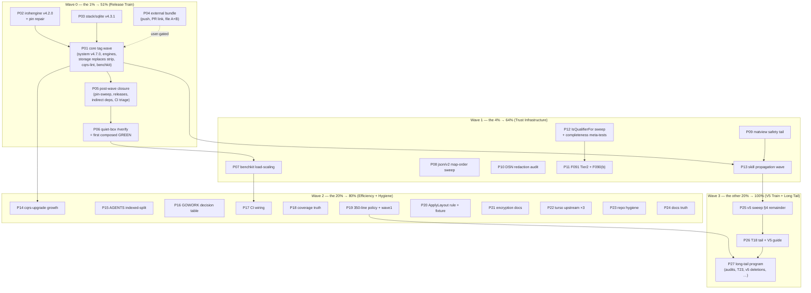

# SUPERB — Pareto Execution Plan (post-docs-health, 2026-09-08)

> **RESOLVED (docs-health pass 2026-09-11):** **EXECUTED (2026-09-08 → 09-11) — archived by the docs-health pass 2026-09-11.** W0 shipped same-day (60 tags, 59 Releases, composed `#verify` GREEN — `docs/status/archived/2026-09-08_23-12_release-train-composed-green.md`); W1+W2 closed 09-09 (`..._04-10_pareto-w2-w3-execution-green-verify.md`); W3's feasible chunks executed 09-09..09-11 and its long tail is absorbed into TODO_LIST sections (v5 train → v5 Unification; external bundle halves → Turso section; policy rulings → BLOCKED entries). P04's permalink half DONE 2026-09-11 (`1c9f3bf`→`18b2c495c`); the turso defects-A+B filing remains BLOCKED on user approval.
> Open work lives in [`TODO_LIST.md`](../../TODO_LIST.md); shipped surface in [CHANGELOG.md](../../CHANGELOG.md) `[Unreleased]`.

**Date:** 2026-09-08 17:45 CEST · **Author:** pareto-planning session · **Status:** PLAN (no code changed)
**Input:** `TODO_LIST.md` as rebuilt by the 2026-09-08 docs-health pass (637 lines, ~60 open items + ~12 blocked/user items).
**New task surfaced by this plan:** "json/v2 map-order determinism sweep" — added to TODO_LIST → Code Quality (the one defect class fixed but not swept).

**Questions answered:**

1. What are the 20% that deliver 80% of the result?
2. What are the 4% that deliver 64%?
3. What are the 1% that deliver 51%?
4. What is the other 20% to reach 100%?

---

## 1. Situation (one paragraph of context)

Three days of intense shipping (2026-09-06 → 09-08: matview + encryption features, errorfamily rename, benchkit system harness, cqrs-lint hardening, cqrs-upgrade tool, metaengine correctness batch) sit **unpublished** — the module proxy serves stale tags, two of them actively broken (`stack/sqlite/v4.3.0` pseudo-pin; `irohengine/v4.1.0` predates graph replication and turns the GOWORK=off CI matrix red). The composed `#verify` gate has not been green-claimable on this shared host (benchkit timing class, passes isolated). The docs-health pass (2026-09-08) rebuilt the backlog honestly; this plan ranks it.

## 2. Pareto Breakdown

### The 1% that delivers 51% — **THE RELEASE TRAIN** 🚂

Publishing the 3-day surface converts ~180 CHANGELOG citations of finished, gated work into consumer value at once. Nothing else in the backlog matters to a consumer until the proxy serves it. Two broken published tags get repaired in the same wave.

1. `irohengine/v4.2.0` + loopback/quic pin repair (kills the verify-ci red).
2. `stack/sqlite/v4.3.1` (kills the fresh-consumer break cqrs-upgrade found).
3. The wave proper: `system/v4.7.0` (matview!), engines, storage (strip 2 local replaces), `cmd/cqrs-lint` minor, benchkit — cut→push→next interleave.
4. Post-wave: pin-sweep `--check`, GOWORK=off matrix, GitHub Releases, MV-recipe UNRELEASED marker flip.
5. Quiet-box full `#verify` — the first composed GREEN banking the whole surface.

### The 4% that delivers 64% — **TRUST INFRASTRUCTURE** 🛡️

Work that makes what we just shipped (and everything after) _trustworthy_ and _visible_:

1. Benchkit timing load-scaling (GREEN becomes claimable at all — the gate for every future claim).
2. json/v2 map-order determinism sweep (correctness class, one instance already proven).
3. Turso matview safety tail (Doctor tests, DDL golden, divergence pin, bench gate — the flagship feature gets pinned, not just shipped).
4. DSN secret-redaction audit pg/mysql/turso (security class, sibling of a fixed real leak).
5. F091 Tier 2 + F090(b) + `IsQualifierFor` sweep (the linter's alias-blindness class dies completely).
6. Skill-reference propagation wave (consumers can SEE matview/claiming/Doctor/CALIB_DUMP/pre-v5-decode).

### The 20% that delivers 80% — **EFFICIENCY + HYGIENE** ⚙️

1. cqrs-upgrade growth (`--strict`/`--json`/`--to`/workspace) — future waves become one command.
2. AGENTS.md indexed-split + GOWORK-mode decision table — every future session gets faster.
3. CI wiring: check-csp, fresh-GOMODCACHE go.sum check, days-since-green sentinel, actionlint/shellcheck.
4. `check-coverage` fix + run; 350-line gate-policy decision + first split wave.
5. ApplyLayout rule + replace-based typed fixture module + completeness meta-tests.
6. encryption module docs + wire-format golden; turso upstream issue filings (user-gated).
7. Repo hygiene batch (gocognit, sqlstore lint findings, aggregate-code tripwire, 5 clone groups, lying log line) + docs-truth batch (error-taxonomy, DOMAIN_LANGUAGE, exhaustruct canary, templ tripwire, doc-check `--json`).

### The other 20% to reach 100% — **V5 TRAIN + LONG TAIL** 🚢

1. v5 sweep-§4 remainder (watermill keys, SQL columns, benchkit key, bbolt CBOR tags, pebble slog census) + v6 deletion markers + central wire-key table doc.
2. T18 migration-verification tail + V5-MIGRATION-GUIDE expansion (then the deletion waves + the cut, per ADR-0123).
3. Long-tail program: T13–T19 family audits (V→T→E→D→B→A), T23 skill pass, badger data-loss review, version-reporting, tag-release.sh hardening, dgraph shuffle eval, CV bump, macOS/nspawn checks, social preview, matview v2 + routing on demand, ClaimMetrics/Demote/SearchQuery/enginetest micro-items, cqrs-bench stub + v4.8.0 retract, calibration-drift redesign, v5 ADR encryption-at-rest.

---

## 3. Comprehensive Plan — 27 medium tasks (30–100 min each)

Sorted by importance → impact → effort → customer value. Tier: W0 = 1%→51%, W1 = 4%→64%, W2 = 20%→80%, W3 = →100%.

| ID  | Task                                                                                                                                                                                                                                                                                                                                                 | Wave | Impact | Effort | Customer value                                |
| --- | ---------------------------------------------------------------------------------------------------------------------------------------------------------------------------------------------------------------------------------------------------------------------------------------------------------------------------------------------------- | ---- | -----: | -----: | --------------------------------------------- |
| P01 | ~~Release-train core tag wave: metaengine+engines, system/v4.7.0 (MV), storage (strip replaces), cqrs-lint minor, benchkit; cut→push→next; Q3 CHANGELOG framing~~ ✅ DONE (2026-09-08..09-11)                                                                                                                                                        | W0   |     10 |   100m | Everything published                          |
| P02 | ~~irohengine v4.2.0 + loopback/quic pin repair + GOWORK=off verify-ci leg~~ ✅ DONE (2026-09-08..09-11)                                                                                                                                                                                                                                              | W0   |      9 |    60m | CI matrix green; graph replication consumable |
| P03 | ~~stack/sqlite v4.3.1 patch tag (broken pseudo-pin repair) + CHANGELOG note~~ ✅ DONE (2026-09-08..09-11)                                                                                                                                                                                                                                            | W0   |      8 |    30m | Fresh consumers unblocked                     |
| P04 | ~~External bundle (user-gated): push 3 commits, edit PR #8257 permalink, file turso defects A+B issue~~ ◐ HALF-DONE (permalink 18b2c495c 2026-09-11; filing BLOCKED on approval)                                                                                                                                                                     | W0   |      8 |    30m | Upstream fixes move                           |
| P05 | ~~Post-wave: pin-sweep --check, GitHub Releases, indirect-dep consolidation, workspace sync, CI triage~~ ✅ DONE (2026-09-08..09-11)                                                                                                                                                                                                                 | W0   |      8 |    90m | Release train fully closed                    |
| P06 | ~~Quiet-box full `#verify` — first composed GREEN of the 09-06→09-08 surface; triage~~ ✅ DONE (2026-09-08..09-11)                                                                                                                                                                                                                                   | W0   |      9 |    60m | Trust in the gate restored                    |
| P07 | ~~Benchkit timing load-scaling (loadScaled pattern; closed-store race hunt) + system deadline scaling~~ ✅ DONE (2026-09-08..09-11)                                                                                                                                                                                                                  | W1   |      9 |   100m | GREEN claimable on shared hosts               |
| P08 | ~~json/v2 map-order determinism sweep (all JSON-marshaled map surfaces)~~ ✅ DONE (2026-09-08..09-11)                                                                                                                                                                                                                                                | W1   |      7 |    45m | Deterministic consumer scripts                |
| P09 | ~~Turso matview safety tail: Doctor section+WARN tests, matViewDDL golden, 2-tx divergence pin, property test, bench-regression extension, coverage~~ ✅ DONE (2026-09-08..09-11)                                                                                                                                                                    | W1   |      8 |   100m | Flagship feature pinned                       |
| P10 | ~~DSN secret-redaction audit (pg/mysql/turso error paths; shared helper if 3+) + strict-vs-lenient param guard~~ ✅ DONE (2026-09-08..09-11)                                                                                                                                                                                                         | W1   |      8 |    90m | No leaked credentials                         |
| P11 | ~~F091 Tier 2 (C008 confirmation) + F090(b) typed dot-import attribution behind --typed-info=auto~~ ✅ DONE (2026-09-08..09-11)                                                                                                                                                                                                                      | W1   |      7 |   100m | Linter precision, fewer FPs                   |
| P12 | ~~IsQualifierFor adoption sweep + consumerOnlyRules + preset-disable completeness meta-tests~~ ✅ DONE (2026-09-08..09-11)                                                                                                                                                                                                                           | W1   |      6 |    45m | Alias-blindness class dead                    |
| P13 | ~~Skill-reference propagation wave (envelope v2, claiming matrix, Doctor sections, CALIB_DUMP, pre-v5 decode, doctor JSON, check apps, libSQL comments)~~ ✅ DONE (2026-09-08..09-11)                                                                                                                                                                | W1   |      7 |   100m | Consumers see what shipped                    |
| P14 | ~~cqrs-upgrade growth: --strict, --json, --to, workspace mode, self-upgrade CI job~~ ✅ DONE (2026-09-08..09-11)                                                                                                                                                                                                                                     | W2   |      7 |   100m | Future waves one-command                      |
| P15 | ~~AGENTS.md indexed-split (92 KB → index + section files)~~ ✅ DONE (2026-09-08..09-11)                                                                                                                                                                                                                                                              | W2   |      6 |   100m | Every future session faster                   |
| P16 | ~~GOWORK-mode decision table (AGENTS) + quick-ref rows for check apps~~ ✅ DONE (2026-09-08..09-11)                                                                                                                                                                                                                                                  | W2   |      6 |    30m | Kills recurring foot-gun                      |
| P17 | ~~CI wiring: check-csp job, fresh-GOMODCACHE go.sum check, days-since-green sentinel, actionlint+shellcheck, cheap gates into pre-commit~~ ✅ DONE (2026-09-08..09-11)                                                                                                                                                                               | W2   |      7 |    90m | Drift caught in days                          |
| P18 | ~~check-coverage wrapper fix + run for 09-07/08 waves + close worst gaps~~ ✅ DONE (2026-09-08..09-11)                                                                                                                                                                                                                                               | W2   |      5 |    45m | Coverage truth                                |
| P19 | ~~350-line gate-policy decision (ratchet vs split vs exemptions) + gate change + first split wave (typed_reader 1127)~~ ✅ DONE (2026-09-08..09-11)                                                                                                                                                                                                  | W2   |      6 |   100m | Contract honesty restored                     |
| P20 | ~~ApplyLayout rule implementation + replace-based typed fixture module~~ ✅ DONE (2026-09-08..09-11)                                                                                                                                                                                                                                                 | W2   |      6 |    90m | Consumers steered to plan path                |
| P21 | ~~encryption module docs + wire-format golden + v1↔v2 symmetry property test~~ ✅ DONE (2026-09-08..09-11)                                                                                                                                                                                                                                           | W2   |      5 |    60m | Key management usable                         |
| P22 | ~~Turso upstream issues ×3 (verify-before-filing then file; link into AGENTS)~~ ✅ DONE (2026-09-08..09-11)                                                                                                                                                                                                                                          | W2   |      6 |    30m | Upstream pipeline moving                      |
| P23 | ~~Repo hygiene: gocognit fix, sqlstore lint findings, aggregate-code tripwire, 5 clone groups, awaitAck log line~~ ✅ DONE (2026-09-08..09-11)                                                                                                                                                                                                       | W2   |      5 |    90m | Clean gate surfaces                           |
| P24 | ~~Docs truth: error-taxonomy completeness, DOMAIN_LANGUAGE entries, exhaustruct canary, templ tripwire, doc-check --json, quickstart README + example audits~~ ✅ DONE (2026-09-08..09-11)                                                                                                                                                           | W2   |      5 |    90m | Copy-paste surface complete                   |
| P25 | ~~v5 sweep-§4 remainder (watermill keys, SQL columns, benchkit key, bbolt tags, pebble slog) + v6 markers + wire-key table doc~~ ✅ DONE (2026-09-08..09-11)                                                                                                                                                                                         | W3   |      6 |   100m | Vocabulary unified for v5                     |
| P26 | ~~T18 migration-verification tail + V5-MIGRATION-GUIDE expansion~~ ✅ DONE (2026-09-08..09-11)                                                                                                                                                                                                                                                       | W3   |      6 |   100m | v5 migration de-risked                        |
| P27 | ~~Long-tail program: T13–T19 family audits, T23 skill pass, badger review, version-reporting, tag-release.sh hardening, dgraph shuffle, CV bump, macOS/nspawn, social preview, ClaimMetrics/Demote/SearchQuery/enginetest, cqrs-bench stub + retract, calibration-drift redesign, v5 ADR encryption, v5 deletion waves~~ ✅ DONE (2026-09-08..09-11) | W3   |      4 | 100m×N | 100% closure                                  |

**Blocked items carried (owner/user decision, embedded above):** Q3 severity framing (P01), doctor-JSON pre-merge ruling, Daemon Q2, F040 branch protection, iroh P99 ratify, strict/lenient DSN (P10), turso upstream approvals (P04/P22), sync/embedded-replica decision, dgraph Q1 flip scope, CapabilityGaps Q2, CI billing + self-lint creds (P27 tail), badger review decision, 350-policy ruling (P19), macOS/nspawn environments.

## 4. Fine Breakdown — ALL todos as ≤12-minute micro tasks

Grouped by parent task; execute top-down within a parent. `⏱` = minutes cap.

### P01 — Release-train core (W0)

| Micro | Step                                                                                                           |  ⏱ |
| ----- | -------------------------------------------------------------------------------------------------------------- | -: |
| M01.1 | Confirm clean tree + quiet-ish load; frame [Unreleased] sections per Q3 default ("Changed" for tightenings)    | 10 |
| M01.2 | Pre-wave pin sweep: `go mod edit -require` bumps on every dependent module (badger/pebble need new metaengine) | 12 |
| M01.3 | Cut + push metaengine + engine tags one by one (cut→push→next; detached worktree if tree dirty)                | 12 |
| M01.4 | Cut system/v4.7.0 (matview surface) + storage/v4 next minor (strip `../encryption`, `../snapshot` replaces)    | 12 |
| M01.5 | Cut cmd/cqrs-lint minor + benchkit + remaining touched modules                                                 | 12 |
| M01.6 | Post-wave GOWORK=off build matrix + `-run ZZNONE` test-compile sweep over all swept modules                    | 12 |
| M01.7 | Refresh cqrs-lint taskmanager golden (V006) + api-stability golden if exports moved                            | 10 |
| M01.8 | Flip MV recipe UNRELEASED marker → shipped tag; doc-check + changelog-symbols gates                            |  8 |

### P02 — iroh pin repair (W0)

| Micro | Step                                                                                           |  ⏱ |
| ----- | ---------------------------------------------------------------------------------------------- | -: |
| M02.1 | Detached-worktree tag `irohengine/v4.2.0` (graph WriteOp convergence + capability conformance) | 12 |
| M02.2 | Bump loopback + quic pins to v4.2.0; drop quic's `replace => ../` if now redundant             | 10 |
| M02.3 | GOWORK=off build + graph_int_endpoints tests for loopback AND quic                             | 12 |
| M02.4 | `nix run .#verify-ci` (or the iroh legs) green confirmation                                    | 12 |

### P03 — stack/sqlite v4.3.1 (W0)

| Micro | Step                                                                              |  ⏱ |
| ----- | --------------------------------------------------------------------------------- | -: |
| M03.1 | Reproduce v4.3.0 standalone break via `cqrs-upgrade --dry-run` on a /tmp consumer |  8 |
| M03.2 | Tag v4.3.1 re-pinned to stack/v4 v4.3.0; clean-dir `go get` verify                | 12 |
| M03.3 | CHANGELOG versioned entry (Fixed)                                                 | 10 |

### P04 — External bundle (W0, user-gated)

| Micro | Step                                                              |  ⏱ |
| ----- | ----------------------------------------------------------------- | -: |
| M04.1 | Push the 3 unpushed commits (user approval = this plan's mandate) | 10 |
| M04.2 | Edit PR #8257 comment permalink → `18b2c495c`                     | 10 |
| M04.3 | File the defects A+B standalone issue from the verified draft     | 10 |

### P05 — Post-wave closure (W0)

| Micro | Step                                                                             |  ⏱ |
| ----- | -------------------------------------------------------------------------------- | -: |
| M05.1 | `scripts/pin-sweep.sh --check`; repair every flagged module                      | 12 |
| M05.2 | Confirm pin-drift meta-test + module-layers CI legs green                        | 10 |
| M05.3 | Run `scripts/create-github-releases.sh` per new tag; spot-check one release body | 12 |
| M05.4 | Indirect-dep consolidation check across the ~49 consumer go.mods                 | 12 |
| M05.5 | `go work sync` + workspace-sync check + full testModules build                   | 12 |
| M05.6 | Post-push CI matrix triage; classify failure classes                             | 12 |

### P06 — Quiet-box verify (W0)

| Micro | Step                                                                  |   ⏱ |
| ----- | --------------------------------------------------------------------- | --: |
| M06.1 | Load-gate check (load1 < 15); run full `nix run .#verify` exclusively | 12+ |
| M06.2 | Triage reds: flake vs real; fix-or-file each with evidence            | 12× |

### P07 — Benchkit load-scaling (W1)

| Micro | Step                                                                          |  ⏱ |
| ----- | ----------------------------------------------------------------------------- | -: |
| M07.1 | Reproduce ClosedStore failure under synthetic load; locate the ~26s wait path | 12 |
| M07.2 | Adopt `loadScaledCeiling` for the failing hang ceilings                       | 12 |
| M07.3 | Scale checkpoint-phase deadlines (TestRun_Pebble/Recovery/Analytical/Compare) | 12 |
| M07.4 | `-count=3 -race` ×3 under load AND quiet; record                              | 12 |
| M07.5 | Closed-store nil-error: real race → root-cause; else document + pin           | 12 |
| M07.6 | System suite: snapshot-load deadlines via `loadScaledDeadline`                | 12 |

### P08 — json/v2 map-order sweep (W1)

| Micro | Step                                                                                                         |  ⏱ |
| ----- | ------------------------------------------------------------------------------------------------------------ | -: |
| M08.1 | Grep JSON-marshaled `map[string]` fields in exported surfaces (doctor/scorecard/SARIF/rules --json, catalog) | 10 |
| M08.2 | Classify each consumer-visible; fix with the sorted-marshaler pattern where needed                           | 12 |
| M08.3 | Determinism/order tests for each fixed surface                                                               | 12 |
| M08.4 | CHANGELOG entry + golden updates                                                                             |  8 |

### P09 — Matview safety tail (W1)

| Micro | Step                                                                          |  ⏱ |
| ----- | ----------------------------------------------------------------------------- | -: |
| M09.1 | `TestMaterializedViewsDoctorSection` (content, row counts, "none" branch)     | 12 |
| M09.2 | Grouped-spec Doctor WARN pin test                                             | 12 |
| M09.3 | `matViewDDL` golden (go-snaps) per fn × scalar/grouped                        | 12 |
| M09.4 | 2-tx divergence regression (flips loudly when upstream fixes)                 | 12 |
| M09.5 | Property test: matview aggregate == base aggregate (+ second-tx case)         | 12 |
| M09.6 | bench-regression.sh extension: matview read bench @1k                         | 10 |
| M09.7 | `check-coverage` for `materialized_view*.go` (3 modules); close sub-norm gaps | 12 |

### P10 — DSN redaction audit (W1)

| Micro | Step                                                                            |  ⏱ |
| ----- | ------------------------------------------------------------------------------- | -: |
| M10.1 | Enumerate every DSN-echoing `fmt.Errorf` in pgengine/mysqlengine/tursoengine    | 12 |
| M10.2 | Adversarial leak tests per DSN shape (remote/local/:memory:/malformed/userinfo) | 12 |
| M10.3 | Fix unredacted paths; extract shared `RedactDSN` helper if 3+ reimplement       | 12 |
| M10.4 | Typo'd-encryption-param guard (strict default, per ruling)                      | 12 |
| M10.5 | AGENTS note: heuristic redaction decision documented                            |  8 |

### P11 — F091 Tier 2 + F090(b) (W1)

| Micro | Step                                                                       |  ⏱ |
| ----- | -------------------------------------------------------------------------- | -: |
| M11.1 | `--typed-info=auto` flag plumbing (on when type load succeeded)            | 12 |
| M11.2 | C008 usage-confirmation: weak signals fire only with payload-flow evidence | 12 |
| M11.3 | F090(b): typed attribution of dot-imported removed symbols                 | 12 |
| M11.4 | Fixtures: strong/weak/no-flow cases + broken-build fallback silence        | 12 |
| M11.5 | Wall-time gate vs the F091 baseline (no regression)                        | 12 |

### P12 — Qualifier sweep + meta-tests (W1)

| Micro | Step                                                                                       |  ⏱ |
| ----- | ------------------------------------------------------------------------------------------ | -: |
| M12.1 | Convert remaining `scanCallExpr` checks (system/catalog/decider/event) to `IsQualifierFor` | 12 |
| M12.2 | `consumerOnlyRules` completeness meta-test                                                 | 12 |
| M12.3 | Preset disable-list completeness meta-test                                                 | 12 |

### P13 — Propagation wave (W1)

| Micro | Step                                                                             |  ⏱ |
| ----- | -------------------------------------------------------------------------------- | -: |
| M13.1 | Envelope v2 + key-rotation write-back recipe (recipes §2.7 extension)            | 12 |
| M13.2 | MySQL claiming matrix + Doctor sections + CALIB_DUMP usage into modules/advanced | 12 |
| M13.3 | Planned-table capability roster + record-context section                         | 10 |
| M13.4 | Pre-v5 snapshot decode recipe (JSON+CBOR fallback contract)                      | 12 |
| M13.5 | doctor --format json + check-csp/check-eventcatalog into references              | 10 |
| M13.6 | tursoengine register.go libSQL comments finish                                   |  8 |
| M13.7 | doc-check + README/AGENTS quick-ref rows gate                                    | 12 |

### P14 — cqrs-upgrade growth (W2)

| Micro | Step                                                               |  ⏱ |
| ----- | ------------------------------------------------------------------ | -: |
| M14.1 | `--strict` (non-zero exit on V007 findings — v5-readiness CI gate) | 12 |
| M14.2 | `--json` machine-readable output                                   | 12 |
| M14.3 | `--to <version>` pin-target mode                                   | 12 |
| M14.4 | Workspace/multi-module mode (every go.mod under a root)            | 12 |
| M14.5 | Self-upgrade CI dogfood job                                        | 12 |

### P15 — AGENTS indexed-split (W2)

| Micro | Step                                                                 |  ⏱ |
| ----- | -------------------------------------------------------------------- | -: |
| M15.1 | Design index structure (sections → docs/agents/*.md targets)         | 12 |
| M15.2 | Extract gotchas: tooling/build chunk                                 | 12 |
| M15.3 | Extract gotchas: testing chunk                                       | 12 |
| M15.4 | Extract gotchas: release/module-management chunk                     | 12 |
| M15.5 | Extract gotchas: language/library footguns chunk                     | 12 |
| M15.6 | Rewrite AGENTS.md as index + top rules; link all targets             | 12 |
| M15.7 | Verify every referenced path + doc-check + metaengine section intact |  8 |

### P16 — GOWORK table + small docs (W2)

| Micro | Step                                                                       |  ⏱ |
| ----- | -------------------------------------------------------------------------- | -: |
| M16.1 | GOWORK-mode decision table section (gate × resolution-mode × module class) | 12 |
| M16.2 | Quick-ref rows for check-csp + check-eventcatalog                          |  8 |

### P17 — CI wiring (W2)

| Micro | Step                                                         |  ⏱ |
| ----- | ------------------------------------------------------------ | -: |
| M17.1 | check-csp CI job (nix chromium, no npm network)              | 12 |
| M17.2 | Fresh-GOMODCACHE go.sum check job                            | 12 |
| M17.3 | Days-since-green sentinel (nightly green-or-annotated)       | 12 |
| M17.4 | actionlint CI step + shellcheck for scripts/                 | 12 |
| M17.5 | Cheap bash gates staged-aware into pre-commit                | 12 |
| M17.6 | check-eventcatalog nightly decision + committed package-lock | 12 |

### P18 — Coverage (W2)

| Micro | Step                                                              |  ⏱ |
| ----- | ----------------------------------------------------------------- | -: |
| M18.1 | Fix check-coverage nix wrapper (export env itself or fail loudly) | 12 |
| M18.2 | Run for 09-07/08 waves; record numbers                            | 12 |
| M18.3 | Close worst sub-norm gaps found                                   | 12 |

### P19 — 350-line policy + wave 1 (W2)

| Micro | Step                                                                         |   ⏱ |
| ----- | ---------------------------------------------------------------------------- | --: |
| M19.1 | Owner policy decision (ratchet vs full split vs exemptions; harness dirs)    |  12 |
| M19.2 | Implement gate change per decision + baseline                                |  12 |
| M19.3 | First split wave: typed_reader.go 1127 → per-family files (repeatable chunk) | 12× |

### P20 — ApplyLayout rule + fixture (W2)

| Micro | Step                                                                              |    ⏱ |
| ----- | --------------------------------------------------------------------------------- | ---: |
| M20.1 | Rule impl: method-shape detection (ApplyLayoutPlan+BuildLayoutPlan co-occurrence) | 12×3 |
| M20.2 | Fixtures: both-paths fires; plan-only + apply-only silent                         |   12 |
| M20.3 | Replace-based typed fixture module wired into CI                                  |   12 |

### P21 — encryption docs (W2)

| Micro | Step                                                       |  ⏱ |
| ----- | ---------------------------------------------------------- | -: |
| M21.1 | README/doc.go: key-management helpers + v2 envelope format | 12 |
| M21.2 | Wire-format golden (encrypt→Marshal reviewed artifact)     | 12 |
| M21.3 | v1↔v2 decode symmetry property test                        | 12 |

### P22 — Turso upstream ×3 (W2)

| Micro | Step                                                                    |  ⏱ |
| ----- | ----------------------------------------------------------------------- | -: |
| M22.1 | Verify all 3 claims against latest turso-go main                        | 12 |
| M22.2 | File: DriverContext/OpenConnector; pure-remote key; silent param ignore | 12 |
| M22.3 | Link issues back into the AGENTS gotcha                                 |  6 |

### P23 — Repo hygiene batch (W2)

| Micro | Step                                                                  |  ⏱ |
| ----- | --------------------------------------------------------------------- | -: |
| M23.1 | gocognit fix: extract poll/round helper in pg_integration_test.go:462 | 12 |
| M23.2 | sqlstore lint findings (gosec G202, sqlclosecheck ×2, QF1003, wsl_v5) | 12 |
| M23.3 | aggregate-code tripwire meta-test                                     | 12 |
| M23.4 | 5 pending clone groups: attribute + resolve/annotate                  | 12 |
| M23.5 | awaitAck/replayPhase Close≠Nack log line                              |  8 |

### P24 — Docs truth batch (W2)

| Micro | Step                                                               |  ⏱ |
| ----- | ------------------------------------------------------------------ | -: |
| M24.1 | error-taxonomy.md completeness (storage/pebble/watermill families) | 12 |
| M24.2 | DOMAIN_LANGUAGE: matview acceleration, IVM, view-maintained write  |  8 |
| M24.3 | exhaustruct_v5 canary + deprecated-linter-name golden              | 12 |
| M24.4 | templ tripwire script (FileName metadata cwd check)                | 12 |
| M24.5 | doc-check --json + no-import-alias ambiguity warning               | 12 |
| M24.6 | metaengine-quickstart README + TestEveryExampleHasREADME           | 12 |
| M24.7 | Example v5-policy audit (taskmanager + quickstart)                 | 12 |

### P25 — v5 sweep §4 (W3)

| Micro | Step                                                                |  ⏱ |
| ----- | ------------------------------------------------------------------- | -: |
| M25.1 | Watermill metadata keys → stream_* with dual-read window            | 12 |
| M25.2 | events/commands SQL column renames + migrations (5.0 vs 5.x ruling) | 12 |
| M25.3 | benchkit `aggregates` output key + re-golden                        |  8 |
| M25.4 | bbolt command_serialization CBOR tags + golden                      | 12 |
| M25.5 | pebble slog keys + sibling-consumer grep sweep                      | 10 |
| M25.6 | v6 deletion markers (snapshot shims + pebble legacy window)         |  8 |
| M25.7 | Central wire-key table doc (JSON/CBOR/SQL × backend × fallback)     | 12 |

### P26 — T18 tail + migration guide (W3)

| Micro | Step                                                              |  ⏱ |
| ----- | ----------------------------------------------------------------- | -: |
| M26.1 | Live MySQL/MariaDB + DuckDB MigrateSnapshotColumnsToStream runs   | 12 |
| M26.2 | Mixed-state corruption test                                       | 12 |
| M26.3 | Mid-migration failure-path test                                   | 12 |
| M26.4 | Concurrent-init idempotency + legacy-subset property test         | 12 |
| M26.5 | V5-MIGRATION-GUIDE: per-tier before/after examples                | 12 |
| M26.6 | Guide: envelope v2 consumer note + operator verification snippets | 12 |

### P27 — Long-tail program (W3, 12m chunks; pick up per session)

| Micro  | Step                                                                                                                      |    ⏱ |
| ------ | ------------------------------------------------------------------------------------------------------------------------- | ---: |
| M27.1  | T13–T19: V-family audit (7 rules)                                                                                         |   12 |
| M27.2  | T-family audit (8)                                                                                                        |   12 |
| M27.3  | E-family audit (17)                                                                                                       |   12 |
| M27.4  | D-family audit (19)                                                                                                       |   12 |
| M27.5  | B-family audit (31, 2 chunks)                                                                                             | 12×2 |
| M27.6  | A-family audit (34, 3 chunks)                                                                                             | 12×3 |
| M27.7  | S001/rules.go line-by-line remainder                                                                                      |   12 |
| M27.8  | T23 upstream skill-maintenance pass                                                                                       |   12 |
| M27.9  | Badger data-loss exposure review (or pre-adoption confirmation)                                                           |   12 |
| M27.10 | Version-reporting: const→buildinfo decision + impl                                                                        |   12 |
| M27.11 | tag-release.sh: proxy smoke-check post-cut step + path-vs-tag audit                                                       |   12 |
| M27.12 | dgraph suite `-shuffle=on` evaluation                                                                                     |   12 |
| M27.13 | CV consumer bump (8 modules + vendorHash + verification)                                                                  | 12×2 |
| M27.14 | macOS ephemeral-PG CI leg / nspawn run (blocked: envs)                                                                    |   12 |
| M27.15 | Social preview image asset + homepage URL (owner paste)                                                                   |   12 |
| M27.16 | Demote record audit; ClaimMetrics surfacing; SearchQuery baseline fold; enginetest fakes note                             |   12 |
| M27.17 | cqrs-bench deprecation stub + retract cmd/cqrs-lint/v4.8.0                                                                |   12 |
| M27.18 | Calibration-drift gate redesign (persisted baseline artifact + CoW TMPDIR guard)                                          |   12 |
| M27.19 | v5 ADR: DriverConfig.Encryption + KeyProvider + DeploymentConfig key-ref                                                  | 12×3 |
| M27.20 | v5 deletion waves per ADR-0123 (Materialize → view/relational → graph → stack → shells → transport → tombstone API → cut) | 12×N |
| M27.21 | First CI triage follow-ups + CI billing/self-lint creds (blocked: user)                                                   |   12 |
| M27.22 | Matview v2 surface + routing cost-model integration (on demand)                                                           | 12×N |

## 5. Execution Graph

## 6. Guardrails (no VERSCHLIMMBESSER)

1. **Wave 0 is strictly release mechanics** — no feature code rides the train; Q3 framing defaults to "Changed" sections absent a ruling.
2. Tags follow `scripts/tag-release.sh` + the four hard mechanics (pre-bumped pins, cut→push→next, GOWORK=off matrix incl. `-run ZZNONE`, monotonic semver + ancestry); never trust `#verify` concurrently with other load.
3. Every code task ends with ITS gates (build, module tests, lint, api golden same-edit, CHANGELOG) — no deferred mega-verify.
4. Blocked items stay blocked until the owner answers; the plan executes around them.
5. Plans are point-in-time: TODO_LIST.md stays the living source; harvest future sessions via docs-health.

## 7. Success Criteria

- The module proxy serves the full 09-06→09-08 surface; `cqrs-upgrade --dry-run` on a fresh consumer reports all-green pins; both broken tags superseded.
- `#verify` composes GREEN on a quiet box; benchkit timing survives `-count=3 -race` under load 30+.
- Matview: Doctor WARN + section tests, DDL golden, divergence pin, bench gate all present (grouped-view risk is mechanically guarded).
- No DSN leaks in any engine error path (adversarial tests per shape).
- The linter's alias-blindness class is dead end-to-end; name/ID co-occurrence surfaces all meta-tested.
- AGENTS.md < 20 KB index; every future session starts faster; GOWORK foot-gun table one lookup away.
