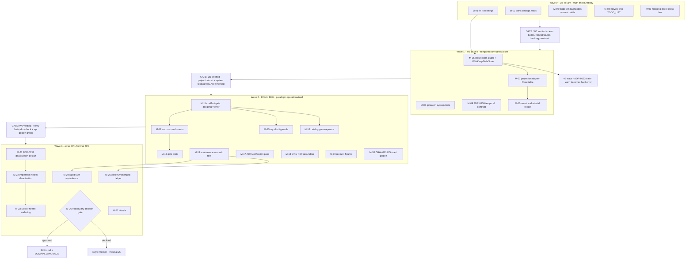

# SUPERB Pareto Execution Plan — Cordis Paradigm Follow-Ups

> **RESOLVED (docs-health pass 2026-09-11):** **EXECUTED IN FULL (2026-09-10, Waves 0-3) — archived by the docs-health pass 2026-09-11.** All 27 tasks (M-01..M-27) shipped and verified (verify-fast GREEN end-to-end, doc-check 1042 refs, api golden 6773): see `docs/status/archived/2026-09-10_23-35_cordis-all-27-done.md` + `2026-09-11_00-04_cordis-closed-verify-green.md`. Shipped surface lives in CHANGELOG `[Unreleased]`; the follow-ups the execution surfaced live in the TODO_LIST Cordis section. The micro-task tables below decompose the same 27 tasks (their resolution follows the parent row).
> Open work lives in [`TODO_LIST.md`](../../TODO_LIST.md); shipped surface in [CHANGELOG.md](../../CHANGELOG.md) `[Unreleased]`.

> **When:** 2026-09-10 08:10 · **Input:** `docs/status/2026-09-10_08-04_cordis-paradigm-mapping-session.md` §f (50 items) + §g open questions
> **Goal:** Operationalize the Cordis learnings (revertible effects, reactive coeffects, observational equivalence) as correctness + trust wins for go-cqrs-lite — **without breaking a single v4 consumer**.
> **Guardrail:** No Verschlimmbesserung. Every behavior change is warn-first in v4.x, hard at v5 (rides the existing ADR-0123 wave). Every task ends at a verify gate (GOWORK=off module tests / doc-check / api-stability + CHANGELOG when API moves).

## 0. Decisions baked in (autonomous defaults for the 3 open questions — all reversible)

| Question                            | Default                                                        | Why                                                                                         |
| ----------------------------------- | -------------------------------------------------------------- | ------------------------------------------------------------------------------------------- |
| Harvest backlog into TODO_LIST now? | **Yes, as Wave-0 task M-04** (not pre-executed)                | Plan is the snapshot; TODO_LIST stays the living source — updated in its own committed step |
| Reset loud-default versioning?      | **Warn in v4.x, hard error at v5**                             | Zero consumer breakage now; the v5 wave already carries the breaking-change train           |
| Paradigm vocabulary public?         | **Internal-only until v5**; M-26 is the explicit decision gate | Cheapest, fully reversible; public docs churn has real cost                                 |

## 1. Pareto Breakdown

### The 1% that delivers 51% (~2.5 h total)

Truth + durability. Without these, everything else sits on unverified ground or evaporates:

~~1. **Resolve the `projection %q is n` anomaly** — if real, users see malformed error messages (M-01)~~ ✅ DONE 2026-09-10
~~2. **`go mod tidy` ×5 cmd modules** — kill phantom `samber/do` requires (M-02)~~ ✅ DONE 2026-09-10
~~3. **Triage the 17+2 pre-existing diagnostics with real builds** — decide real-vs-LSP-noise with `nix run .#build` / `GOWORK=off` builds, not the LSP (M-03)~~ ✅ DONE 2026-09-10
~~4. **Persist the backlog** — TODO_LIST harvest + §9 cross-link in the mapping doc (M-04, M-05)~~ ✅ DONE 2026-09-10

### The 4% that delivers 64% (+~4 h)

Temporal-composability correctness core:

~~5. **Loud partial-revert guard** on `Host.Reset` (warn-default + `WithKeepStaleState` opt-out) (M-06)~~ ✅ DONE 2026-09-10
~~6. **`projectionadapter` implements `Resettable`** — one-call revert complete for the 80% path (M-07)~~ ✅ DONE 2026-09-10
~~7. **goleak in `system` tests** — teardown completeness as CI, not convention (M-08)~~ ✅ DONE 2026-09-10
~~8. **Temporal-contract ADR** — the invertibility ladder + user decision rule (M-09)~~ ✅ DONE 2026-09-10
~~9. **Revert & rebuild recipe** in skill references (M-10)~~ ✅ DONE 2026-09-10

### The 20% that delivers 80% (+~6 h)

The paradigm operationalized end-to-end:

10. **Coeffect validation gate** in `system.New` — dangling subscription = error, unconsumed event = warn (M-11–M-13)
    ~~11. **Observational-equivalence test** via scenario DSL (M-14)~~ ✅ DONE 2026-09-10
    ~~12. **cqrs-lint static rule** for event-type typos (M-15)~~ ✅ DONE 2026-09-10
    ~~13. **Catalog exposes the validation** (render + gate) (M-16)~~ ✅ DONE 2026-09-10
11. **Ground-truth pass** — open the 5 cited ADRs, fetch the arXiv PDF, recount the 82/47 figures (M-17–M-19)
    ~~15. **Release hygiene for M-06/07** — CHANGELOG + api-stability golden (M-20)~~ ✅ DONE 2026-09-10

### The other 80% (of effort) for the final 20% (of result) — Waves 3

Health-driven engine deactivation (M-21–M-23), fuzz + DSL helpers (M-24–M-25), public-vocabulary decision (M-26), visuals (M-27).

**Explicitly declined (paradigm-envy guard):** runtime plugin loading / HMR · service-locator `ctx.<key>` · implementing the paper's formal calculus. Go's answers already exist: versioned modules + redeploy + upcasts.

---

## 2. Comprehensive Plan — 27 medium tasks (30–100 min each)

Sorted by tier → impact → effort. **Imp** = impact (H/M/L), **CV** = customer value.

### Wave 0 — 1% → 51% (truth + durability)

| ID   | Task                                                                                                                             | Imp | Effort | CV                            | Depends     |
| ---- | -------------------------------------------------------------------------------------------------------------------------------- | --- | ------ | ----------------------------- | ----------- |
| M-01 | ~~Investigate `projection %q is n` strings in projectionhost; fix if bug, document if artifact~~ ✅ DONE (2026-09-10, Waves 0-3) | H   | 45min  | Users get real error messages | —           |
| M-02 | ~~`go mod tidy` ×5 `cmd/*` modules; verify zero `samber/do` remains; GOWORK=off builds~~ ✅ DONE (2026-09-10, Waves 0-3)         | M   | 30min  | Honest dependency surface     | —           |
| M-03 | ~~Triage 17 stdversion + 2 tidy warnings via real builds; fix-or-ticket each~~ ✅ DONE (2026-09-10, Waves 0-3)                   | H   | 45min  | Build trust, kill noise       | —           |
| M-04 | ~~HARVEST this plan into `TODO_LIST.md` (new section, existing style)~~ ✅ DONE (2026-09-10, Waves 0-3)                          | H   | 30min  | Backlog durability            | plan exists |
| M-05 | ~~Append §9 cross-link (plan + backlog) to the mapping doc; doc-check~~ ✅ DONE (2026-09-10, Waves 0-3)                          | M   | 30min  | Discoverability               | —           |

### Wave 1 — 4% → 64% (temporal correctness core)

| ID   | Task                                                                                                                               | Imp | Effort | CV                                 | Depends    |
| ---- | ---------------------------------------------------------------------------------------------------------------------------------- | --- | ------ | ---------------------------------- | ---------- |
| M-06 | ~~`Host.Reset`: warn-by-default on non-`Resettable` + `WithKeepStaleState` opt-out + tests~~ ✅ DONE (2026-09-10, Waves 0-3)       | H   | 70min  | No more silent partial reverts     | M-01       |
| M-07 | ~~`metaengine/projectionadapter` implements `Resettable` + test~~ ✅ DONE (2026-09-10, Waves 0-3)                                  | H   | 45min  | One-call revert works for 80% path | M-06       |
| M-08 | ~~goleak `VerifyTestMain` in `system` tests~~ ✅ DONE (2026-09-10, Waves 0-3)                                                      | M   | 30min  | Teardown bugs caught in CI         | —          |
| M-09 | ~~ADR-0136 temporal contract (invertibility ladder: replayable → compensable → must-be-an-event)~~ ✅ DONE (2026-09-10, Waves 0-3) | H   | 40min  | Users can reason about reverts     | —          |
| M-10 | ~~Revert & rebuild recipe (Reset → replay-from-zero) in skill `readmodels.md`/`recipes.md`~~ ✅ DONE (2026-09-10, Waves 0-3)       | M   | 30min  | Copy-paste revert for users        | M-06, M-07 |

### Wave 2 — 20% → 80% (paradigm operationalized)

| ID   | Task                                                                                                                  | Imp | Effort | CV                                 | Depends        |
| ---- | --------------------------------------------------------------------------------------------------------------------- | --- | ------ | ---------------------------------- | -------------- |
| M-11 | ~~`system.New` coeffect gate: dangling subscription → hard error + disable option~~ ✅ DONE (2026-09-10, Waves 0-3)   | H   | 50min  | Typos fail at compose, not in prod | —              |
| M-12 | ~~Unconsumed-events warning wired into `New`~~ ✅ DONE (2026-09-10, Waves 0-3)                                        | M   | 30min  | Dead-event visibility              | M-11           |
| M-13 | ~~Tests for the gate (dangling / unconsumed / disabled; reuse `record.Type` alias)~~ ✅ DONE (2026-09-10, Waves 0-3)  | H   | 45min  | Gate itself trusted                | M-11, M-12     |
| M-14 | ~~Observational-equivalence scenario test: projection A alone vs A+B interleaved~~ ✅ DONE (2026-09-10, Waves 0-3)    | H   | 50min  | Theorem becomes regression gate    | —              |
| M-15 | ~~cqrs-lint rule: projection `EventTypes()` vs registered producers~~ ✅ DONE (2026-09-10, Waves 0-3)                 | M   | 45min  | Static catch before runtime        | M-11 semantics |
| M-16 | ~~Catalog export carries validation summary (render + gate)~~ ✅ DONE (2026-09-10, Waves 0-3)                         | M   | 30min  | Ops sees the coeffect graph        | M-11           |
| M-17 | ~~Open ADRs 0114/0123/0124/0126/0127; verify report claims; addendum corrections~~ ✅ DONE (2026-09-10, Waves 0-3)    | M   | 40min  | Docs stop lying                    | —              |
| M-18 | ~~Fetch arXiv PDF; extract calculus + equivalence; grounding addendum~~ ✅ DONE (2026-09-10, Waves 0-3)               | M   | 30min  | Mapping rests on primary source    | —              |
| M-19 | ~~Recount 82 modules / 47 DeferClose sites; correct via addendum~~ ✅ DONE (2026-09-10, Waves 0-3)                    | L   | 30min  | Figures honest                     | —              |
| M-20 | ~~CHANGELOG + api-stability golden regen + `#verify-fast` for M-06/M-07 API surface~~ ✅ DONE (2026-09-10, Waves 0-3) | H   | 35min  | Release procedure held             | M-06, M-07     |

### Wave 3 — other 80% → final 20%

| ID   | Task                                                                                                                        | Imp | Effort                  | CV                             | Depends       |
| ---- | --------------------------------------------------------------------------------------------------------------------------- | --- | ----------------------- | ------------------------------ | ------------- |
| M-21 | ~~Design spike + ADR-0137: health-driven engine deactivation~~ ✅ DONE (2026-09-10, Waves 0-3)                              | H   | 30min                   | Multi-engine operator story    | —             |
| M-22 | ~~Implement deactivation: errorfamily storm → quarantine + reroute + auto-reprobe + tests~~ ✅ DONE (2026-09-10, Waves 0-3) | H   | 100min+ (multi-session) | Survives engine loss           | M-21          |
| M-23 | ~~Health state in `Doctor` / `GetEngineStats` + tests~~ ✅ DONE (2026-09-10, Waves 0-3)                                     | M   | 30min                   | Operator observability         | M-22          |
| M-24 | ~~rapid fuzz: A unchanged under randomized B interleavings~~ ✅ DONE (2026-09-10, Waves 0-3)                                | M   | 30min                   | Stronger equivalence guarantee | M-14          |
| M-25 | ~~scenario DSL helper `AssertUnchanged(projection)` + docs~~ ✅ DONE (2026-09-10, Waves 0-3)                                | M   | 30min                   | Users write equivalence tests  | M-14          |
| M-26 | ~~Vocabulary positioning decision; if approved → SKILL.md cheat-sheet + DOMAIN_LANGUAGE~~ ✅ DONE (2026-09-10, Waves 0-3)   | M   | 40min                   | Story clarity (gated)          | user decision |
| M-27 | ~~Mermaid/D2 diagram for the mapping report; optional HTML render~~ ✅ DONE (2026-09-10, Waves 0-3)                         | L   | 30min                   | Comprehensibility              | —             |

**Totals:** Wave 0 ≈ 3h · Wave 1 ≈ 4.5h · Wave 2 ≈ 6.5h · Wave 3 ≈ 4h+ → the 20% (W0–W2) ≈ **14h** for 80% of the value.

---

## 3. Micro Breakdown — every task ≤ 12 min

### Wave 0 micro (16 tasks)

| ID     | Micro-task                                                   | Min |
| ------ | ------------------------------------------------------------ | --- |
| M-01.1 | View `host_reset.go` + grep all projectionhost error strings | 6   |
| M-01.2 | Decide bug vs artifact; define correct message text          | 6   |
| M-01.3 | Fix strings (or write artifact note into status addendum)    | 12  |
| M-01.4 | Run projectionhost tests GOWORK=off                          | 6   |
| M-02.1 | `go mod tidy` in the 5 cmd modules                           | 10  |
| M-02.2 | `GOWORK=off go build ./...` per module                       | 12  |
| M-02.3 | Grep-confirm zero `samber/do` requires remain                | 4   |
| M-03.1 | Run `nix run .#build` (jsonv2 tag)                           | 12  |
| M-03.2 | GOWORK=off builds of `system/` + `integration/`              | 10  |
| M-03.3 | Classify each warning: real vs LSP noise; write verdicts     | 12  |
| M-03.4 | Real → fix or TODO entry; noise → one-line AGENTS.md gotcha  | 12  |
| M-04.1 | Draft TODO_LIST section items from this plan                 | 12  |
| M-04.2 | Edit TODO_LIST.md matching existing style + legend           | 10  |
| M-04.3 | Commit TODO_LIST update                                      | 4   |
| M-05.1 | Append §9 cross-link to mapping doc                          | 8   |
| M-05.2 | Run doc-check over its input set                             | 8   |

### Wave 1 micro (20 tasks)

| ID     | Micro-task                                                 | Min |
| ------ | ---------------------------------------------------------- | --- |
| M-06.1 | Read `host_reset.go` fully + existing reset tests          | 10  |
| M-06.2 | Choose warn mechanism (returned warning vs structured log) | 12  |
| M-06.3 | Implement non-Resettable warn branch                       | 12  |
| M-06.4 | Add `WithKeepStaleState` ResetOption                       | 12  |
| M-06.5 | Unit tests: warn default + opt-out silences                | 12  |
| M-06.6 | Full projectionhost test run                               | 8   |
| M-07.1 | Read projectionadapter wrapping internals                  | 10  |
| M-07.2 | Implement `Resettable` on the adapter                      | 12  |
| M-07.3 | Test: Reset clears collection state                        | 12  |
| M-07.4 | Cross-module build + test                                  | 8   |
| M-08.1 | Add goleak (test-only) to system go.mod                    | 8   |
| M-08.2 | Wrap system TestMain with `VerifyTestMain`                 | 10  |
| M-08.3 | Run system tests `-race`                                   | 12  |
| M-09.1 | Draft invertibility ladder + decision rule text            | 12  |
| M-09.2 | Write `docs/adr/0136-temporal-composability-contract.md`   | 12  |
| M-09.3 | Link ADR from mapping doc + AGENTS.md note                 | 8   |
| M-09.4 | doc-check + commit                                         | 8   |
| M-10.1 | Write revert & rebuild recipe body                         | 12  |
| M-10.2 | Insert into readmodels.md/recipes.md + cross-refs          | 12  |
| M-10.3 | Run doc-check over references                              | 8   |

### Wave 2 micro (31 tasks)

| ID     | Micro-task                                               | Min |
| ------ | -------------------------------------------------------- | --- |
| M-11.1 | Locate `system.New` wiring + DomainConfig projections    | 10  |
| M-11.2 | Collect produced event types at composition              | 12  |
| M-11.3 | Implement dangling-subscription → error                  | 12  |
| M-11.4 | Add validation disable/strictness option                 | 12  |
| M-12.1 | Implement unconsumed-events warning                      | 12  |
| M-12.2 | Wire warnings into New's result path                     | 10  |
| M-13.1 | Test: dangling subscription errors                       | 12  |
| M-13.2 | Test: unconsumed event warns                             | 12  |
| M-13.3 | Test: option disabled + alias-equality via `record.Type` | 12  |
| M-13.4 | system module GOWORK=off test run                        | 10  |
| M-14.1 | Draft equivalence scenario with two projections          | 12  |
| M-14.2 | Implement A-alone baseline assertion                     | 12  |
| M-14.3 | Implement A+B interleaved assertion                      | 12  |
| M-14.4 | Determinism guard: serial dispatch                       | 10  |
| M-15.1 | Survey cqrs-lint rule structure + category               | 12  |
| M-15.2 | Implement event-type typo rule                           | 12  |
| M-15.3 | Rule tests + fixture cases                               | 12  |
| M-15.4 | Run cqrs-lint self-suite                                 | 8   |
| M-16.1 | Add validation summary to catalog export                 | 12  |
| M-16.2 | Export tests + `#check-eventcatalog` run                 | 12  |
| M-17.1 | Open ADR-0114 + 0123; check cited claims                 | 12  |
| M-17.2 | Open ADR-0124 + 0126 + 0127; check cited claims          | 12  |
| M-17.3 | Write mapping-doc addendum corrections                   | 12  |
| M-18.1 | Download arXiv PDF                                       | 6   |
| M-18.2 | Extract calculus + equivalence definitions               | 12  |
| M-18.3 | Write grounding addendum section                         | 12  |
| M-19.1 | Recount go.mod files (`find \| wc -l`)                   | 4   |
| M-19.2 | Recount production DeferClose sites                      | 6   |
| M-19.3 | Correct figures via addendum                             | 8   |
| M-20.1 | CHANGELOG `[Unreleased]` entries for M-06/07             | 10  |
| M-20.2 | api-stability `--update` + `TestEvery`                   | 12  |
| M-20.3 | `nix run .#verify-fast` gate                             | 12  |

### Wave 3 micro (18 tasks)

| ID     | Micro-task                                                 | Min |
| ------ | ---------------------------------------------------------- | --- |
| M-21.1 | Spike notes: deactivation design options                   | 12  |
| M-21.2 | Draft `docs/adr/0137-health-driven-engine-deactivation.md` | 12  |
| M-22.1 | Error-family classification hook in engine loop            | 12  |
| M-22.2 | Quarantine + reroute path                                  | 12  |
| M-22.3 | Auto-reprobe loop                                          | 12  |
| M-22.4 | Tests with a failing engine                                | 12  |
| M-23.1 | `Doctor` line + `GetEngineStats` health field              | 12  |
| M-23.2 | Doctor tests                                               | 12  |
| M-24.1 | rapid generator for command interleavings                  | 12  |
| M-24.2 | Property: A unchanged under B interleavings                | 12  |
| M-25.1 | `AssertUnchanged` helper in scenario DSL                   | 12  |
| M-25.2 | Helper tests + doc line                                    | 12  |
| M-26.1 | Draft positioning options one-pager                        | 12  |
| M-26.2 | If approved: SKILL.md cheat-sheet terms                    | 12  |
| M-26.3 | If approved: DOMAIN_LANGUAGE entries                       | 12  |
| M-27.1 | Mermaid/D2 diagram into mapping report                     | 12  |
| M-27.2 | Optional HTML render via html-report-kit                   | 12  |

**Micro total: 85 tasks · ≈13.5 h listed (M-22 realistically multi-session beyond the listed 48 min — treat 100min+ as honest floor).**

---

## 4. Execution Graph

## 5. Verification gates (per wave, before declaring done)

1. **Wave 0:** `GOWORK=off` builds green in touched modules; grep proves zero `samber/do`; TODO_LIST contains the new section; doc-check green.
2. **Wave 1:** projectionhost + system tests green (`-race` where added); ADR-0136 exists and is linked; api-stability golden regenerated + CHANGELOG updated in the same edit as any API change (repo procedure).
3. **Wave 2:** `nix run .#verify-fast`; cqrs-lint self-suite green; `#check-eventcatalog` green; mapping doc carries addenda (never silent edits — point-in-time policy).
4. **Wave 3:** metaengine suite + integration runs for deactivation; `nix run .#verify` before closing.

## 6. Standing rules for execution

- One micro-task → one verify → one commit (daemon absorbs; commit explicitly at wave gates).
- Never edit the mapping report inline — addenda only.
- If any task risks consumer behavior in v4: stop, downgrade to warn, note for v5.
- If evidence contradicts the plan (e.g., M-17 finds an ADR mismatch), fix the doc first, then re-decide the dependent task.
