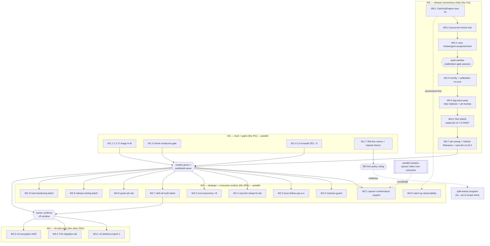

> **RESOLVED-BY-ROUTING — docs-health 9th pass (2026-09-20):** SUPERSEDED-SNAPSHOT (kept for ranking rationale since the 8th pass, archived by this pass): the queue arc, Go 1.27 wave, lint-zero, and ADR-0143 all landed after this snapshot; every open thread lives in [TODO_LIST.md](../../../TODO_LIST.md), the living source.

# SUPERB Pareto Execution Plan v2 — 2026-09-13

> **Point-in-time snapshot** of [`TODO_LIST.md`](../../TODO_LIST.md) (717→763
> lines, 96→106 open threads). Ranked by customer value (this is a LIBRARY:
> consumers import modules — the product IS the published, trusted surface).
> Predecessor plan (2026-09-08, W0–W3) was executed through 2026-09-11.
> This file is a snapshot; TODO_LIST.md stays the living source.
>
> **REFRESH (docs-health 8th pass, 2026-09-19):** snapshot is 6 days stale —
> the queue arc (W2.1) completed through M4 incl. `queue/mysql` (2026-09-19),
> the Go 1.27 wave + jsonv2 graduation landed, lint debt zeroed, ADR-0143
> resolved the replay-starvation flake. Authoritative state: TODO_LIST.md +
> the archived 11-28 execution report. This file is kept as the ranking
> rationale, not as a status source.
>
> **Concurrency note (2026-09-13 08:55):** a parallel session is mid-move on
> `claiming/` → the Durable Work Queue extraction (P0). This plan treats
> queue/ as IN FLIGHT: W2.1 covers only the conformance-suite skeleton and
> review support, never conflicting edits.

---

## 0) Inventory Basis

- **96 open TODO threads** at plan start (15 [BLOCKED] on owner/upstream,
- 4 🔥 Pareto-flagged), plus **10 new follow-ups** from the 2026-09-13
- quick-win batch self-review (added to TODO_LIST this session).
- Everything below maps 1:1 to TODO entries — nothing invented, nothing
  dropped; the Declined guard list stays out by design.

## 1) Pareto Breakdown — what really moves the needle

### The 1% that delivers 51%

**The v4 release-correctness chain: `CatchUpEngine` race fix → quiet-window
verify → the v4 tag wave.** Weeks of shipped-but-unpublished consumer
surface sit on master: watermill v4.7.0 typed causation (go-localsync is
running a documented workaround UNTIL this tag exists), the matview family,
encryption envelope v2, cqrs-lint `--fix`, `SortPaginate`, MySQL claiming.
One known correctness hole (the CatchUpEngine snapshot race) gates the wave;
one quiet window gates the verify. Nothing else on the list converts
accumulated engineering into consumer value this fast. The ~49-file indirect
dep cleanup and GitHub Releases ride the same wave.

### The 4% that delivers 64% (adds to the 1%)

1. **CI trust restored** — the 8 undiagnosed red-job classes (FlakeHub auth,
   SC2086, coverage, verify-fast, go.work sync, flake check, CGo, security)
   - the missing-go.sum-hash gate (`check-modsums`). Master-red is a tax on
     every future session.
2. **erraudit baseline → zero** (253 findings / 22 modules) — activates the
   already-wired error-audit CI gate; go-codec's ADR-0001 is the recipe.
3. **350-line policy ratification memo** — one owner decision that unblocks
   (or retires) the XL split-waves program.
4. **cqrs-lint v4.10.2 + GitHub Releases for outstanding tags** —
   discoverability + honest version reporting.

### The 20% that delivers 80% (adds to the 4%)

The strategic + consumer-surface batch: queue/ conformance support (the
declared strategic future), matview grouped-spec mechanical guard, turso
follow-ups (a)–(e), cqrs-lint cheap-fix tail (a)–(f), error-taxonomy gate
+8 modules, catch-up observability, skill-reference truth batch (reset
recipe 12/12, WithContentionObserver, v6-table completion), release-tooling
hardening (smoke-all, check-retracts, baseline audit, path lib), test
hardening (sqlstore slice, conformance tail, taskmanager, private-dep
guard), calibration quiet-window re-runs (same window as W0.4), and the
v5 pre-cut deletions batch 1.

### The other 20% to reach 100%

The v5 cut train (deletions, NewStreamRef validation, sweep §4 renames,
encryption ADR, T18 migration tail, guide expansion, the cut itself), the
deliberately-deferred heuristic-gate audits, matview v2 surface, the
AggregateOn routing design, turso/badger contention backport, passthrough
unification, macOS/nspawn verifications, CV consumer bump — and the
[BLOCKED] owner/upstream decisions, each parked with its unblock condition
(§5). Not schedulable; listed so the 100% is explicit.

---

## 2) Medium Plan — 27 tasks, 10–30 min each, sorted by impact/effort/customer-value

> Impact: H/M/L · CV: customer value · Effort: minutes. Order = execution order.

### W0 — Release-correctness chain (the 1%)

| ID   | Task (30m unless noted)                                                                                                                                                                                            | Impact | CV                    | Effort | Depends            |
| ---- | ------------------------------------------------------------------------------------------------------------------------------------------------------------------------------------------------------------------ | ------ | --------------------- | ------ | ------------------ |
| W0.1 | **CatchUpEngine snapshot race fix** — loop reset+replay until `Events()` length stabilizes (or final pass under `s.mu` write-lock); metaengine/catchup path                                                        | H      | H (ships in tag wave) | 30     | —                  |
| W0.2 | **Concurrent catch-up stress test** — apply-loop racing `CatchUpEngine`; assert post-reactivation reads see every event (sequential tests cannot see the hole)                                                     | H      | H                     | 30     | W0.1               |
| W0.3 | **`-race` metaengine + projectionhost** (never run since the dispatch-core fold-reroute refactor)                                                                                                                  | H      | M                     | 30     | W0.2               |
| W0.4 | **Quiet-window composed `nix run .#verify`** + `verify-docs.sh` end-to-end + calibration re-runs (SearchQuery count=5 → baseline re-pin → dgraph constants) — record S03 acceptance (date+commit+durations)        | H      | H                     | 30×3   | quiet window; W0.3 |
| W0.5 | **Tag-wave prep** — strip `storage/go.mod` replaces; bump+strip sibling replaces (metaengine engines, projectionadapter, irohengine); CONTRIBUTING pre-tag checklist                                               | H      | H                     | 30     | W0.4 green         |
| W0.6 | **Cut the v4 tag wave** — watermill v4.7.0 FIRST (unblocks go-localsync), then encryption/snapshot/storage/cqrs-lint/api-stability/catalog/benchkit/metaengine+engines/scheduling/system; cut→push→next interleave | H      | H                     | 30×2   | W0.5               |
| W0.7 | **Post-wave** — `pin-sweep.sh --check` standing run + storage/eventstore pin evidence; GitHub Releases batch (`create-github-releases.sh`); tag `cmd/cqrs-lint` v4.10.2 + verify installed binary prints the tag   | H      | H                     | 30     | W0.6               |

### W1 — Trust + gates (the 4%)

| ID   | Task                                                                                                                                                                                                                                                     | Impact | CV | Effort | Depends   |
| ---- | -------------------------------------------------------------------------------------------------------------------------------------------------------------------------------------------------------------------------------------------------------- | ------ | -- | ------ | --------- |
| W1.1 | **CI triage cluster A** — FlakeHub auth despite `use-flakehub:false`; SC2086 disable-or-restructure in test-tag-release.sh (`git $notag` is intentional); verify-fast; go.work sync check                                                                | H      | M  | 30×2   | —         |
| W1.2 | **CI triage cluster B** — Minimum Coverage, Nix Flake Check, CGo build, Security Scan; dry-run benchmarks.yml matview `cd ../metaengine/tursoengine` hop                                                                                                 | H      | M  | 30×2   | —         |
| W1.3 | **`check-modsums` gate** — per-module `go mod download` + no-diff assertion in `#verify-ci` (or flake app) + `TestEveryModulePassesStandaloneVet`-style meta-test; kills the missing-go.sum-hash class at the root (tidy-under-warm-cache)               | H      | M  | 30     | —         |
| W1.4 | **erraudit batch 1: storage (53) + graph (46)** — per go-codec ADR-0001 pattern                                                                                                                                                                          | H      | M  | 30×3   | —         |
| W1.5 | **erraudit batch 2: event (25) + encryption (14) + command (13) + decider (12) + kv (11)**                                                                                                                                                               | H      | M  | 30×2   | —         |
| W1.6 | **erraudit batch 3: stack/snapshot/benchkit (9 ea) + signing/query/middleware/catalog (7 ea) + schema/metaengine/id/dispatcher/watermill/projectionhost/deriver/scheduling (rest) + recount + activate the dormant CI gate**                             | H      | M  | 30×2   | W1.4–W1.5 |
| W1.7 | **Policy/proof bundle** — 350-line ratification decision memo (ratchet vs split waves vs harness exemptions; adttest/enginetest 953/935); `aggregate_*` tripwire permanent testdata fixture + scanner self-assert; sqlstore lint attribution 15-min diff | H      | L  | 30     | —         |

### W2 — Strategic + consumer surface (the 20%)

| ID    | Task                                                                                                                                                                                                                                                                                                                      | Impact | CV                     | Effort | Depends          |
| ----- | ------------------------------------------------------------------------------------------------------------------------------------------------------------------------------------------------------------------------------------------------------------------------------------------------------------------------- | ------ | ---------------------- | ------ | ---------------- |
| W2.1  | **queue/ support (IN FLIGHT elsewhere)** — review the parallel claim-core extraction; build the mirrored conformance-suite skeleton across dialects (go-taskqueue `internal/queue.Store` contract as spec); no conflicting edits                                                                                          | H      | H (2 named consumers)  | 30     | parallel session |
| W2.2  | **Matview grouped-spec mechanical guard** — decide validation-refusal vs `AllowGroupedViews` flag vs status; implement + wire `TestTursoMatView_GroupedSumDefectAEnvelopeGuard` flip point                                                                                                                                | M      | M                      | 30     | —                |
| W2.3  | **Turso IVM follow-ups (a)–(e)** — check-turso-version `--self-test`; `-race` the `-tags ivmrepro` suite once; clamp last chunk for non-multiple-of-1000 rows; release-checklist repro command; fold 3 findings into frozen upstream draft                                                                                | M      | M                      | 30     | —                |
| W2.4  | **cqrs-lint cheap-fix tail (a)–(f)** — S001 allowlist corpus validation; D014/D015 registry-acceptance tests; B008 Warning baseline pin; S001 selector-LHS receiver context + golden impact; full-module `-race`; extract URL/placeholder classifier into lintutil                                                        | M      | M (all lint consumers) | 30×2   | —                |
| W2.5  | **Error-taxonomy gate expansion** — +watermill, +storage/pebble, +core event/command/query; per-module pool-size floor tripwire; replace `rg … \|\| true` with explicit extraction assertions                                                                                                                             | M      | L                      | 30     | —                |
| W2.6  | **Catch-up observability** — running/failed/last-caught-up-event-id in `Doctor` + `GetEngineStats`; per-engine high-water marks (tail replay); return `ResetResult` from `CatchUpEngine`; `Reset` docs pointer                                                                                                            | M      | M                      | 30     | W0.1             |
| W2.7  | **Skill-reference truth batch** — reset recipe 12/12 engines; `WithContentionObserver` recipe entry; ROADMAP v6 table + pebble serialization.go row; module-map genproto graph-forced note; calibration-gate message golden                                                                                               | M      | H (consumer-facing)    | 30     | —                |
| W2.8  | **Quick-win tail batch** — absolute seed-log paths + ephemeral-pg `cd $REPO_ROOT`; `-race` cmd/cqrs-upgrade; repo shellcheck gate over the 7 touched scripts; archive-count automation in check-doc-links.sh; CI artifact upload for shuffle-seeds.log                                                                    | M      | L                      | 30     | —                |
| W2.9  | **Release-tooling batch** — `--smoke-all` batch mode; document same-batch sibling limitation; extract `path_matches_major` into sourced lib; CONTRIBUTING refs for batch-release + check-release-scripts; `check-retracts-shipped.sh`; `smoke-probes.txt` + Test-5 no-main-package path; `tag-release --audit --baseline` | M      | M                      | 30×2   | —                |
| W2.10 | **Test-hardening batch** — sqlstore slice 1 (race-stress Due-vs-Metrics + counter-scope pin); conformance-sweep tail (`ApplyIdempotent` dedup no-op + legacy-log-entry synthesis pin); taskmanager tail (must.go unit tests + 0.080s census + module-map note); `check-private-deps.sh` + visibility audit                | M      | M                      | 30×2   | —                |

### W3 — v5 train prep (the other 20%)

| ID   | Task                                                                                                                                                                                                                                                                                                        | Impact     | CV                   | Effort | Depends                  |
| ---- | ----------------------------------------------------------------------------------------------------------------------------------------------------------------------------------------------------------------------------------------------------------------------------------------------------------- | ---------- | -------------------- | ------ | ------------------------ |
| W3.1 | **v5 pre-cut deletions batch 1** — ADR-0126 shells (`schema.VersionedStore`, `signing.Rejecting*`, `encryption.ErrInnerStoreNot*`, `metadata.CustomData`); `storage/sql.BuildWhereClause`; transport/http+grpc death prep (drop from go.work/flake/api-stability) — behind the v5 gate, per ADR-0123 timing | H (for v5) | H (future consumers) | 30×2   | owner confirms v5 window |
| W3.2 | **T18 migration-verification tail slice 1** — live MySQL/MariaDB + DuckDB `MigrateSnapshotColumnsToStream` runs; mid-migration failure-path test                                                                                                                                                            | M          | M                    | 30×2   | —                        |
| W3.3 | **v5 ADR: encryption-at-rest configuration** — `DriverConfig.Encryption` + `KeyProvider func(ctx)([]byte,error)` (rotation/hot-reload; keys never in config structs; sets the pg/mysql-password precedent) + DeploymentConfig key-reference slot; loud construction failure precedent                       | H (v5)     | H                    | 30×2   | —                        |

---

## 3) Fine Plan — ≤12 min per task, sorted by wave then impact

> Fine IDs encode parent (W0.1 → 01a, 01b…). Global execution order = wave
> order; within a task, top-down. **+** marks tasks startable in parallel
> with anything (no shared files).

### W0 fine tasks

| ID  | Task (≤12m)                                                                                                        | Impact | Depends      |
| --- | ------------------------------------------------------------------------------------------------------------------ | ------ | ------------ |
| 01a | Read `metaengine` catch-up path; map the snapshot take → replay → reactivate window; write the fix comment plan    | H      | —            |
| 01b | Implement the stabilize loop (re-snapshot until log length stops growing) or write-lock final pass                 | H      | 01a          |
| 01c | Unit test: sequential regression — catch-up still replays exactly                                                  | H      | 01b          |
| 02a | Write the concurrent stress test: N goroutines applying while CatchUpEngine runs                                   | H      | 01b          |
| 02b | Assert post-reactivation reads see EVERY event (no missed window) + `-race` clean                                  | H      | 02a          |
| 03a | `-race` over `metaengine` `./...` (GOWORK=off, jsonv2 tag), record anomalies                                       | H      | 02b          |
| 03b | `-race` over `projectionhost` `./...`, record anomalies                                                            | H      | 02b          |
| 04a | Quiet-window check: `scripts/calibration-gate.sh` passes → start `#verify`                                         | H      | 03a+b; quiet |
| 04b | Run `scripts/verify-docs.sh` end-to-end (first true tripwire run)                                                  | H      | 04a          |
| 04c | Calibration: SearchQuery count=5 re-run; supersede table if medians move >5%                                       | M      | 04a          |
| 04d | Calibration: titled `benchmark-baseline.txt` re-pin via `--save`                                                   | M      | 04c          |
| 04e | Calibration: dgraph constants re-anchor campaign (gate-guarded)                                                    | M      | 04d          |
| 04f | Record S03 acceptance: date + commit + durations in TODO_LIST                                                      | M      | 04b–04e      |
| 05a | Strip `storage/go.mod` two local replaces; standalone tidy+build                                                   | H      | 04a green    |
| 05b | Bump + strip sibling replaces for metaengine engines / projectionadapter / irohengine; per-module standalone build | H      | 05a          |
| 05c | Walk CONTRIBUTING pre-tag checklist for the wave manifest (order constraints)                                      | H      | 05b          |
| 06a | Tag `watermill/v4.7.0` FIRST + push + `go list -m` proxy-visible check                                             | H      | 05c          |
| 06b | Tag batch 2 (encryption, snapshot, storage, cmd/cqrs-lint, api-stability, catalog, benchkit) + push                | H      | 06a          |
| 06c | Tag batch 3 (metaengine + 8 engines, scheduling/sqlstore, system v4.7.0) + push; MV recipe UNRELEASED marker flips | H      | 06b          |
| 06d | Smoke the wave (`--smoke` / smoke-probes); fix any tag-order fallout                                               | H      | 06c          |
| 07a | `scripts/pin-sweep.sh --check` post-wave + commit sweep                                                            | H      | 06d          |
| 07b | Verify `storage/eventstore` pin health with evidence (clean-dir list -m)                                           | M      | 07a          |
| 07c | Run `create-github-releases.sh` per new tag; spot-check one release page                                           | M      | 06d          |
| 07d | Tag `cmd/cqrs-lint` v4.10.2; `go install …@v4.10.2`; binary prints real tag                                        | M      | 07a          |

### W1 fine tasks (all **+** parallelizable except noted)

| ID  | Task (≤12m)                                                                                                        | Impact | Depends          |
| --- | ------------------------------------------------------------------------------------------------------------------ | ------ | ---------------- |
| 1Aa | CI triage: pull the FlakeHub error lines from the failing jobs; classify fatal vs cosmetic                         | H      | —                |
| 1Ab | Fix or `use-flakehub` workaround; re-run one ephemeral job                                                         | H      | 1Aa              |
| 1Ac | test-tag-release.sh SC2086: add disable directive or restructure `git $notag`                                      | M      | —                |
| 1Ad | verify-fast job: reproduce locally, diagnose, fix                                                                  | H      | —                |
| 1Ae | go.work sync check job: reproduce, fix                                                                             | M      | —                |
| 1Ba | Minimum Coverage job: extract the failing assertion; correlate with local `#check-coverage`                        | H      | —                |
| 1Bb | Nix Flake Check job: `nix flake check` locally, fix the failing check                                              | M      | —                |
| 1Bc | CGo build job: reproduce duckdb/stack builds standalone (GOWORK=off)                                               | M      | —                |
| 1Bd | Security Scan job: run `#vulncheck`, fix or baseline findings                                                      | M      | —                |
| 1Be | benchmarks.yml matview gate: dry-run the exact CI invocation incl. the relative cd hop                             | M      | —                |
| 1Ca | `check-modsums`: script skeleton (per-module `go mod download` + go.sum no-diff)                                   | H      | —                |
| 1Cb | Wire as flake app + CI leg next to verify-ci                                                                       | H      | 1Ca              |
| 1Cc | Repo-level meta-test `TestEveryModulePassesStandaloneDownload` (or vet-style)                                      | H      | 1Ca              |
| 1Da | erraudit storage: run + triage 53 findings into fix/suppress buckets                                               | H      | —                |
| 1Db | erraudit storage: apply fixes batch 1 (~27)                                                                        | H      | 1Da              |
| 1Dc | erraudit storage: apply fixes batch 2 (~26) + recount = 0                                                          | H      | 1Db              |
| 1Ea | erraudit graph: triage + fix 46 (two passes)                                                                       | H      | —                |
| 1Eb | erraudit event + encryption: triage + fix 39                                                                       | H      | —                |
| 1Ec | erraudit command + decider + kv: triage + fix 36                                                                   | H      | —                |
| 1Fa | erraudit stack + snapshot + benchkit (27)                                                                          | M      | —                |
| 1Fb | erraudit signing + query + middleware + catalog + schema (34)                                                      | M      | —                |
| 1Fc | erraudit remainder (metaengine, id, dispatcher, watermill, projectionhost, deriver, scheduling ~14) + full recount | M      | 1D–1Fb           |
| 1Fd | Create the ERRAUDIT_PAT secret + confirm the CI gate activates and goes green                                      | H      | 1Fc; user secret |
| 1Ga | 350-line decision memo: lay out ratchet-vs-waves-vs-exemptions with evidence                                       | H      | —                |
| 1Gb | `aggregate_*` tripwire: testdata fixture with planted code + scanner self-assert                                   | M      | —                |
| 1Gc | sqlstore lint attribution: 15-min diff vs 09-06 worktree; write the closure note                                   | L      | —                |

### W2 fine tasks (mostly **+**; W2.6 after W0.1)

| ID  | Task (≤12m)                                                                      | Impact | Depends          |
| --- | -------------------------------------------------------------------------------- | ------ | ---------------- |
| 21a | Review the parallel queue/ extraction diff (claim core semantics intact)         | H      | parallel session |
| 21b | Conformance-suite skeleton: enumerate the go-taskqueue Store contract behaviors  | H      | 21a              |
| 21c | Mirror the suite across SQLite/PG/MySQL dialect runners                          | H      | 21b              |
| 22a | Matview guard: pick the option (lean: flag `AllowGroupedViews`), write rationale | M      | —                |
| 22b | Implement guard + tests + Doctor note update                                     | M      | 22a              |
| 23a | check-turso-version.sh `--self-test` (temp-fixture fault injection)              | M      | —                |
| 23b | Run `-tags ivmrepro -race` once; record                                          | M      | —                |
| 23c | Clamp last chunk for non-multiple-of-1000 `TURSO_IVM_REPRO_ROWS`                 | M      | —                |
| 23d | Add the repro one-liner to docs/release-checklist.md                             | M      | —                |
| 23e | Fold the 3 session findings into the frozen upstream draft                       | M      | —                |
| 24a | S001 allowlist: corpus-validate vs taskmanager + a probe project                 | M      | —                |
| 24b | D014/D015 registry-acceptance tests                                              | M      | —                |
| 24c | Pin B008 non-bitshift Warning baseline test                                      | M      | —                |
| 24d | S001 selector-LHS receiver context in message + golden impact check              | M      | —                |
| 24e | Full-module `-race` for cmd/cqrs-lint                                            | M      | —                |
| 24f | Extract URL/placeholder classifier into lintutil                                 | M      | —                |
| 25a | Error-taxonomy gate: +watermill module line + complete section inventory         | M      | —                |
| 25b | +storage/pebble; +core event/command/query (3 lines, 3 inventories)              | M      | —                |
| 25c | Pool-size floor tripwire + explicit extraction assertions (kill `\|\| true`)     | M      | 25a+b            |
| 26a | Catch-up state struct + Doctor section (running/failed/last-event-id)            | M      | W0.1             |
| 26b | `GetEngineStats` catch-up fields + test                                          | M      | 26a              |
| 26c | Per-engine high-water marks; tail-only re-catch-up                               | M      | 26a              |
| 26d | Return `ResetResult` from `CatchUpEngine`; `Reset` docs pointer                  | M      | 26a              |
| 27a | Reset recipe: rewrite as 12/12 engines ladder in readmodels.md/recipes.md        | H      | —                |
| 27b | `WithContentionObserver` recipe entry                                            | M      | —                |
| 27c | ROADMAP v6 table + pebble serialization.go row                                   | L      | —                |
| 27d | module-map.md genproto graph-forced note                                         | L      | —                |
| 27e | Calibration-gate failure-message golden test                                     | L      | —                |
| 27f | doc-check pass over changed references                                           | M      | 27a–27e          |
| 28a | Absolute seed-log paths in 5 scripts + ephemeral-pg `cd $REPO_ROOT`              | M      | —                |
| 28b | `-race` cmd/cqrs-upgrade                                                         | M      | —                |
| 28c | Run repo shellcheck/pre-commit gate over the 7 touched scripts                   | L      | —                |
| 28d | Archive-count automation in check-doc-links.sh                                   | L      | —                |
| 28e | CI artifact upload for build/shuffle-seeds.log on failure                        | L      | —                |
| 29a | `--smoke-all` batch mode in tag-release.sh/batch-release.sh                      | M      | —                |
| 29b | Document same-batch sibling limitation + batch `--verify` dry-run decision       | M      | —                |
| 29c | Extract `path_matches_major` into sourced lib (two-copy lockstep risk)           | M      | —                |
| 29d | CONTRIBUTING.md: batch-release + check-release-scripts references                | M      | —                |
| 29e | `check-retracts-shipped.sh` + clean-dir acceptance test                          | M      | —                |
| 29f | `smoke-probes.txt` + Test-5 no-main-package skip path                            | M      | —                |
| 29g | `tag-release --audit --baseline` known-violations mode + CI leg                  | M      | —                |
| 2Aa | sqlstore: race-stress test (concurrent Due pollers vs Metrics reader)            | M      | —                |
| 2Ab | sqlstore: counter-scope pin test (MarkFired/Schedule/Cancel never touch claims)  | M      | —                |
| 2Ac | Conformance sweep: `ApplyIdempotent` dedup no-op second apply                    | M      | —                |
| 2Ad | Conformance sweep: legacy `EventLog.Record()` synthesis pin case                 | M      | —                |
| 2Ae | taskmanager: must.go unit tests + 0.080s test census                             | L      | —                |
| 2Af | module-map taskmanager note (no go-must)                                         | L      | —                |
| 2Ag | `check-private-deps.sh` (proxy-servable require check) + flake app               | M      | —                |
| 2Ah | Sibling repo visibility audit → module-map public/private column                 | M      | —                |

### W3 fine tasks

| ID  | Task (≤12m)                                                                                             | Impact | Depends         |
| --- | ------------------------------------------------------------------------------------------------------- | ------ | --------------- |
| 31a | Delete `schema.VersionedStore` + `NewVersionedStore`; regen api golden                                  | H      | owner v5 window |
| 31b | Delete `signing.Rejecting*` forwarders + `encryption.ErrInnerStoreNot*` + `metadata.CustomData`; golden | H      | —               |
| 31c | Delete `storage/sql.BuildWhereClause`; sweep internal callers; golden                                   | H      | —               |
| 31d | transport/http+grpc: drop from go.work + flake testModules + api-stability list                         | M      | —               |
| 32a | Live MariaDB `MigrateSnapshotColumnsToStream` run + record                                              | M      | —               |
| 32b | Live DuckDB migration run + record                                                                      | M      | —               |
| 32c | Mid-migration failure-path test (kill between steps; assert idempotent re-run)                          | M      | —               |
| 32d | Mixed-state + concurrent-init idempotency tests                                                         | M      | —               |
| 33a | v5 ADR encryption-at-rest: skeleton + KeyProvider decision + precedents section                         | H      | —               |
| 33b | ADR: DeploymentConfig key-reference slot + loud-failure semantics                                       | H      | 33a             |
| 33c | ADR: pg/mysql password precedent paragraph + review pass                                                | M      | 33b             |

---

## 4) Execution Graph

## 5) Parked / owner-gated (the explicit remainder to 100%)

| Item                                                                                | Unblock condition                             |
| ----------------------------------------------------------------------------------- | --------------------------------------------- |
| Turso upstream issue A+B filing (🔥)                                                | user approval (draft frozen, verified)        |
| Release-policy Q3 (severity-in-minor; envelope v2; `bumps` wire)                    | owner ruling                                  |
| Doctor-JSON raw-vs-effective                                                        | owner ruling (minutes to implement after)     |
| Daemon Q2 `.golangci.yml` self-heal vs upstream                                     | owner decision                                |
| F040 branch protection                                                              | owner decision                                |
| Dead-path module/tag decisions (taskmanager path, eventtest v0 tags)                | owner decision                                |
| Turso DSN strict policy; sync/embedded-replica scope; upstream turso-go (a)(b)(c)   | owner + verify-before-filing                  |
| dgraph one-RPC scope; CapabilityGaps→Doctor                                         | owner + benches                               |
| GitHub Actions billing; self-lint creds; nspawn root; macOS runner                  | user/infra                                    |
| iroh P99 50→150ms ratification                                                      | owner XS call                                 |
| Split-waves program (XL)                                                            | 350-line ruling (W1.7 memo feeds it)          |
| Matview v2 surface; AggregateOn routing design                                      | consumer pull + upstream defect-A fix         |
| Contention backport turso/badger; passthrough unification; composite-runner shuffle | after W2 core; OQ #9                          |
| T23 skill-maintenance pass; heuristic-gate audits                                   | next maintenance window / deliberate deferral |
| v5 cut train beyond W3 (sweep §4, guide, cut)                                       | W3 + owner window                             |

## 6) Session log

- 2026-09-13 08:55 — plan created from the post-quick-win-batch TODO state;
  10 new follow-up threads added to TODO_LIST (quick-win batch follow-ups
  section). Concurrent queue/ extraction observed (claiming/ moved) and
  routed to coordination-only (W2.1).
