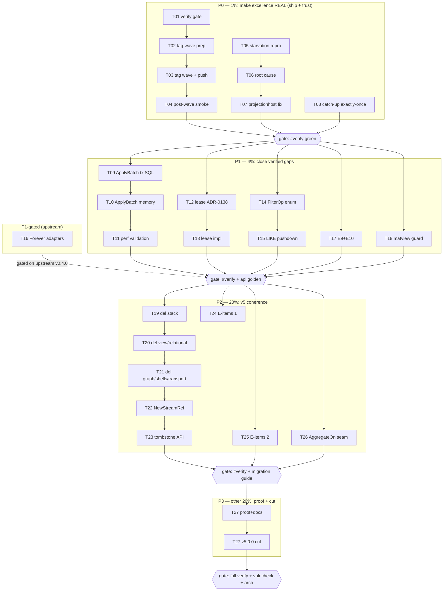

# SUPERB — metaengine + system Excellence (Pareto Plan)

> **RESOLVED-BY-ROUTING — docs-health 11th pass (2026-09-22):** the plan is
> superseded by events: P0 (tag wave) shipped as the 92-tag train 2026-09-19;
> the matview/replay/reset items shipped 2026-09-10/11 (Cordis waves); the
> lease one-pager + AggregateOn + scan-default items were delivered 2026-09-21
> (M20, live docs/planning one-pagers); FilterOp + E-items + ApplyBatch
> atomicity live on as open TODO_LIST rows (CV section + v5 Unification);
> feedback #6 slices → TODO metaengine row. Every open remainder is tracked;
> archived as a historical snapshot. ARCHIVED.

- **Date:** 2026-09-16 21:05 CEST
- **Mandate:** "metaengine + system must be SUPERB, reliable, 100% just fuvking the best and composable and smart!"
- **Scope:** the `metaengine/` module family (core + engines + projectionadapter) and `system/` — every open TODO that touches them, harvested from `TODO_LIST.md` (all sections), the 2026-09-16 CV-verdicts reflection (`docs/reviews/2026-09-16_cv-verdicts-reflection.md`), and this session's status report (`docs/status/archived/2026-09-16_21-02_cv-verdicts-reflection-verification.md`).
- **Method:** pareto-planning skill; user format overrides honored (`.md` + mermaid, 10–30 min medium tasks, ≤12 min micro tasks, commit+push authorized).
- **Anti-Verschlimmbesserung contract:** every behavior change is warn-first in v4.x / hard at v5 (ADR-0136 precedent); API-surface change ⇒ api golden regen in the SAME edit; file-size/dup/dep gates green before done; `nix run .#verify` after each phase; no deletions before their replacements are tagged; blocked/owner-gated items are NEVER unilaterally executed.

## 0. Goal decomposition — what "SUPERB" means, measurably

| Pillar     | Meaning (consumer-perceivable)                                                                          | Measured proxy                                                                                       |
| ---------- | ------------------------------------------------------------------------------------------------------- | ---------------------------------------------------------------------------------------------------- |
| Reliable   | replay completeness (never miss an event), batch atomicity, exactly-once catch-up, no silent truncation | ADR-0136 replay guarantee holds under load; ApplyBatch all-or-nothing on SQL engines; 0 known flakes |
| Composable | one composition root (`system.New`), engines = `Profile()+Closer`, decorator seams stay open            | CV's lease decorator buildable via `RegisterDriver` with zero library fork                           |
| Smart      | cost-based routing sees the truth; coeffect gate; O(1) where data allows                                | matview-covered shapes priced O(1) by the planner; `DomainConfig.Events` live                        |
| The Best   | released, documented, honestly benchmarked                                                              | consumers on latest tags get the best features; docs never lie (Scan-100 class: zero)                |

**The uncomfortable truth this plan starts from:** the library's best work — the coeffect gate, ADR-0137 health-driven engine deactivation, `EngineResetter` on all 12 engines, planner capability partition, `Store.StreamCollection`, matviews — is **unreleased** (latest `system` tag = v4.7.0; `DomainConfig.Events` exists on master in NO tag). Every consumer, including CV (the most rigorous evaluator we have), runs an older library and hand-rolls what master already does. Excellence that is not consumable is not excellence.

## 1. Pareto Breakdown

### The 1% that delivers 51% — "Make the excellence REAL and TRUSTWORTHY"

Three items; everything else compounds on top of them:

1. **Ship the pending v4 tag wave** (system + metaengine + engines, otel-first ordering). Zero new code; converts months of shipped work from invisible to consumable. Customer value: maximal, instant.
2. **Kill the replay-starvation hazard** (`TestSystem_ResetProjection_RestartAndReplay` stall; sibling witness: `TestEngineHealth_CatchUpUnderConcurrentApplies`). A projection that permanently misses replay under load = silent read-model data loss = the one failure that kills trust in an event-sourced library forever.
3. **Land ApplyBatch batch atomicity** (spike-validated FoldOp design, ADR-0123 §10). Measured: 3.4 s → 109 ms (31×) for a 6.2k-event rebuild, AND fixes silent partial batches on failure. Reliability + performance in one, already designed.

### The 4% that delivers 64% — "Close every externally-verified gap"

The CV four-tier benchmark + seam spike gave us a verified gap list; closing it makes the library the best answer to its toughest customer:

4. Lease/single-writer story (ADR-0138 + impl) — CV's Phase-1 blocking condition #1.
5. `FilterContains`/`FilterPrefix` pushdown — search measured at client-scan speed today.
6. go-idempotency `Forever` adapters with overflow-proof MaxInt64 mapping (verified landmine).
7. E9 (turso Policy nil-write panics) + E10 (ShutdownDependency name validation) — small, real crash/logic class fixes.
8. Grouped-matview mechanical guard (advisory → enforced; upstream defect A makes grouped IVM unsafe).

### The 20% that delivers 80% — "v5 coherence: one root, zero zombies"

9. The v5 deletion wave (stack presets, storage/view, graph projection, ADR-0126 shells, BuildWhereClause, transport modules) — makes `system` THE composition root in truth, not just in ADR-0123 prose.
10. `record.NewStreamRef` breaking validation + tombstone-metadata API deletion (ADR-0114 completion).
11. Extended-review E-items (E1/E3/E6/E7/E8/E11/E13/E14/E15).
12. `AggregateOn(fn, column, group)` planner seam one-pager — the design that lets routing become genuinely smart (matview-covered = O(1)).

### The other 20% to reach 100% — "Proof, polish, and the cut"

13. Honest benchmarks: tuned-tier metaengine numbers (planned tables vs hand-indexed SQL), benchkit cross-tier PARITY gate (CV's template), calibration quiet-window re-runs, live PG/MySQL ClaimMetrics legs.
14. Docs-truth tail: readmodels.md Scan note, modules.md row, CHANGELOG entries, doc-check ambiguous aliases, probe-source embedding.
15. V5-MIGRATION-GUIDE expansion, T18 migration-verification tail, T23 skill pass.
16. Go 1.27 toolchain wave (own wave, L — planned here, executed separately).
17. Cut v5.0.0.

### Owner-gated / blocked (tracked, never unilaterally executed)

Turso strict-DSN policy · Turso sync/embedded-replica decision · upstream turso-go filings (verify-before-filing done for 3 defects) · dgraph one-RPC scope · CapabilityGaps→Doctor reach · ADR-0139 encryption ruling (4 open questions) · session-log boundary · upstream go-idempotency Forever green-light (CV g-1/Q2) · scheduling `RenewLease` claim tokens · Phase-1-scope cross-repo write-back (CV g-3).

## 2. Comprehensive Plan — medium granularity (10–30 min per task, ALL open TODOs in scope)

Sorted by importance (customer value × reliability) then effort. Phase gates: `nix run .#verify` after each phase; api golden regen with any API touch; per-module `GOWORK=off` tests after each code slice.

| #   | Task                                                                                                                                                                                                                                        | Pillar     | Impact   | Effort       | Phase    |
| --- | ------------------------------------------------------------------------------------------------------------------------------------------------------------------------------------------------------------------------------------------- | ---------- | -------- | ------------ | -------- |
| T01 | Pre-wave verification: full `#verify` + `#verify-ci` on a clean, quiet tree (load-gated per calibration-gate)                                                                                                                               | All        | Critical | 30m          | P0       |
| T02 | Tag-wave prep: order checklist (otel-first `DBSystem`, replace-strips incl. queue/{sqlite,postgres}, cqrs-bench→benchkit, storage's two), version bumps decided, CONTRIBUTING pre-tag list                                                  | All        | Critical | 30m          | P0       |
| T03 | Tag-wave execution: tag otel → storage → engines → metaengine + projectionadapter/irohengine pin repair → system; push; module-proxy probe per tag; CHANGELOG release notes                                                                 | All        | Critical | 30m          | P0       |
| T04 | Post-wave smoke: consumer-side `go get` probes (system, metaengine, watermill v4.7.0 workaround retirement in go-localsync), README/SKILL version truths, CV notified it can adopt `DomainConfig.Events`                                    | All        | High     | 30m          | P0       |
| T05 | Replay-starvation repro harness: system suite + CPU/IO soakers + `-parallel`, deterministic-fail script (the TODO's "next" step)                                                                                                            | Reliable   | Critical | 30m          | P0       |
| T06 | Replay-starvation root cause: trace `system.Start` → projectionhost subscribe/drain ordering vs the TOCTOU guard (recipes §2.23); write the causal one-pager                                                                                | Reliable   | Critical | 30m          | P0       |
| T07 | Replay-starvation fix at projectionhost layer + regression test under soakers; ADR-0136 replay-guarantee property extended                                                                                                                  | Reliable   | Critical | 30m          | P0       |
| T08 | CatchUp exactly-once flake (`primary ticks = 2001`): repro under `-parallel`, fix counter/apply race, pin with `-count=5` gate                                                                                                              | Reliable   | Critical | 30m          | P0       |
| T09 | ApplyBatch atomicity (SQL): wrap applyWithRecord in engine tx for `Transactional` engines (spike Approach 1/3); invariant tests per dialect (pg, mysql, duckdb, sqlite)                                                                     | Reliable   | Critical | 30m          | P1       |
| T10 | ApplyBatch atomicity (memory): undo-log/snapshot semantics (spike Approach 2/3); partial-batch property test; Doctor surfaces batch mode                                                                                                    | Reliable   | Critical | 30m          | P1       |
| T11 | ApplyBatch perf validation: 6.2k-event replay bench before/after (CV's 3.4s→109ms shape); `synchronous=NORMAL` documented pragma note; CHANGELOG                                                                                            | Reliable   | High     | 30m          | P1       |
| T12 | Lease/single-writer design one-pager + ADR-0138 (engine open-mode vs advisory file lock vs BEGIN EXCLUSIVE; queue/claiming precedent; CV `<dsn>.lease` interop)                                                                             | Composable | Critical | 30m          | P1       |
| T13 | Lease impl: engine/system option + conflict tests + `RegisterDriver` decorator recipe in skill refs                                                                                                                                         | Composable | Critical | 30m          | P1       |
| T14 | FilterContains/FilterPrefix: FilterOp enum + closure-fallback evaluation + AllFilterOps/enum_validation regen                                                                                                                               | Smart      | High     | 30m          | P1       |
| T15 | FilterContains SQL pushdown: LIKE/prefix mapping on sqlite/pg/mysql/duckdb + enginetest parity + readmodels.md recipe                                                                                                                       | Smart      | High     | 30m          | P1       |
| T16 | Forever adapters (GATED on upstream go-idempotency v0.4.0): map `Forever` → `expires_at = MaxInt64` DIRECT (never via expiryFromTTL — overflow proven); dedup the two `expiryFromTTL` copies; overflow boundary test                        | Reliable   | High     | 30m          | P1-gated |
| T17 | E9 + E10: turso Policy nil-write panic fix; ShutdownDependency name validation — each with regression test                                                                                                                                  | Reliable   | Medium   | 30m          | P1       |
| T18 | Grouped-matview mechanical guard: decide validation-vs-flag, implement + Doctor/Doctor-doc update (upstream defect A)                                                                                                                       | Reliable   | Medium   | 30m          | P1       |
| T19 | v5 deletion wave 1: `stack.Materialize` + `stack.Bundle` + all 8 presets + `stack/` module (incl. stack/bench) — replacement recipes verified first                                                                                         | Composable | High     | 30m          | P2       |
| T20 | v5 deletion wave 2: `storage/view` (SQLViewStore) + `storage.RelationalProjection` + `aggregate_*` surfaces; migrate internals to metaengine planned tables                                                                                 | Composable | High     | 30m          | P2       |
| T21 | v5 deletion wave 3: `graph.GraphProjection`, ADR-0126 shells (`schema.VersionedStore`, `signing.Rejecting*`, `encryption.ErrInnerStoreNot*`, `metadata.CustomData`), `BuildWhereClause`, transport/http+grpc module drops                   | Composable | High     | 30m          | P2       |
| T22 | `record.NewStreamRef` breaking validation + all call-site migration + api golden                                                                                                                                                            | Composable | High     | 30m          | P2       |
| T23 | Tombstone metadata API deletion (ADR-0114 completion): listing type-driven status, example/taskmanager off `OnTombstone`, golden regen                                                                                                      | Composable | Medium   | 30m          | P2       |
| T24 | E-items batch 1: E1 (Encoding → record.Encoding), E7 (RetryConfig collision), E8 (typed Message Kind enum)                                                                                                                                  | Best       | Medium   | 30m          | P2       |
| T25 | E-items batch 2: E3 (bbolt error-family), E6 (Option merge/bridge), E11 (AdapterCore.Encode error), E13 (SQLTimerStore phantom param), E14 (eventstore ownership), E15 (middleware signature unification)                                   | Best       | Medium   | 30m          | P2       |
| T26 | `AggregateOn(fn, column, group)` planner-seam one-pager (SUPERB S28): declarative aggregate spec on QueryDecl; scalar-covered → O(1) routing; grouped stays O(N) until upstream defect A fixed                                              | Smart      | High     | 30m          | P2       |
| T27 | Proof + docs + cut: tuned-tier benchmark, benchkit parity gate, calibration re-runs, ClaimMetrics live legs, docs-truth tail (readmodels note, modules row, CHANGELOG, aliases, probe embed), V5-MIGRATION-GUIDE expansion, then v5.0.0 cut | Best       | High     | 30m×4 slices | P3       |

**Out of scope for this plan (own waves / gated):** Go 1.27 toolchain wave (L — TODO_LIST row stands), ADR-0139 encryption ruling (owner), queue M-tail (T14–T17 there), turso/dgraph owner-gated rows. They remain in `TODO_LIST.md` as their own sections — nothing is lost, nothing is duplicated into two independently-markable copies (the T29 split-brain lesson).

## 3. Micro Breakdown — fine granularity (≤12 min per task)

Grouped by medium task; execute top-down inside each group. Total: 108 micro tasks.

| Group | Micro tasks (each ≤12m)                                                                                                                                                                                                                                                                                                                                                                                                                                                                                   |
| ----- | --------------------------------------------------------------------------------------------------------------------------------------------------------------------------------------------------------------------------------------------------------------------------------------------------------------------------------------------------------------------------------------------------------------------------------------------------------------------------------------------------------- |
| T01   | M01 run `nix run .#verify` (load check first) · M02 run `#verify-ci` · M03 triage any red → fix or park with evidence                                                                                                                                                                                                                                                                                                                                                                                     |
| T02   | M04 inventory unpublished surfaces vs tags (`git tag -l` diff vs CHANGELOG Unreleased) · M05 write ordered tag list honoring otel-first + sibling-replace constraints · M06 dry-run `scripts/tag-release.sh --dry-run` + pre-tag checklist read-through                                                                                                                                                                                                                                                   |
| T03   | M07 tag otel/v4 + proxy probe · M08 tag storage + engines (sqlite/turso/pg/mysql/duckdb/badger/dgraph/iroh pin repair) + probes · M09 tag metaengine + projectionadapter + probes · M10 tag system + commandlifecycle/projections + probes · M11 strip replaces (queue/*, cqrs-bench, storage) in same wave · M12 CHANGELOG release-notes section + push                                                                                                                                                  |
| T04   | M13 consumer probe module: `go get system@new system.New boots` · M14 go-localsync watermill workaround retirement probe · M15 README/SKILL/AGENTS version-truth sweep · M16 note-to-CV: `DomainConfig.Events` adoptable (cross-repo pointer only)                                                                                                                                                                                                                                                        |
| T05   | M17 soaker script (CPU+IO, load 35–52 class) in scripts/ · M18 wire system suite `-parallel` + soakers run config · M19 capture stall with `-timeout` + progress logs; store artifacts under cv-verify                                                                                                                                                                                                                                                                                                    |
| T06   | M20 trace subscribe-vs-drain ordering in projectionhost Start · M21 compare against TOCTOU guard (recipes §2.23) invariants · M22 write causal one-pager (docs/research/) · M23 identify exact interleaving window + assert in test                                                                                                                                                                                                                                                                       |
| T07   | M24 implement fix (drain-before-subscribe or guard extension) · M25 regression test with soakers, `-count≥3` · M26 ADR-0136 addendum + CHANGELOG · M27 module tests + full system suite green                                                                                                                                                                                                                                                                                                             |
| T08   | M28 repro script `-run TestEngineHealth_CatchUpUnderConcurrentApplies -count=10 -parallel` · M29 root-cause counter race · M30 fix + pin test · M31 metaengine suite green                                                                                                                                                                                                                                                                                                                                |
| T09   | M32 port FoldOp closure from spike into applyWithRecord · M33 RunInTx wrap when engine is Transactional · M34 dialect invariant tests (sqlite/pg/mysql/duckdb: fail-mid-batch ⇒ zero applied) · M35 GOWORK=off tests ×4 engine modules                                                                                                                                                                                                                                                                    |
| T10   | M36 memory-engine undo-log in apply path · M37 partial-batch property test (rapid) · M38 Doctor `--- Batch ---` section + EngineStats flag · M39 CHANGELOG + bench smoke                                                                                                                                                                                                                                                                                                                                  |
| T11   | M40 bench: 6.2k events replay before/after (benchkit profile) · M41 document `synchronous=NORMAL` pragma note (recipes + engine godoc) · M42 record numbers in docs/benchmarks/ + CHANGELOG                                                                                                                                                                                                                                                                                                               |
| T12   | M43 survey queue/claiming + CV lease decorator shape · M44 write ADR-0138 (3 options, one picked, tradeoffs) · M45 review pass: does the option compose at system DeploymentConfig?                                                                                                                                                                                                                                                                                                                       |
| T13   | M46 implement engine open-mode/lock option · M47 conflict tests (second opener fails loud, release-on-close) · M48 RegisterDriver decorator recipe in recipes.md (compile-gated) · M49 api golden + module tests                                                                                                                                                                                                                                                                                          |
| T14   | M50 FilterContains/FilterPrefix consts + Valid() + AllFilterOps · M51 closure-fallback evalFilterOp/matchFilter cases · M52 unit tests + enum_validation regen                                                                                                                                                                                                                                                                                                                                            |
| T15   | M53 sqlite LIKE/prefix pushdown SQL build · M54 pg/mysql/duckdb dialect twins (art-dupl:accept pattern) · M55 enginetest parity suite extension · M56 readmodels.md recipe + FAQ update                                                                                                                                                                                                                                                                                                                   |
| T16   | M57 wait-gate check upstream v0.4.0 tag · M58 adapters write MaxInt64 direct + Forever mapping · M59 dedup expiryFromTTL (shared helper) · M60 overflow boundary test (2262 wrap pin) · M61 pin bumps (middleware/sqlstore/kvstore) via go-ecosystem-upgrade flow                                                                                                                                                                                                                                         |
| T17   | M62 E9 turso Policy nil-write fix + test · M63 E10 ShutdownDependency validation + test · M64 module tests + golden if API touched                                                                                                                                                                                                                                                                                                                                                                        |
| T18   | M65 decide guard shape (validation vs AllowGroupedViews flag) in the row's decision frame · M66 implement + Doctor wording · M67 tests incl. `TURSO_IVM_ENFORCE_FIX` interplay                                                                                                                                                                                                                                                                                                                            |
| T19   | M68 verify auto-projection recipes cover every Materialize use (doc-check) · M69 delete Materialize+Bundle+presets, update go.work/testModules/api-stability list · M70 stack/ module removal + stack/bench relocation · M71 golden regen + full verify leg                                                                                                                                                                                                                                               |
| T20   | M72 verify planned-table parity for every SQLViewStore capability · M73 delete storage/view + re-exports + RelationalProjection · M74 aggregate_* SQL surface removal + conformance sweep · M75 golden + verify                                                                                                                                                                                                                                                                                           |
| T21   | M76 graph.GraphProjection delete + graphadapter check · M77 ADR-0126 shells delete · M78 BuildWhereClause delete · M79 transport module drops (go.work/flake/api lists) · M80 golden + verify                                                                                                                                                                                                                                                                                                             |
| T22   | M81 NewStreamRef validation impl · M82 call-site migration sweep (rg) · M83 breaking-change CHANGELOG + migration-guide entry · M84 golden + tests                                                                                                                                                                                                                                                                                                                                                        |
| T23   | M85 listing type-driven status (replace DetectTombstone call) · M86 taskmanager off OnTombstone · M87 delete tombstone metadata API + golden                                                                                                                                                                                                                                                                                                                                                              |
| T24   | M88 E1 Encoding alias swap + sweep · M89 E7 RetryConfig collision rename · M90 E8 Kind enum + tests                                                                                                                                                                                                                                                                                                                                                                                                       |
| T25   | M91 E3 bbolt error-family · M92 E6 Option bridge · M93 E11 AdapterCore.Encode error return + callers · M94 E13 phantom param fix · M95 E14 ownership asymmetry · M96 E15 signature unification decision + impl                                                                                                                                                                                                                                                                                            |
| T26   | M97 survey QueryDecl shape + planner cost hooks · M98 one-pager: AggregateOn signature, plan-time visibility, routing v1 (scalar-only) · M99 Doctor note design for uncovered grouped shapes · M100 ADR draft or research doc                                                                                                                                                                                                                                                                             |
| T27   | M101 tuned-tier bench (BuildLayoutPlanFromType vs hand-indexed) + record · M102 benchkit parity-gate API + self-test · M103 calibration re-runs in quiet window + ClaimMetrics live legs · M104 docs-truth tail (readmodels note, modules row, CHANGELOG, 3 ambiguous aliases, probe embed) · M105 V5-MIGRATION-GUIDE per-tier examples · M106 T18 migration-verification tail (mysql/duckdb runs, corruption/mid-failure tests) · M107 v5.0.0 cut checklist run · M108 post-cut verify + tags + announce |

## 4. Execution Graph

**Phase rules:** P0 is strictly first (releasing before fixing the starvation hazard would ship the flake to consumers; fixing after release means a fast-follow tag). P1 tasks are parallelizable after G1. P2 requires G2 (gaps closed before deletions — v5 removes the escape hatches). P3 is the cut train.

## 5. Verification gates (per phase, non-negotiable)

- **Every code slice:** per-module `GOWORK=off go test -count=1` + `nix fmt`; API touch ⇒ `api-stability --update` same-edit; doc touch ⇒ doc-check.
- **G1 (after P0):** `nix run .#verify` full + soaker re-run of both repro tests `-count≥3` green.
- **G2 (after P1):** `#verify` + engine integration suites (`#test-all-backends`) + bench-regression sweep (ApplyBatch path).
- **G3 (after P2):** `#verify` + V5-MIGRATION-GUIDE covers every deleted tier + cqrs-lint V007 clean on examples.
- **G4 (cut):** full release checklist — verify, vulncheck, check-arch, check-coverage, check-duplication, check-error-taxonomy, doc-check, per-tag proxy probes.

## 6. Risks & anti-Verschlimmbesserung guards

| Risk                                                                     | Guard                                                                                                                                                                                                                                                                               |
| ------------------------------------------------------------------------ | ----------------------------------------------------------------------------------------------------------------------------------------------------------------------------------------------------------------------------------------------------------------------------------- |
| Tag wave ships the starvation flake to consumers                         | P0 ordering: repro→fix BEFORE tag wave ships system (T05–T08 precede or same-wave-block T03's system tag; if the repro stays unreproducible after T05–T06, ship with the documented stall + expanded budgets and file the fix as v4.x fast-follow — decision point recorded in T02) |
| ApplyBatch tx changes ordering semantics                                 | Invariant tests assert all-or-nothing AND apply order; memory undo-log property test with rapid                                                                                                                                                                                     |
| Lease option adds a second locking truth (CV lease vs library lease)     | ADR-0138 must define interop explicitly; CV decorator recipe proves compose-without-fork                                                                                                                                                                                            |
| v5 deletions orphan a consumer path                                      | Every deletion task's first micro-step is "verify replacement recipe" (doc-check compile-gated)                                                                                                                                                                                     |
| Bench claims regress to defaults-vs-tuned asymmetry (CV's fairness note) | T27 M101 measures BOTH sides tuned; parity gate (M102) runs before any number is cited                                                                                                                                                                                              |
| Double-markable TODO copies (T29 split-brain class)                      | This plan is a snapshot; new medium tasks were added to TODO_LIST ONCE, cross-linked here; HARVEST must link, not duplicate                                                                                                                                                         |

## 7. Status & ownership

- **Plan owner:** session 2026-09-16; execution NOT started — this document is the plan artifact.
- **New tasks surfaced by this plan** (added to `TODO_LIST.md` in the same change): docs-truth tail, benchkit parity gate, tuned-tier benchmark, session-tail block (readmodels note, CHANGELOG entry, overflow pin, probe embed, ambiguous aliases, modules row).
- **Revisit triggers:** upstream go-idempotency v0.4.0 (unblocks T16) · upstream turso defect-A fix (unblocks grouped routing) · CV Phase-1 lease decorator decision (feeds ADR-0138) · any G-gate red twice ⇒ stop and re-plan, do not push through.
